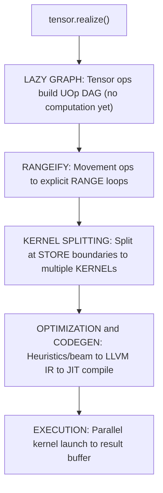
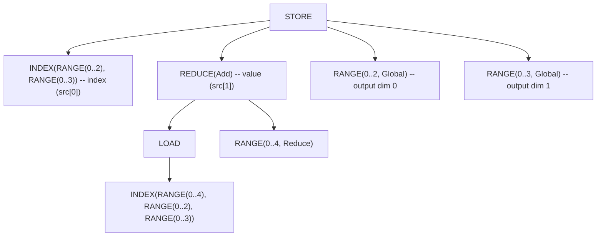
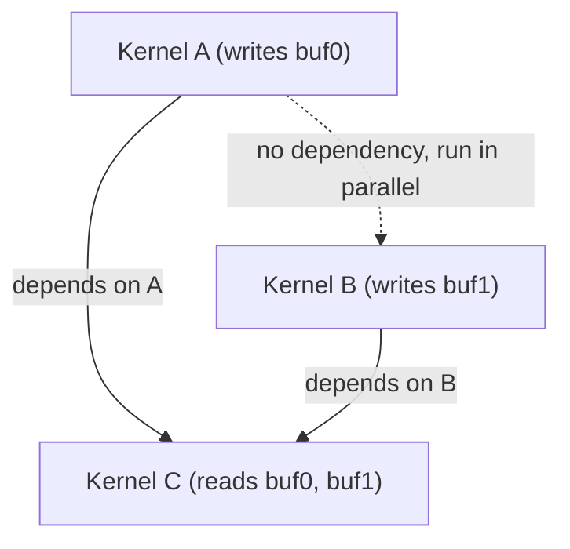
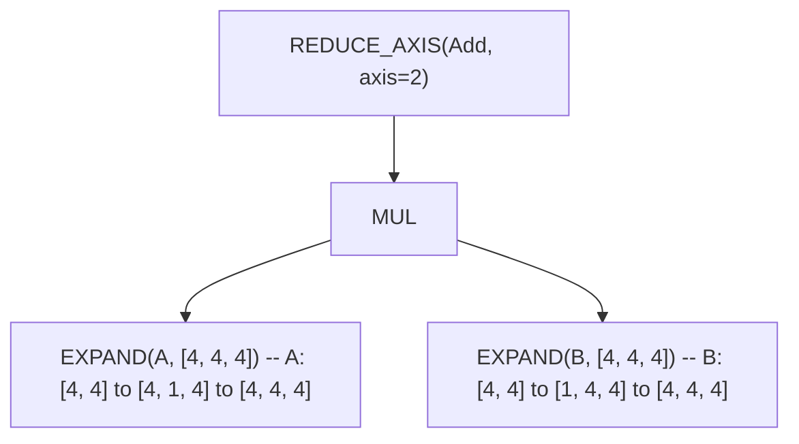
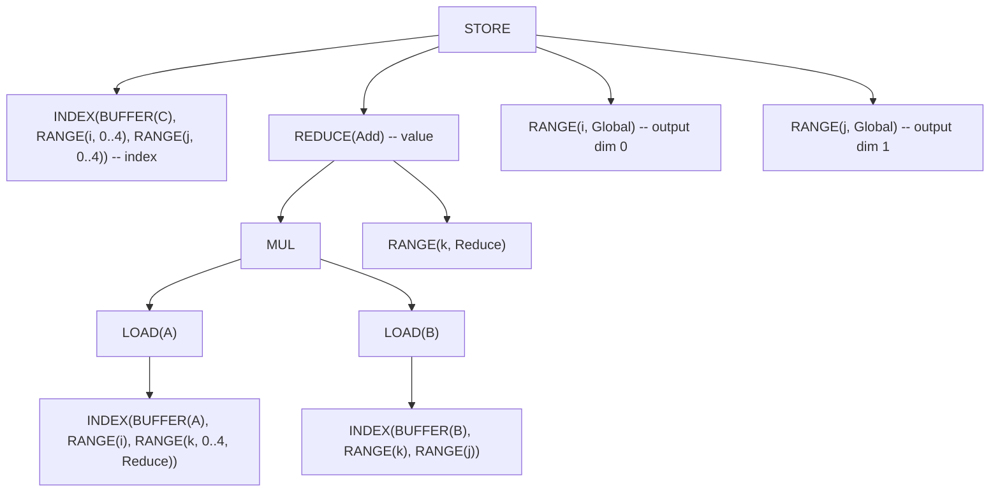
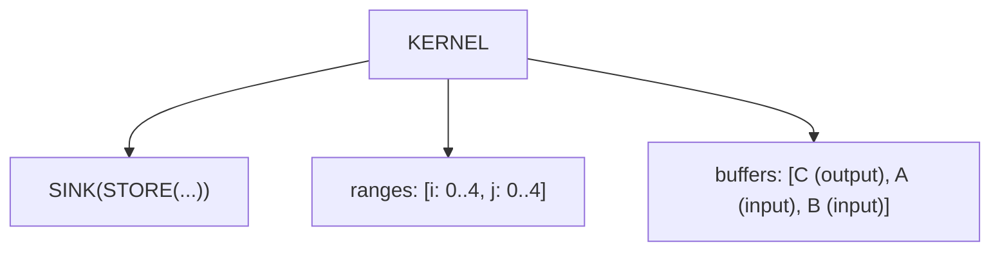

# От тензора до машинного кода

В большинстве ML-фреймворков вычисления происходят немедленно. Напишите `a + b` в PyTorch — и он выполнится *сейчас*: GPU перемалывает числа ещё до того, как вы успеете заглянуть в результат. Такое eager-выполнение просто для понимания, но упускает возможности для оптимизации. Как компилятор может оптимизировать вычисление, которое ещё не видел целиком?

Svod использует противоположный подход: **ленивые вычисления**. Когда вы пишете `a.try_add(&b)?`, ничего не вычисляется. Svod строит граф, описывающий *что* вычислить, а не *когда*. Магия происходит при вызове `realize()` — этот единственный метод запускает полный пайплайн компиляции, от высокоуровневых тензорных операций до JIT-скомпилированного машинного кода.

Эта глава прослеживает этот путь.



Каждый блок — отдельная фаза. Разберём их по порядку.

---

## Ленивые вычисления: построение графа

`Tensor` в Svod — на удивление лёгкая структура:

```rust
pub struct Tensor {
    entry: Arc<TensorEntry>,  // Computation graph + its realized buffer
}
```

`entry` содержит `TensorEntry` с UOp-графом — вычислением, которое этот тензор представляет, — и `OnceLock`-буфер, который заполняет реализация. У ленивого тензора буфера ещё нет, у реализованного он есть, а поскольку буфер живёт в общей записи, а не в хендле, клонирование тензора разделяет и его реализацию. Именно поэтому `realize()`, `prepare()` и `profile()` принимают `&self`.

### Три способа создать тензор

**1. Входные тензоры** — буфер выделяется сразу:

```rust
let a = Tensor::from_slice([1.0f32, 2.0, 3.0]);
// `a.buffer` = Some(Arc<Buffer>) with actual data
```

При создании тензора из данных Svod выделяет память на устройстве и копирует байты. UOp-граф содержит узел `BUFFER`, указывающий на эту аллокацию.

**2. Ленивые операции** — нет буфера, только граф:

```rust
let b = a.try_add(&a)?;   // b.buffer = None
let c = b.try_mul(&a)?;   // c.buffer = None
```

Арифметические операции ничего не вычисляют. Они строят UOp-граф: `Binary(Add, a.uop, a.uop)`. Тензор существует исключительно как описание будущей работы.

**3. Movement-операции** — разделяют исходный буфер:

```rust
let d = a.try_reshape(&[1, 3])?;  // d.buffer = same as a.buffer
```

Reshape, permute и подобные операции создают новые *view* поверх существующих данных. Буфер расшаривается; меняется только UOp-граф, описывающий новую индексацию.

### Глобальный реестр

Svod поддерживает два глобальных словаря (lock-free, потокобезопасные):

| Словарь | Ключ → Значение | Назначение |
|---------|-----------------|------------|
| `TENSORS` | tensor_id → `Weak<TensorEntry>` | Отслеживание всех тензоров для подстановки в графе |
| `BUFFERS` | uop_id → `Arc<Buffer>` | Поиск буферов при планировании |

Этот реестр обеспечивает критическую возможность: **глобальную подстановку в графе**. Когда оптимизация преобразует UOp, все тензоры, ссылающиеся на этот UOp, автоматически видят обновлённую версию. Никаких устаревших ссылок, никаких ручных обновлений.

### Hash consing в действии

Поскольку UOp используют hash consing (дедупликация по содержимому), идентичные вычисления разделяют память:

```rust
let x = a.try_add(&b)?;
let y = a.try_add(&b)?;
// x.uop() and y.uop() point to the SAME Arc<UOp>
```

Это важно для кэширования: при компиляции ядер мы кэшируем по UOp ID. Hash consing означает, что идентичные вычисления автоматически попадают в кэш, даже если построены по отдельности.

---

## Rangeify: делаем циклы явными

Когда вы пишете `tensor.reshape([2, 3]).expand([4, 2, 3]).sum(axis=0)`, movement-операции (reshape, expand) — это высокоуровневые описания. Чтобы сгенерировать реальные циклы, нужна явная итерационная структура.

**Rangeify** преобразует movement-операции в `RANGE`-циклы и `INDEX`-арифметику. Точка входа — `rangeify()` в `schedule/src/rangeify/transforms.rs`.

### Пайплайн Rangeify

Rangeify — не одно преобразование, а многоступенчатый пайплайн:

| Стадия | Назначение |
|--------|------------|
| **0. Назначение RANGE** | Создание RANGE UOp для каждой размерности тензора |
| **1. Ранние movement-ops** | Очистка movement-операций перед назначением диапазонов |
| **2. Свёртка LOAD** | Устранение REDUCE через определение range-независимости |
| **3. Разделение RANGE** | Разбиение диапазонов с модулем, выравнивание |
| **4. Начальная символьная** | Алгебраическое упрощение, свёртка констант |
| **5. Упрощение RANGE** | Слияние соседних диапазонов с анализом стоимости |
| **6. Разделение STORE** | Разбиение графа по границам STORE |
| **7. Применение оптимизаций** | Поиск оптимизаций (beam или эвристика) |
| **Мега-проход** | Символьная + reduce + buffer folding + удаление буферов + упрощение редукций |

Мега-проход объединяет несколько символьных и структурных оптимизаций в один цикл до фиксированной точки. Далее по-ядерные проходы запускаются в `apply_pre_optimization()`.

Каждый проход использует перезапись на основе паттернов (см. главу [Движок паттернов](./optimizations/pattern-system)). Паттерны срабатывают, пока есть совпадения, затем начинается следующий проход.

### До и после

Рассмотрим тензорное выражение:

```text
Before: BUFFER.reshape([2, 3]).expand([4, 2, 3]).sum(axis=0)
```

После rangeify movement-операции становятся явными вычислениями индексов:



`EXPAND` превратился в `RANGE(0..4)`, который не влияет на индекс буфера — broadcasting. `RESHAPE` превратился в другую индексную арифметику. `SUM` стал `REDUCE(Add)` с первым диапазоном типа `Reduce`.

### Movement → индексная арифметика

Каждая movement-операция имеет конкретное преобразование:

| Операция | Преобразование |
|----------|----------------|
| **RESHAPE** | Flatten/unflatten индексных выражений |
| **PERMUTE** | Перестановка размерностей в INDEX |
| **EXPAND** | Индекс становится 0 (или RANGE не влияет на индекс) |
| **PAD** | WHERE(in_bounds, LOAD, pad_value) |
| **SHRINK** | Коррекция смещения в INDEX |
| **FLIP** | `size - 1 - index` |

После rangeify movement-операций больше нет — только арифметика над индексами.

---

## Разделение на ядра: поиск границ

Граф вычислений может иметь несколько выходов или промежуточные значения, требующие материализации. **Разделение на ядра** определяет эти границы и создаёт отдельные ядра.

Точка входа — `try_get_kernel_graph()` в `schedule/src/rangeify/kernel.rs`.

### Пайплайн разделения на ядра

Разделение проходит через несколько скоординированных шагов:

**Шаг 1: STAGE → STORE**

Узлы `STAGE` отмечают, где значения должны материализоваться. `pm_add_buffers_patterns()` конвертирует их в явные `STORE`-операции:

```text
Before: STAGE(computation, ranges)
After:  END(STORE(INDEX(...), computation), ranges)
```

Обёртка `END` фиксирует, какие диапазоны ограничивают этот store. Буферы выделяются и получают ID на этом этапе.

**Шаг 2: Разделение store на ядра**

`split_all_stores()` и `split_store()` разбивают граф по границам STORE, создавая отдельные ядра. Нумерация буферов назначается через счётчик `LocalAddBufferContext.param_slot` во время разделения.

```text
Before: END(STORE(...), ranges)
After:  KERNEL(SINK(STORE(...)), ranges, buffer_list)
```

Узел `KERNEL` оборачивает всё: вычисление (как `SINK`), диапазоны итераций и список буферов, которые это ядро читает и записывает.

**Шаг 3: Фиксация присваиваний**

`fix_assign()` привязывает каждый buffer_id к ядру, которое его записывает, и строит граф зависимостей.

### Отслеживание зависимостей

Когда выход одного ядра является входом другого, нужно отслеживание зависимостей:

1. `fix_assign()` привязывает каждый buffer_id к ядру-производителю и строит граф зависимостей
2. Когда ядро B читает буфер, записанный ядром A, B зависит от A
3. Зависимости представляются узлами `AFTER` в IR

Узлы `AFTER` в IR гарантируют, что ядра выполняются в корректном порядке.

### Нумерация буферов

Нумерация буферов управляется счётчиком `LocalAddBufferContext.param_slot` в `split_store()`. Каждый аргумент ядра становится `PARAM(slot=N)`, и слоты назначаются во время разделения в порядке срабатывания паттернов — отдельного прохода перенумерации не требуется.

---

## Создание расписания: подготовка к выполнению

После разделения на ядра нужно составить **расписание**: определить порядок выполнения, выделить буферы и подготовиться к компиляции.

`create_schedule()` в `tensor/src/schedule.rs` выдаёт `Vec<ScheduleItem>`:

```rust
pub struct ScheduleItem {
    pub kernel: Arc<UOp>,              // Callable (CALL) wrapper: dependency identity
    pub ast: Arc<UOp>,                 // Inner computation (for codegen)
    pub buffers: Vec<Buffer>,          // Device buffers
    pub buffer_uop_ids: Vec<u64>,      // UOp IDs for registry cleanup
    pub fixedvars: HashMap<String, i64>,  // Bound iteration variables
    pub loop_var_names: HashSet<String>,  // fixedvars fed by schedule-loop counters
    pub dependencies: Vec<u64>,        // Producer callable UOp IDs
    pub instance_dependencies: Vec<usize>, // Producer schedule-item indices
}
```

### Стратегия выделения буферов

- **Входные буферы**: Уже выделены (из `Tensor::from_slice`)
- **Промежуточные буферы**: Выделяются при планировании (для выходов ядер, подаваемых на вход другим ядрам)
- **Выходной буфер**: Выделяется и регистрируется за конечным тензором

### Анализ параллельных групп

Не все ядра требуют последовательного выполнения. Независимые ядра можно запускать параллельно:



Планировщик использует **алгоритм Кана** для нахождения параллельных групп:

1. Построить DAG зависимостей ядер
2. Найти все ядра без входящих рёбер → Группа 1
3. Убрать Группу 1, повторить → Группа 2 и т.д.

Ядра каждой группы выполняются параллельно, затем запускается следующая группа.

---

## Кодогенерация: от UOp до LLVM IR

С готовым расписанием ядер генерируем реальный код. У Svod два рендерера, и какой из них запустится, решает бэкенд устройства:

| Бэкенд устройства | Рендерер | Выход |
|-------------------|----------|-------|
| **CPU** | LLVM text (по умолчанию) или C | LLVM IR либо исходник на C |
| **CUDA** | LLVM text, целевая платформа NVPTX | LLVM IR (`ptx_kernel`) |
| **AMD** | LLVM text, целевая платформа AMDGPU | LLVM IR (`amdgpu_kernel`) |
| **Metal** | C, диалект Metal | Metal Shading Language |

Трейт `Renderer` абстрагирует кодогенерацию:

```rust
pub trait Renderer {
    fn render(&self, uop: &Arc<UOp>, name: Option<&str>) -> Result<RenderedKernel>;
    fn backend_name(&self) -> &str;
    fn decompositor(&self) -> Option<TypedPatternMatcher<()>>;
}
```

### LLVM CPU Renderer

LLVM-рендерер (`codegen/src/llvm/cpu/`) обходит UOp-граф и порождает LLVM IR:

```llvm
define void @kernel_0(ptr noalias align 32 %buf0, ptr noalias align 32 %buf1) #0 {
entry:
  br label %loop_0

loop_0:
  %i = phi i32 [ 0, %entry ], [ %i.next, %loop_0 ]
  ; ... computation ...
  %i.next = add nsw i32 %i, 1
  %cond = icmp slt i32 %i.next, 128
  br i1 %cond, label %loop_0, label %exit

exit:
  ret void
}
```

Каждый буфер — прямой параметр `ptr noalias align 32`, без косвенной адресации через массив args. Символьные переменные (для динамических форм) и thread ID передаются как дополнительные типизированные параметры (например, `i32 %N`).

### Проходы пост-оптимизации

Перед кодогенерацией ~15 проходов на основе паттернов подчищают IR:

| Проход | Назначение |
|--------|------------|
| `pm_add_loads` | Обернуть INDEX-операции в LOAD |
| `pre_expand` | Преобразовать UNROLL/UPCAST диапазоны в явные операции |
| `devectorize` | Группировка последовательных обращений к памяти |
| `pm_reduce_devectorize` | Обработка векторных редукций (K-vec, bool, горизонтальные) |
| `pm_bool_devectorize` | Обработка паттернов булевых векторов |
| `pm_split_ends` | Разбиение многодиапазонных END на вложенные однодиапазонные |
| `pm_fma_decomposition` | Преобразование `a*b+c` в fused multiply-add (для поддерживающих бэкендов) |
| `pm_float_decomp` | Декомпозиция операций с плавающей точкой |
| `bool_storage_patterns` | Преобразование bool ↔ uint8 для операций с памятью |

Эти проходы преобразуют оптимизированный AST в форму, пригодную для кодогенерации. Результат — чистый, векторизованный код с правильными паттернами доступа к памяти.

### Поддержка бэкендов

Два рендерера покрывают четыре бэкенда устройств:

| Рендерер | Выход | Кто использует |
|----------|-------|----------------|
| **LLVM text** | LLVM IR для целевых платформ CPU, AMDGPU и NVPTX | CPU (по умолчанию), AMD, CUDA |
| **C** | Исходник на C либо Metal Shading Language | CPU (`SVOD_CPU_BACKEND=clang`), Metal |

---

## Выполнение: запуск ядер

Кодогенерация порождает строки исходного кода — LLVM IR, C или Metal Shading Language. Выполнение включает их компиляцию во время работы программы и запуск ядер.

### ExecutionPlan

`prepare()` (один тензор) или `prepare_batch()` (несколько тензоров) строит `ExecutionPlan` (`runtime/src/execution_plan.rs`):

```rust
pub struct ExecutionPlan {
    ops: Vec<PreparedOp>,               // Compiled kernels and buffer copies
    op_order: Vec<usize>,               // Topological execution order
    op_levels: Vec<Vec<usize>>,         // Parallel groups (Kahn levels)
    buffers: Vec<Buffer>,
    ast_to_buffer: HashMap<u64, usize>, // AST id -> buffer index mapping
    output_buffer_indices: Vec<usize>,  // Indices of output buffers (multi-output)
    device: DeviceSpec,
    // ... graph/queue state elided
}
```

Планы теперь поддерживают **множественные выходы** через `realize_batch()` / `prepare_batch()`. Когда несколько тензоров разделяют подграфы, батч-планирование позволяет компилятору разделять ядра между выходами.

Ключевые методы:

| Метод | Назначение |
|-------|------------|
| `output_buffer_at(i)` | Получить i-й выходной буфер (соответствует порядку источников SINK) |
| `num_outputs()` | Количество выходных буферов в плане |
| `execute_with_vars(var_vals)` | Повторное выполнение с другими значениями символьных переменных (без рекомпиляции) |

План **переиспользуемый**: компилируем один раз, выполняем многократно с разными данными.

### JIT-компиляция

LLVM-рантайм (`runtime/src/llvm.rs`) компилирует IR в машинный код. Никакого LLVM `ExecutionEngine` нет: IR превращается в перемещаемый объектный файл, который загружает и релоцирует внутрипроцессный ELF-загрузчик.

1. **Компиляция** текста IR в перемещаемый объектный файл с `-O2` — внутри процесса через подгруженную по `dlopen` libLLVM, либо, если её нет, через `clang -x ir -c -O2`
2. **Переиспользование** объектного файла из дискового кэша по ключу «дайджест исходника + идентичность компилятора»
3. **Загрузка** ELF-загрузчиком: секции в анонимный mmap, применение релокаций
4. **Кэширование** полученной функции по (AST ID, device) для повторного использования

```rust
// Simplified compile flow
let object = producer.compile_object(ir_string)?;  // libLLVM in-process, or `clang -x ir -c -O2`
validate_relocatable_object(&object, &entry_point)?;
let (fn_ptr, _mmap) = jit_load(&object, &entry_point)?;  // ELF loader, no linker
// Cache: (ast_id, device) → function
```

### Выполнение ядер

С скомпилированными ядрами выполнение проходит по ядрам в топологическом порядке, соблюдая зависимости:

```rust
for kernel in &plan.kernels {
    // Dependencies tracked per-kernel via kernel.dependencies
    kernel.execute(buffers);
}
```

Ядра несут собственную спецификацию устройства, так что план может охватывать несколько устройств.

### Кэширование ядер

Hash consing делает кэширование ядер очень эффективным:

- **Ключ**: `(UOp ID, device string)`
- **Хранилище**: Lock-free HashMap (крейт papaya)
- **Процент попаданий**: Высокий, потому что идентичные вычисления разделяют UOp ID

Когда вы вычисляете одно и то же выражение дважды, второй вызов попадает в кэш — рекомпиляции нет.

---

## Разбор на примере: матричное умножение

Проследим путь `C = A @ B` через весь пайплайн. Предположим матрицы 4x4.

### Стадия 1: Построение ленивого графа

```rust
let a = Tensor::from_slice(a_data);  // Input buffer allocated
let b = Tensor::from_slice(b_data);  // Input buffer allocated
let c = a.matmul(&b);                 // Graph built, no computation
```

На этом этапе `c` — ленивый тензор со следующим UOp-графом:



### Стадия 2: Rangeify

Movement-операции становятся явными циклами:



Диапазоны `i` и `j` — размерности выхода. Диапазон `k` — размерность редукции (свёртки).

### Стадия 3: Разделение на ядра

Один STORE → одно ядро:



### Стадия 4: Расписание

Один `ScheduleItem` с:
- `kernel`: KERNEL UOp
- `ast`: внутренний SINK/STORE
- `buffers`: [C, A, B]
- `dependencies`: [] (нет предшествующих ядер)

### Стадия 5: Оптимизация

Эвристический оптимизатор применяет:
- Векторизацию: UPCAST размерности j на 4
- Порядок циклов: обеспечение хорошего cache-поведения

### Стадия 6: Кодогенерация

Сгенерированный LLVM IR (упрощённо):

```llvm
define void @matmul(ptr noalias align 32 %C, ptr noalias align 32 %A, ptr noalias align 32 %B) #0 {
entry:
  br label %loop_i

loop_i:
  %i = phi i64 [ 0, %entry ], [ %i.next, %loop_i.end ]
  br label %loop_j

loop_j:
  %j = phi i64 [ 0, %loop_i ], [ %j.next, %loop_k.end ]
  %acc = ... ; initialize accumulator
  br label %loop_k

loop_k:
  %k = phi i64 [ 0, %loop_j ], [ %k.next, %loop_k ]
  %a_val = load float, ptr ...  ; A[i, k]
  %b_val = load float, ptr ...  ; B[k, j]
  %prod = fmul float %a_val, %b_val
  %acc.new = fadd float %acc, %prod
  %k.next = add i64 %k, 1
  %k.cond = icmp slt i64 %k.next, 4
  br i1 %k.cond, label %loop_k, label %loop_k.end

loop_k.end:
  store float %acc.new, ptr ...  ; C[i, j]
  ; ... continue j, i loops
}
```

### Стадия 7: Выполнение

1. JIT-компиляция LLVM IR
2. Выполнение: `kernel([C_ptr, A_ptr, B_ptr], [])`
3. Результат — в буфере C

Итого: один вызов функции, результат готов.

---

## Сравнение: как выполняют другие фреймворки

| Аспект | PyTorch | JAX | TVM | **Svod** |
|--------|---------|-----|-----|-----------|
| **Вычисление** | Eager (немедленное) | Трассировка (jit-декоратор) | Ленивое (te.compute) | Ленивое (realize) |
| **Захват графа** | torch.compile | jax.jit trace | Явное расписание | Неявно через операции |
| **Компиляция** | TorchInductor | XLA-бэкенд | Auto-scheduler | Паттерны + beam |
| **Кэширование** | По хэшу графа | По трассировке | По расписанию | По AST (hash consing) |
| **Параллелизм** | DataParallel/DDP | pmap/pjit | Parallel schedule | Параллельные группы |

**PyTorch**: Eager по умолчанию, torch.compile для оптимизации. TorchInductor генерирует Triton или C++ код.

**JAX**: Функциональные преобразования (jit, grad, vmap) трассируют вычисления. XLA компилирует в оптимизированные ядра.

**TVM**: Явное разделение вычисления и расписания. Auto-scheduler ищет хорошие расписания.

**Svod**: Полностью ленивый — ничего не выполняется до `realize()`. Hash consing обеспечивает автоматическое кэширование. Оптимизация на основе паттернов с опциональным beam search для продакшн-качества.

---

## Глубинная идея

Пайплайн воплощает несколько принципов проектирования:

**Ленивые вычисления дают глобальную оптимизацию.** Откладывая вычисления, мы видим весь граф до генерации кода. Ни одно локальное решение не ограничивает глобальную оптимизацию.

**Явные циклы позволяют планировать под конкретное железо.** Movement-операции — удобные абстракции, но GPU нужны циклы. Rangeify соединяет эти миры.

**Hash consing делает кэширование автоматическим.** Идентичные вычисления разделяют указатели, так что ключи кэша тривиальны. Никакого сложного хэширования графов.

**Разделение ответственности упрощает каждый этап.** Rangeify ничего не знает об LLVM. Кодогенерация ничего не знает о тензорной семантике. Каждый этап делает одну вещь хорошо.

Результат: пайплайн компиляции, который одновременно мощный и поддерживаемый. От `tensor.realize()` до машинного кода каждый шаг прозрачен, отлаживаем и расширяем.
