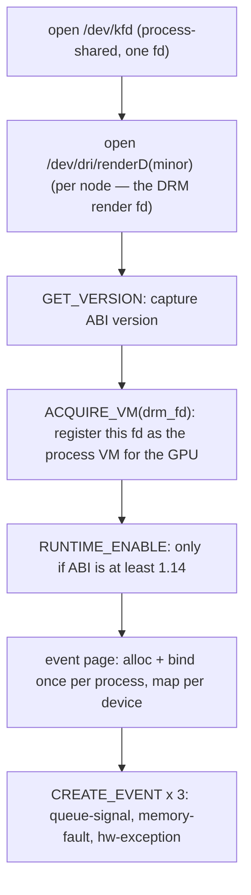

# Привязки KFD

Бэкенд общается с ядром через небольшой фиксированный набор вызовов
`ioctl` на `/dev/kfd`. Эта страница описывает, как эти вызовы привязываются к
Rust, какие из них бэкенд реально использует, как обнаруживаются GPU-узлы и как
устроен поток выделения, превращающий `ioctl` в замапленный GPU-буфер. О том,
*почему* бэкенд работает напрямую через KFD, а не на базе HIP, см.
[Обзор](./overview.md).

---

## Как генерируются привязки

ABI KFD — это C-заголовок `kfd_ioctl.h`, дословно вендоренный из ядра в
`device/include/kfd_ioctl.h` (исходный файл AMD, вместе с историей версий его
ABI). Rust-привязки генерируются из него во время сборки через `bindgen`:

- `device/build.rs` запускает `bindgen` **безусловно на каждом хосте** — нет ни
  платформенной ветки, ни заглушки-пустышки. Он **герметичен**: ему не нужны
  системные заголовки ядра. Два заголовка, которые `kfd_ioctl.h`
  транзитивно подтягивает (`<linux/ioctl.h>` ради макросов `_IOC`/`_IO*`,
  `<linux/types.h>` ради псевдонимов `__uNN`/`__sNN`), плюс заглушка
  `<drm/drm.h>` (рудиментарная — тело использует только поля `__u32 drm_fd`),
  сами вендорены под `device/include/`, и `build.rs` передаёт `-Iinclude`, так
  что bindgen резолвит их вместо `/usr/include`. Переход на вендоренные
  заголовки проверен на байт-эквивалентность: перегенерированные привязки
  отличаются от базовой версии с системными заголовками лишь в 8 написаниях
  псевдонимов типов фиксированной ширины (`__u32 = u32` против `c_uint`,
  одинакового размера) — все 60 структур и 34 константы идентичны. (bindgen'у
  нужен `libclang`, который на macOS поставляется с Xcode CLT.)

  Он разрешает по allow-листу ровно те KFD-типы и константы, которые нужны
  бэкенду:

  ```text
  allowlist_type:  kfd_ioctl_.*_args, kfd_process_device_apertures,
                   kfd_event_data, kfd_hsa_signal_event_data,
                   kfd_hsa_memory_exception_data, kfd_hsa_hw_exception_data,
                   kfd_memory_exception_failure, __u\d+, __s\d+
  allowlist_var:   KFD_IOC_.*, KFD_MMAP_TYPE.*, KFD_MAX_QUEUE_PERCENTAGE,
                   AMDKFD_IOC_.*
  ```

  (Коды запросов `AMDKFD_IOC_*` внесены в allow-лист, но никогда не
  материализуются: bindgen не может const-fold-ить раскрытия их макросов
  `_IOWR(...)`, и именно поэтому номера ioctl вычисляются на стороне Rust — см.
  примечание ниже.)

  с `.derive_default(true).layout_tests(false).generate_comments(false)`.
  Результат записывается в `$OUT_DIR/kfd_sys.rs`.

- `device/src/amd/sys/kfd.rs` — это однострочник, который `include!`-ит
  сгенерированный файл.

- **Второй проход bindgen** покрывает сторону AQL/HSA:
  `include/amd_hsa_wrapper.h` подтягивает вендоренные ROCm-заголовки `hsa/` и
  выдаёт `$OUT_DIR/hsa_sys.rs` (`hsa_kernel_dispatch_packet_t`, `hsa_queue_t`,
  `amd_queue_t`, `amd_signal_t` и компания), который `include!`-ит
  `device/src/amd/sys/hsa.rs`. Здесь `layout_tests` намеренно оставлены
  **включёнными**: 256-байтный `amd_queue_t` и 64-байтный AQL-пакет критичны по
  раскладке, так что структура неверного размера обязана ронять сборку.

Повсеместная компиляция привязок — это и есть то, что делает AMD-бэкенд
[провайдером исполнения, определяемым во время выполнения](./overview.md), а не
фичей времени компиляции: привязки генерируются везде, каждый `cargo check` на
Unix проверяет типы в лежащих над ними местах вызова KFD (единственная часть под
`cfg(unix)` — это ioctl-обёртки `nix`), а хост без GPU просто никогда не
регистрирует фабрику.

:::note[Почему ioctl-макросы написаны вручную]
`bindgen` выдаёт *структуры* аргументов, но не макросы номеров ioctl `_IOWR`.
Они объявлены вручную в `device/src/amd/sys/ioctl.rs` через
`nix::ioctl_readwrite!`, с кодом типа `KFD_IOCTL_BASE = b'K'`. Каждый ioctl
объявлен как `readwrite`, даже там, где заголовок указывает `_IOR`/`_IOW` — KFD
трактует структуру аргументов как in/out, а ядро допускает оба направления.
:::

---

## Какие ioctl использует бэкенд

Тройки `(group, opcode, args)` берутся прямо из `kfd_ioctl.h`. Вот те, у
которых есть действующие места вызова:

| Обёртка | Op | Используется для |
|---|---|---|
| `kfd_get_version` | `0x01` | Чтение версии ABI KFD (гейтит `RUNTIME_ENABLE`) |
| `kfd_create_queue` | `0x02` | `setup_ring` — создать compute/SDMA-очередь |
| `kfd_destroy_queue` | `0x03` | `teardown_ring` |
| `kfd_update_queue` | `0x07` | Отвязать и заново привязать AQL-очередь, чтобы прошивка CP перечитала её дескриптор scratch в `amd_queue_t` |
| `kfd_create_event` | `0x08` | События queue-signal, memory-fault и hw-exception; привязка event-страницы |
| `kfd_destroy_event` | `0x09` | Снести все три события при `Drop` |
| `kfd_wait_events` | `0x0C` | `wait_events` — блокировка на событиях завершения / сбоя |
| `kfd_acquire_vm` | `0x15` | Зарегистрировать DRM render fd как VM этого процесса для GPU |
| `kfd_alloc_memory_of_gpu` | `0x16` | `alloc_raw` — выделить VRAM/GTT |
| `kfd_free_memory_of_gpu` | `0x17` | `free_raw` |
| `kfd_map_memory_to_gpu` | `0x18` | Привязать выделение в таблицу страниц GPU |
| `kfd_unmap_memory_from_gpu` | `0x19` | `free_raw` |
| `kfd_runtime_enable` | `0x25` | Включить рантайм (только KFD ABI ≥ 1.14) |

Ещё пять (`set_memory_policy`, `get_clock_counters`, `get_process_apertures`,
`set_event`, `reset_event`) объявлены для полноты, но сейчас не вызываются.

### Последовательность инициализации устройства

`KfdIface::open` (`device/src/amd/iface.rs`) выдаёт их по порядку, зеркаля
`ops_amd.py` из tinygrad:



Цепочка строго упорядочена: `ACQUIRE_VM` обязан предшествовать любому выделению,
а event-страница должна быть привязана до первого `CREATE_QUEUE`.

С DRM render fd связана любопытная деталь: **DRM-ioctl нет вообще**. `drm_fd`
используется лишь двумя способами — передаётся *по номеру* в `ACQUIRE_VM` и
служит `mmap`-fd для видимых хосту маппингов. Doorbell, напротив, `mmap`-ится
из KFD-fd.

---

## Топология: поиск GPU

GPU-узлы перечисляются из sysfs, а не через ioctl.
`device/src/amd/topology.rs` читает
`/sys/devices/virtual/kfd/kfd/topology/nodes/<N>/properties` — по одной паре
`key value` на строку — плюс соседний `<N>/gpu_id`, и возвращает
`Vec<AmdNode>`, пропуская CPU-узлы (`gpu_id == 0`). Паники здесь невозможны:
хост без `/dev/kfd` даёт пустой вектор.

Это же перечисление определяет доступность всего бэкенда во время выполнения.
`topology::has_devices()` — «любой узел, чей `gfx_target_version` разрешается в
поддерживаемую `AmdArch`» — это проверка без побочных эффектов, которую рантайм
вызывает, чтобы решить, регистрировать ли фабрику устройств `"AMD"` вообще
([модель провайдера](./overview.md)). Нет поддерживаемого узла ⇒ нет типа
устройства `"AMD"`; а если у фабрики запросят узел, которого нет, она вернёт
аккуратный `Err(NoAmdGpu)`.

Каждый `AmdNode` несёт поля, нужные остальной части бэкенда:
`gpu_id`, `drm_render_minor`, `gfx_target_version` (например, `110000` →
gfx1100), `simd_count`, `simd_per_cu`, `max_waves_per_simd`, `num_xcc`,
`lds_size_in_kb`, `max_slots_scratch_cu` и прочие — на их основе вычисляется
размер scratch и принимается решение PM4 против AQL.

:::tip[Тестирование без железа]
Корень sysfs переопределяется через **`SVOD_KFD_TOPOLOGY`**, так что парсер
покрыт unit-тестами против сфабрикованной директории узлов без присутствующего
GPU.
:::

---

## Поток выделения

Каждый буфер проходит один и тот же четырёхшаговый путь, реализованный один раз
в `KfdIface::alloc_raw`:

```text
1. reserve_va(size)                     mmap(PROT_NONE, …) — зарезервировать host VA
2. ALLOC_MEMORY_OF_GPU(va, size, flags) → возвращает handle + mmap_offset
3. если видимо хосту:                   mmap(va, …, MAP_FIXED, drm_fd, offset)
4. MAP_MEMORY_TO_GPU(handle)            привязать в таблицу страниц GPU
```

Хостовый VA резервируется первым — анонимным `PROT_NONE`-маппингом, чтобы
видимый хосту `mmap` на шаге 3 мог лечь ровно по этому адресу (`MAP_FIXED`).
Освобождение идёт в обратном порядке: `UNMAP_MEMORY_FROM_GPU` → `munmap` →
`FREE_MEMORY_OF_GPU`.

### Разновидности выделения

`alloc_raw` принимает `AllocKind`, который выбирает набор KFD-флагов —
единственное место, где эти флаги составляются:

| `AllocKind` | Флаги | Используется для |
|---|---|---|
| `DeviceVram { executable }` | `VRAM \| WRITABLE \| NO_SUBSTITUTE` (+ `EXECUTABLE` для кода, + `PUBLIC`, когда видимо хосту) | Данные тензоров, code object, scratch |
| `UncachedGtt` | `GTT \| WRITABLE \| EXECUTABLE \| NO_SUBSTITUTE \| PUBLIC \| COHERENT \| UNCACHED` | Командные кольца, GART-страницы, слоты сигналов, event-страница |

Разновидность GTT `UNCACHED | COHERENT` важна: командное кольцо и слоты
сигналов должны быть немедленно видимы и для CPU, и для GPU, иначе хост будет
вечно крутиться в ожидании значения завершения, застрявшего в L2 GPU. KFD
отклоняет `CREATE_QUEUE` на обычном VRAM-кольце с ошибкой `EINVAL`.

### `cpu_access` следует за очередью копирования

Аллокатор (`device/src/amd/allocator.rs`) вычисляет
`cpu_access = options.cpu_access || !self.dev.has_sdma_queue()`. Когда
установлена SDMA-очередь копирования (по умолчанию на CDNA — см.
[Обзор](./overview.md)),
промежуточный буфер может быть VRAM **только для устройства**, а копии идут через
DMA: `_copyin`/`_copyout` копируются через промежуточный буфер очереди
копирования, `_transfer` — прямое копирование устройство→устройство. Когда
очереди копирования нет,
`has_sdma_queue()` равно `false`, поэтому каждый буфер принудительно делается
видимым хосту, а копии откатываются к обычному хостовому `memmove` после
ограниченного по области `wait_storage`. Обобщённый `LruAllocator`
(`device/src/allocator.rs`) складывает освобождённые буферы в пул по
`(size, BufferSpec)`; спецификация `nolru` обходит пул для code object'ов и
буферов EOP / CWSR-сохранения контекста, а кольца, GART-страницы, слоты сигналов
и scratch вовсе минуют пуловый аллокатор и идут прямо к шву через
`alloc_uncached_tagged` / `alloc_host_visible_tagged` / `alloc_scratch`.

:::note[Состояние, разделяемое процессом]
`/dev/kfd` открывается один раз на процесс и разделяется всеми устройствами
(события адресуются по id относительно этого fd). KFD **event-страница**
размером 0x8000 байт точно так же выделяется и привязывается один раз на
процесс; последующие устройства только `MAP_MEMORY_TO_GPU`-ят её в свой
собственный `gpu_id`. И то, и другое повторяет per-process модель tinygrad.
:::

---

## Почему это важно

Вся обращённая к ядру поверхность — это **горстка вендоренных заголовков,
тринадцать ioctl и парсер sysfs**. Именно поэтому бэкенд может
обойтись без userspace-стека ROCm: ядерный ABI мал и стабилен, так что
привязать его напрямую — это меньше кода, чем интегрировать HIP, — и при этом
[шов бэкенда](./overview.md) остаётся свободным, чтобы заменить KFD на
userspace [драйвер AM](./am-driver.md), не трогая ничего над ним.
