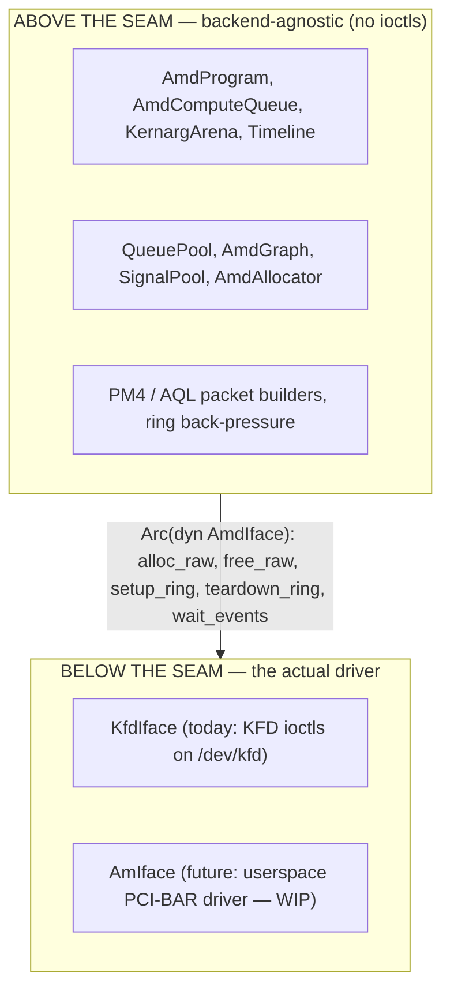
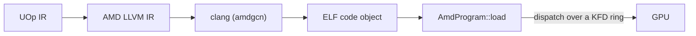

# AMD-бэкенд

Svod работает на GPU AMD, общаясь с драйвером ядра напрямую. Здесь нет ни HIP,
ни рантайма ROCr/HSA, ни `libamdhip64.so` — единственная внешняя зависимость —
это `clang` (для компиляции, ровно так же, как его использует
[JIT-загрузчик CPU](../jit-loader.md)). Всё остальное — выделение VRAM,
построение командных колец, диспетчеризация ядер, ожидание завершения —
делается сырыми вызовами `ioctl` к `/dev/kfd`, интерфейсу Linux **KFD**
(Kernel Fusion Driver), который поставляется внутри модуля ядра `amdgpu`.

Это точный порт `ops_amd.py` из
[tinygrad](https://github.com/tinygrad/tinygrad), который сам по себе работает
напрямую через KFD. Почти каждая функция бэкенда несёт ссылку
`ops_amd.py:NNN` / `hcq.py:NNN`, так что дизайн можно сверить с эталоном.

Код находится в крейте `svod-device`, в `device/src/amd/`.

---

## Провайдер исполнения, определяемый во время выполнения

AMD-бэкенд **всегда компилируется** (на каждом Unix-хосте — `cfg(unix)`,
поскольку `nix` существует только под Unix), никогда не прячется за cargo-фичей.
Доступность решается **во время выполнения, а не во время компиляции**, в стиле
ORT: реестр устройств зондирует железо через
`svod_device::amd::has_devices()` — чтение топологии KFD только из sysfs, без
побочных эффектов — и регистрирует фабрику устройств `"AMD"` *только* тогда,
когда поддерживаемый GPU присутствует. На хосте без `/dev/kfd` тип устройства
`"AMD"` просто не появляется.

Смысл — в надёжности: поскольку бэкенд участвует в проверке типов каждой сборки,
изменение API в обобщённом ядре (скажем, в трейте `Program` или `PlanContext`)
отлавливается на каждой dev-машине на `cargo check`, а не только на хосте с GPU.
Цена — время компиляции, и мы на это идём. Шаг bindgen, соответственно,
**герметичен** — он запускается на всех платформах на основе вендоренных
заголовков и не требует системных заголовков ядра
(см. [Привязки KFD](./kfd-bindings.md)).

---

## Почему KFD-direct, а не HIP

«Здравомыслящий человек», пишущий AMD-бэкенд, тянется к HIP (рантайм, похожий
на CUDA) или к лежащему под ним рантайму HSA. Svod намеренно так не делает. Вот почему:

- **Никакой зависимости от userspace-рантайма.** HIP/ROCr — это сотни мегабайт
  разделяемых библиотек, которые должны совпадать с версией драйвера ядра.
  KFD — это стабильный ядерный `ioctl`-ABI; бинарник Svod линкует `libc` +
  `nix` и вызывает `clang`, и больше ничего. Бэкенд работает на любом хосте с
  достаточно свежим `amdgpu` и таргетом `amdgcn` у `clang` — без установки
  ROCm.
- **Детерминированный контроль.** Мы сами владеем командным кольцом, doorbell,
  сигналом таймлайна, видимыми в таблице страниц выделениями и
  scratch-буфером. Между нами и железом нет рантайма, который переупорядочивал бы
  отправки или прятал состояние, а это важно для свободной от блокировок
  диспетчеризации с несколькими владельцами, вокруг которой построен бэкенд
  (см. [Очереди и диспетчеризация](./queues-and-dispatch.md)).
- **Проверенный эталон.** Модель HCQ (Hardware Command Queue) из tinygrad
  работает напрямую через KFD и обкатана в бою. Портируя её, мы наследуем её
  точные раскладки пакетов и последовательность инициализации, а не реверсим
  собственные.

И HIP, и ROCr лежат *поверх* KFD — они открывают тот же `/dev/kfd` и
выдают те же ioctl, что и мы. Прямой доступ убирает промежуточные слои, а не
возможности.

:::note
KFD-direct — это AMD-аналог того, что [JIT-загрузчик CPU](../jit-loader.md)
делает для x86/ARM: пропустить тяжеловесный вендорский тулчейн и приводить в
действие голый механизм прямо в процессе. Загрузчик CPU прогоняет код через
`clang` и `mmap`-ит результат; AMD-бэкенд прогоняет код через `clang` и
диспетчеризует результат через KFD-кольцо.
:::

---

## Шов бэкенда

Бэкенд разделён на две половины трейтом **`AmdIface`**
(`device/src/amd/iface.rs`):



Всё, что *не* является вызовом ядра — 16-мегабайтное командное кольцо,
построение PM4/AQL пакетов, bump-арена kernarg, счётчик таймлайна, загрузчик
программ — живёт выше шва и используется каждым бэкендом. Трейт намеренно
крошечный: **пять обязательных методов** (`alloc_raw`, `free_raw`,
`setup_ring`, `teardown_ring`, `wait_events`) плюс три хука, у которых
реализация по умолчанию ничего не делает (`queue_event_mailbox`,
`publication_checkpoint`, `update_queue_percentage`). Ключевая идея, благодаря
которой он остаётся малым, в том, что кольцо, GART-страница, EOP-буфер и MQD —
это *просто GPU-память*: они выделяются выше шва через `alloc_raw`, и то
единственное, что
драйвер действительно обязан делать иначе, — это **активировать очередь**
(замапить doorbell, сообщить планировщику, что кольцо существует), то есть
`setup_ring`.

Реализация выбирается при открытии устройства по переменной окружения
`SVOD_AMD_BACKEND`:

| `SVOD_AMD_BACKEND` | Бэкенд | Статус |
|---|---|---|
| `kfd` (по умолчанию) | `KfdIface` — KFD-direct | В эксплуатации |
| `am` | `AmIface` — userspace-драйвер AM | Пока недоступен для выбора — см. ниже |

:::caution[AM пока не запускается]
Установка `SVOD_AMD_BACKEND=am` сейчас возвращает ошибку (`device.rs` принимает
только `kfd`) — пока ни один AM-тип не реализует шов. Userspace-драйвер **AM**
нацелен на **SR-IOV VF на CDNA3** (gfx9.4.3) и находится в разработке:
discovery, mailbox VF↔GIM, косвенный доступ к регистрам, GMMU и инициализация
GMC реализованы и **проверены на живой VF**, но ни один движок GPU пока не
потребляет работу (doorbell-апертура принадлежит хосту). О том, что именно
существует сегодня и где проходит граница, см. в
[Драйвере AM](./am-driver.md).
:::

---

## Память, локальная для устройства, и SDMA-очередь копирования

Бэкенд устанавливает **SDMA-очередь копирования** (`AmdCopyQueue`) при открытии
устройства на чипах CDNA — RDNA остаётся на пути через видимую хосту память, а
`AMD_DISABLE_SDMA` отключает саму попытку целиком, — что переводит
`has_sdma_queue` в `true`. С ней промежуточные данные могут жить в **VRAM только
для устройства** (`cpu_access = false`), а копии хост↔устройство идут через
асинхронный DMA: `_copyin`/`_copyout` копируются через промежуточный буфер
SDMA-очереди, `_transfer` делает прямое копирование устройство→устройство. Когда
очереди
копирования нет, аллокатор откатывается к более простой модели — каждый буфер
принудительно делается видимым хосту (CPU-отображаемая VRAM или GTT), а копии —
это обычный `memmove` после `synchronize()`. Выделение и копии описаны в
[Привязках KFD](./kfd-bindings.md).

---

## Запуск на AMD

Выберите AMD GPU переменной окружения `SVOD_DEVICE` — `AMD:0` — это первый
AMD-узел в [топологии KFD](./kfd-bindings.md). Например, прогон модели от начала
до конца:

```bash
SVOD_DEVICE=AMD:0 cargo run --release -p svod-model --example gigaam_infer -- ./audio.wav
```

Кроме поддерживаемого AMD GPU, единственное требование к хосту — это `clang` с
таргетом `amdgcn` в `PATH` (он используется для компиляции ядер — см.
[Компиляцию и граф](./compile-and-graph.md)); никакой установки ROCm/HIP не
нужно. Страница [Очереди и диспетчеризация](./queues-and-dispatch.md)
перечисляет все переменные окружения.

---

## Где он находится в пайплайне

AMD-бэкенд — это устройственная половина компилятора. Фронтенд опускает тензоры
в единый UOp IR; кодген отображает этот IR на индексы GPU-потоков (стадия
[«Добавление GPU-измерений»](../../architecture/codegen/devectorizer.md)
превращает диапазоны в SPECIAL-индексы `gidxN`/`lidxN`, согласно
[дизайну IR](../../architecture/ir-design.md)); рендерер выдаёт AMD LLVM IR; а
этот бэкенд компилирует и запускает его:



Слой [JIT-графов](../../architecture/jit-graphs.md) оборачивает это так, что
граф модели компилируется один раз и переигрывается многократно.

---

## Путеводитель по чтению

| Страница | Что она покрывает |
|---|---|
| [Привязки KFD](./kfd-bindings.md) | Как привязывается ядерный ABI (bindgen поверх вендоренного заголовка), какие именно ioctl используются, топология sysfs и поток выделения |
| [Очереди и диспетчеризация](./queues-and-dispatch.md) | Командное кольцо, PM4 против AQL, ограниченный пул вычислительных полос, публикация и дренажи на уровне всего устройства, таймлайн и каждая конфигурационная переменная окружения |
| [Компиляция и граф](./compile-and-graph.md) | Как ядро проходит путь от LLVM IR до загруженной программы, как оно диспетчеризуется и как работает захват/переигрывание графа (AQL — по умолчанию, PM4 — по явному включению) |
| [Драйвер AM](./am-driver.md) | Userspace-драйвер в разработке: что построено, что отложено и как он подключается к шву |
| [Отладка](./debugging.md) | Реестр VA→выделение для классификации сбоев, poison-защёлка и диагностика диспетчеризации/трассировки |
