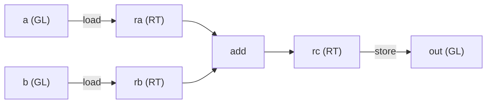

# Пишем первое ядро

[Пишем прямо в IR](./lowering) разобрал билдер в общих чертах: `Kernel` выдаёт сырьё, `Group`
несёт вычислительный словарь, а `finish` оборачивает всё в `SINK`. Эта глава доводит дело до
конкретики: мы напишем мельчайшее ядро, которое делает реальную работу, —
**загрузить два тайла `16×16`, сложить их, сохранить результат**, — и запустим его.

Это намеренно простейшее, что всё-таки прорабатывает форму ядра целиком: дуга
загрузка → вычисление → сохранение из [Что такое тайлинг](./tiling), переведённая в код. Ни
матричного умножения, ни разделяемой памяти, ни цикла — ровно столько, чтобы увидеть каждый шаг.
Ядра matmul и Flash Attention — тот же костяк, только с надстройкой сверху.



---

## Ядро целиком

Вот оно от начала до конца — объявить буферы, собрать тело, запустить, прочитать результат обратно:

```rust
use svod_dtype::DType;
use svod_tensor::Tensor;
use svod_tk::arch::FragRole;
use svod_tk::index::Idx;
use svod_tk::tiles::TileLayout;
use svod_tk::{run_kernel, MoveIdx};

// Two 16×16 inputs and an output, as flat f32 buffers.
let a: Vec<f32> = (0..256).map(|i| i as f32).collect();
let b: Vec<f32> = (0..256).map(|i| (2 * i) as f32).collect();
let ta = Tensor::from_slice(&a);
let tb = Tensor::from_slice(&b);
let mut out = Tensor::empty(&[1, 1, 16, 16], DType::Float32);

// One wave covers the tile; its width is 64 on CDNA, 32 on RDNA and CUDA.
let arch = svod_tk::target::resolve_arch(&ta.device()).expect("a GPU device");
let w = svod_tk::ArchCaps::for_arch(arch).wave_size as i64;

run_kernel("tile_add", [1, 1, 1], w, &mut [&mut out], &[&ta, &tb], |ker| {
    let warp = ker.warp();

    // Globals, in launch order: output first, then the two inputs.
    let o = ker.gl(&[1, 1, 16, 16], DType::Float32);
    let ga = ker.gl(&[1, 1, 16, 16], DType::Float32);
    let gb = ker.gl(&[1, 1, 16, 16], DType::Float32);

    // Ask for the 16×16 f32 fragment by role — arch-correct on wave32 and wave64.
    let frag = ker.caps.frag(FragRole::Accumulator);
    let blk = [Idx::Const(0), Idx::Const(0), Idx::Const(0), Idx::Const(0)];

    // global → register
    let ra = warp.load(ker.rt((16, 16), DType::Float32, TileLayout::Row, frag), ga, MoveIdx::block(&blk, 2));
    let rb = warp.load(ker.rt((16, 16), DType::Float32, TileLayout::Row, frag), gb, MoveIdx::block(&blk, 2));

    // the one compute op
    let rc = warp.add(ra, &rb);

    // register → global, then close the kernel around its single store
    let _ = warp.store(o, rc, MoveIdx::block(&blk, 2));
    ker.finish(1)
})
.expect("tile_add launch");

let result = out.as_vec::<f32>().expect("read out"); // result[i] == 3 * i
```

Это и есть всё ядро. Остаток главы проходит по каждой строке.

---

## Шаг за шагом

### 1. Объявить запуск

`run_kernel` — точка входа прямого диспатча с лица DEBUG: она реализует входы, выделяет выходы,
собирает за вас `Kernel`, прогоняет ваше замыкание, чтобы получить `SINK`, и затем компилирует и
отправляет на исполнение — записывая выходы на месте.

```rust
run_kernel("tile_add", [1, 1, 1], w, &mut [&mut out], &[&ta, &tb], |ker| { /* body */ })
```

Grid `[1, 1, 1]` и block `w` задают геометрию запуска. Мы берём **одну рабочую группу из одной
волны**: весь тайл `16×16` помещается в регистры одной волны, так что распределять по блокам нечего.
Размер блока — это `w`, **ширина волны**, которую мы заранее запросили у устройства
(`resolve_arch(&ta.device()).wave_size()`): волна — это 64 лейна на CDNA, но 32 на RDNA, и
размерность блока *и есть* это число лейнов. Выходной слайс идёт первым, входы — вторыми, и
**этот порядок — контракт**, на который опирается следующий шаг.

### 2. Взять волну для работы

```rust
let warp = ker.warp();
```

`Group` — это кооперирующаяся волна (`warp` — термин NVIDIA для того же самого). Любая
вычислительная операция — загрузки, сложение, сохранение — это метод на ней. `ker.warp()` — это
группа из одной волны; `ker.group(n)` дал бы вам `n` волн под тайл побольше.

### 3. Объявить глобальные

```rust
let o  = ker.gl(&[1, 1, 16, 16], DType::Float32);
let ga = ker.gl(&[1, 1, 16, 16], DType::Float32);
let gb = ker.gl(&[1, 1, 16, 16], DType::Float32);
```

**Глобальная разметка** (`GL`) — типизированное представление над одним из буферов: она знает
логическую форму, так что загрузки вычисляют верный адрес. Каждый вызов `gl()` привязывает
*следующий* буфер в порядке объявления, и этот порядок должен совпадать с запуском: мы передали
`&mut [&mut out]`, затем `&[&ta, &tb]`, поэтому объявляем `o`, потом `ga`, потом `gb`. Перепутаете
порядок — и ядро будет читать и писать не те буферы.

Форма `[1, 1, 16, 16]` — это принятое в tk-ядрах соглашение о 4-мерной адресации; две ведущие `1` —
размерности batch/head, которые реальное ядро итерировало бы, а здесь оставлены тривиальными. (Сами
входные *тензоры* могут быть плоскими 256-элементными буферами — логическую форму поставляет
представление `GL`; свою форму, для выделения, несёт только выходной тензор.)

### 4. Запросить тайл по роли

```rust
let frag = ker.caps.frag(FragRole::Accumulator);
```

Это приём переносимости из [Wave32 против Wave64](./wave-portability), и он важен даже в ядре без
матричного умножения: один и тот же логический тайл `16×16` f32 имеет *разную физическую разметку
лейнов* на двух ширинах волн AMD, поэтому именование **роли** вместо зашитого фрагмента позволяет
одному телу компилироваться под обе. Мы просим у `ArchCaps` роль `Accumulator` — попросту роль для
результирующего тайла полной точности, который выдаёт и сложение, не только MMA, — и даём ей
разрешить физический фрагмент под целевую платформу: wave64 на CDNA, чётно-нечётная разметка wave32
на RDNA.

### 5. Загрузка: global → register

```rust
let blk = [Idx::Const(0), Idx::Const(0), Idx::Const(0), Idx::Const(0)];
let ra = warp.load(ker.rt((16, 16), DType::Float32, TileLayout::Row, frag), ga, MoveIdx::block(&blk, 2));
let rb = warp.load(ker.rt((16, 16), DType::Float32, TileLayout::Row, frag), gb, MoveIdx::block(&blk, 2));
```

`ker.rt(...)` выделяет регистровый тайл в той разметке фрагмента, что мы только что разрешили;
`warp.load` заполняет его из глобальной. `MoveIdx::block(&blk, 2)` говорит, *какой именно* тайл
глобальной читать: `blk` — координата тайла вдоль каждой из четырёх размерностей (все нули, ведь у
единственного тайла `16×16` есть лишь позиция `(0, 0)`), а `2` — ось, вдоль которой эти тайлы
уложены: размерность 2, размерность строк представления `[1, 1, 16, 16]`. (Глобальная
`[1, 1, 32, 16]` держала бы два тайла строк; чтобы прочитать второй, эту координату выставили бы в
`Idx::Const(1)`.) Волна сообща затягивает все 256 элементов прямо в регистры, уже в той разметке,
которую хочет вычисление.

Это *прямой* путь `global → register`, без остановки в разделяемой памяти. Ядро, потоково гоняющее
большие тензоры, сперва прошло бы через разделяемый тайл (ради коалесинга и бесконфликтного свизла —
узких мест из [Где прячутся FLOPS](./where-flops-hide)); мы это пропускаем, потому что единственному
резидентному тайлу не нужно ни то, ни другое.

### 6. Вычисление: единственная операция

```rust
let rc = warp.add(ra, &rb);
```

Единственная арифметика в ядре. `add` поэлементна над тайлом — никакого индексирования лейнов,
никакой адресной математики, просто «сложи эти два тайла». (Первый операнд берётся по значению,
второй по ссылке, на выходе — результирующий тайл.) Здесь, в реальном ядре, встали бы `mma`,
редукции и поэлементные отображения; механика вокруг них — ровно та, что вы видите здесь.

### 7. Сохранение и завершение

```rust
let _ = warp.store(o, rc, MoveIdx::block(&blk, 2));
ker.finish(1)
```

`warp.store` записывает результирующий тайл обратно в выходную глобальную — то же индексирование, но
наоборот. `ker.finish(1)` закрывает ядро вокруг его **единственного** сохранения, выдавая `SINK`
(проштампованный `opts_to_apply: Some(vec![])`, чтобы оптимизатор не трогал опущенное руками тело,
как описывала глава [Пишем прямо в IR](./lowering)). Число, которое вы передаёте в `finish`, — это
сколько выходных сохранений собрать в `SINK`; выход у нас один, поэтому `1`.

### 8. Запустить и прочитать обратно

`run_kernel` компилирует и отправляет на исполнение в момент возврата из замыкания. Выход был
привязан на месте, так что читаем его прямо с тензора:

```rust
let result = out.as_vec::<f32>().expect("read out"); // result[i] == 3 * i
```

При `a[i] = i` и `b[i] = 2i` каждый элемент возвращается как `3i`.

---

## Правила, которые нельзя нарушать

Несколько ограничений несущие — нарушите одно, и получите ошибку компиляции, панику или неверный
ответ:

| Правило | Почему |
|------|-----|
| **Размерности тайла кратны `16`** | Тайл — это целое число фрагментов матричного блока `16×16`; `ker.rt` это проверяет. |
| **Порядок `gl()` = порядок буферов запуска** | Сначала выходы, потом входы. Привязка позиционная; рассогласование молча меняет буферы местами — неверные числа, без ошибки, компилятор такое не поймает. |
| **Запрашивать фрагменты по роли, а не по константе** | Именно `caps.frag(role)` заставляет одно тело работать и на wave32, *и* на wave64. |
| **Это GPU-ядро** | Билдер создаёт настоящие индексы лейнов (`Op::Special`), поэтому исполнение идёт на GPU — AMD или CUDA, — а не на CPU. |

---

:::tip Для экспертов по GPU
Тело опускается ровно в форму `RANGE` / `INDEX` / `LOAD` / `STORE` из главы
[Пишем прямо в IR](./lowering) — никаких новых типов узлов. Ядро создаёт индекс лейна `Op::Special`,
на котором едут загрузки волны; каждый `warp.load` становится глобальным `LOAD` под этим лейном,
`warp.add` — это единственный `Op::Binary(Add)`, а сохранение — это один `STORE`, который замыкает
`SINK`. **Нет** ни `Wmma`, ни `DefineLocal`: это проход только через регистры и обратно, самое
компактное ядро, какое IR способен выразить.

Раз ядро выдаёт операции `Special`, оно *и есть* полностью опущенное руками GPU-ядро: оптимизатор и
проходы размерностей рабочей группы видят граф с `Special` как уже опущенный и пропускают его
насквозь (тот же шлюз, что обеспечивает `opts_to_apply: Some(vec![])`). Поэтому же оно рендерится
только на GPU-бэкенде — AMD или NVPTX: на скалярном CPU-пути индекс лейна смысла не имеет. А вот *построение*
`SINK` — это чистое конструирование UOp: GPU ему не нужен, нужен он только исполнению. Это разделение
и позволяет защитить ядро проверкой формы на стороне хоста при каждом построении, держа отдельный
гейтированный тест на числа на устройстве.
:::

---

## Почему это важно

Это крошечное ядро — шаблон, по которому отливается каждое tk-ядро. Ядро matmul добавляет `mma` и
K-цикл, а разобранный пример [Flash Attention](./flash-attention) ставит матричный блок работать
рядом с рекуррентностью онлайн-softmax, потоковой передачей с двойной буферизацией и веткой по
размеру волны. Но костяк ровно тот, что вы только что написали: объявить глобальные в порядке
запуска, запросить тайлы по роли, перемещать данные между пространствами памяти, считать над тайлами,
`finish`. Выучите этот скелет — и более трудные ядра не заменят его, а лишь нарастят.

И всё это — один UOp IR. Собранный вами `SINK` — объект того же рода, что компилятор производит для
автотюненного ядра, в чём и весь смысл раздела.

Дальше — заковыка, из-за которой авторство руками на AMD по-настоящему тяжело: как удержать ядро
корректным сразу на разных размерах волн — [Wave32 против Wave64](./wave-portability).
