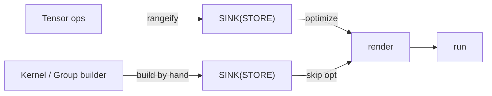
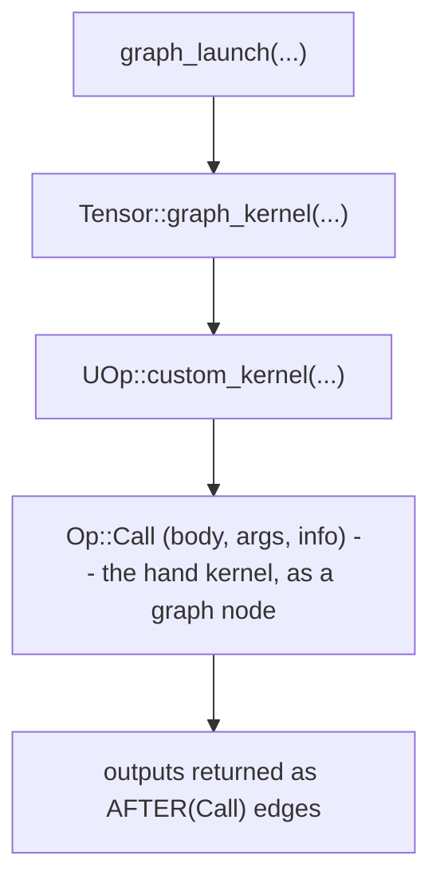
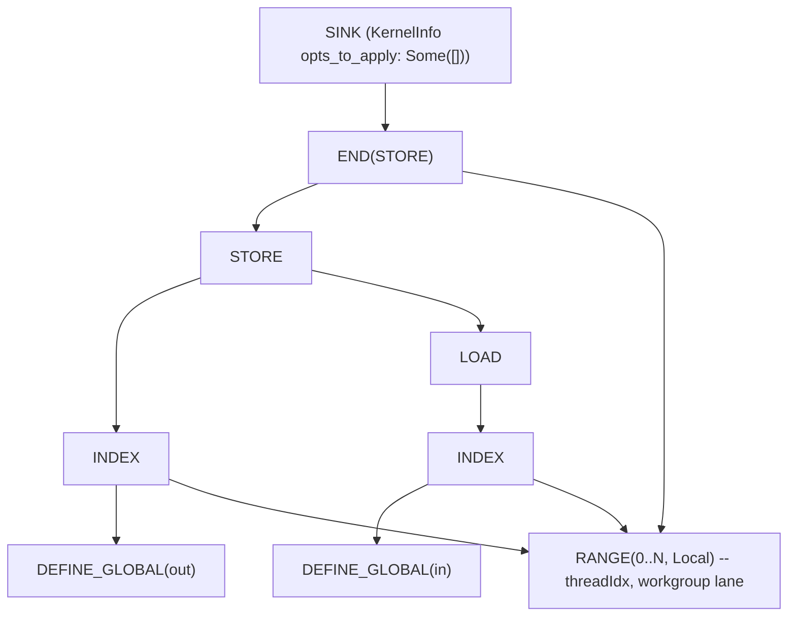

# Пишем сразу в едином IR

На вопрос «как дать пользователям писать ядро руками?» большинство tile-фреймворков отвечают,
добавляя *слой*: новый DSL со своим компилятором, своим отладчиком и своим профайлером, пристроенный
сбоку к фреймворку. Определяющий выбор `tk` — не добавлять **никакого слоя вовсе**. Написанное руками
ядро опускается в *тот же* UOp IR, что и всё остальное, а значит, делит с ним один путь рендеринга,
один отладчик и один профайлер. Разработчику ML-приложения нужно выучить ровно **один IR** — от
сложения `Tensor` и до настроенного руками attention-ядра.

Как это устроено, и показывает глава. Она рассчитывает, что вы прочитали
[Один IR, чтобы править всеми](../architecture/ir-design) и
[Пайплайн выполнения](../architecture/pipeline): вы должны понимать, что такое UOp и как ленивый
`Tensor` становится скомпилированным ядром. Заново эту философию мы не пересказываем — мы покажем,
как написанное руками ядро встраивается *в неё*.

---

## Никакого нового слоя: ядро — это просто подграф

Вспомним тезис из [Обзора](./overview): `tk` — билдер, а не бэкенд. Он не выдаёт ассемблер и не
заводит собственного IR. На выходе у него *ровно тот же* опущенный IR, что уже потребляет обычный
путь кодогенерации: циклы `RANGE`, операции памяти `INDEX`/`LOAD`/`STORE`, матричные инструкции
`WMMA` (а где нужно — сырой LLVM/ASM как `Op::Custom`).

Поэтому написать ядро — это просто *собрать UOp DAG руками* вместо того, чтобы поручить сборку
`rangeify`. На выходе — UOp `SINK`, ровно то же, что планировщик производит для автотюненного ядра.
Написанные руками и сгенерированные компилятором ядра — не два рода объектов; это один род,
собранный двумя разными способами:



---

## Что даёт жизнь в одном IR

В этом весь смысл главы, поэтому скажем конкретно. Раз написанное руками ядро *и есть* просто ещё
немного UOp-ов, оно бесплатно наследует всю инфраструктуру компилятора — строить или учить что-то
специфичное для tk не приходится:

- **Один рендерер.** Тот же путь `svod-codegen`, что опускает графовые ядра в LLVM IR — а оттуда
  в AMD-бинарник или в PTX, — рендерит и ваше `tk`-ядро. Нет второго бэкенда, который пришлось бы писать,
  переносить и держать в синхроне.
- **Один отладчик.** `tk`-ядро вы инспектируете ровно как любое вычисление: печатаете дерево UOp.
  Написанный руками Flash Attention и автотюненный matmul выглядят в *одной и той же* текстовой
  форме, с теми же именами операций — ни отдельного формата дампа, ни загадки «что вообще такое
  ядро X».
- **Один профайлер.** Раз `tk`-ядро несёт своё `name` сквозь IR, в профиле устройства оно
  показывается *под этим именем*, а не безымянным блобом, и замеряется тем же путём аппаратного
  таймстампа, что и любое другое ядро. Профилирование написанных руками и графовых ядер — единый
  рабочий процесс.
- **Один IR для изучения.** Вот в чём выигрыш для разработчика. Чтобы строить, оптимизировать,
  отлаживать и профилировать ML-приложение на Svod — от сложения `Tensor` и до настроенного руками
  attention-ядра, — вы держите в голове ровно *одно* представление. Никаких «тензорный IR против DSL
  для ядер против IR бэкенда»: есть только один UOp-граф.

Обычно всё устроено наоборот: tile-DSL — это *отдельный* язык со своим компилятором, своим
отладчиком и своим профайлерским представлением, надстроенный над фреймворком. Каждое из этого —
ещё один слой, который фреймворку приходится строить, и ещё одна вещь, которую пользователю
приходится учить. `tk` не добавляет ни одного из них — именно эту цену он платить отказывается.

---

## Билдер: `Kernel` и `Group`

Пишете вы двумя типами (с лица AUTHOR в `tk/src/lib.rs`):

- **`Kernel`** (`tk/src/kernel.rs`) — билдер с немедленным исполнением. Он выдаёт вам сырьё:
  размерности grid/block (они становятся операциями `SPECIAL`), диапазоны циклов (`RANGE`), буферы
  разделяемой памяти (`DEFINE_LOCAL`), регистровые буферы (`DEFINE_REG`) и глобальные параметры. Вы
  привязываете к нему тензоры и просите у него тайлы.
- **`Group`** (`tk/src/group.rs`) — кооперирующаяся волна (или группа волн). На ней висит
  *вычислительный* словарь: загрузки и сохранения между пространствами памяти, матричное умножение
  `mma`, редукции, перетасовки, поэлементные отображения.

Каждая операция `Group` строит узлы UOp напрямую. Загрузка открывает нужные `RANGE`, выдаёт `STORE`,
который их закрывает, и возвращает целевой тайл, заново обёрнутый ребром зависимости, чтобы
следующая операция выстроилась после неё. Вы пишете граф с немедленным исполнением, по одной
операции над тайлом за раз.

Закончив, вы вызываете `Kernel::finish(...)`: он закрывает открытые диапазоны и оборачивает всё в
терминальный `SINK`.

---

## Один маркер, что решает всё

Вот поле, на котором держится авторство руками. `SINK`, который производит `finish`, несёт
`KernelInfo`, и `tk` штампует его так:

```rust
KernelInfo { opts_to_apply: Some(vec![]), name: Some(...), .. }
```

Этот `opts_to_apply: Some(vec![])` — именно он решает всё. Встретив ядро, оптимизатор проверяет это
поле (в `schedule/src/optimizer/`):

| `opts_to_apply` | Смысл |
|-----------------|---------|
| `None` | «Выбирай ты.» Запусти эвристики или [поиск методом beam](../architecture/optimizations/kernel-search), если включён. |
| `Some(vec![])` | «Это тело **уже опущено**. Никаких дальнейших оптимизаций.» |
| `Some(non-empty)` | «Применить ровно эти оптимизации, по порядку.» |

`tk`-ядро использует `Some(vec![])`: расписание вы написали руками, поэтому оптимизатор оставляет
его как есть. Проходы переписывания, которые *всё же* выполняются (алгебраическое упрощение,
опускание индексов), получают указание не спускаться в тело ядра. Ваш настроенный руками цикл
доживает до кодогенерации ровно таким, как написан, — и при этом остаётся обычным UOp-графом,
который *тот же* рендерер превращает в LLVM IR, а *та же* среда выполнения исполняет.

И это не только удобство («ты уже оптимизировал, так что не утруждайся»). Это **контракт
безопасности**: оптимизатор *не может* безопасно трогать написанное руками тело. В нём могут
оказаться сырые интринсики LLVM/ASM как `Op::Custom` — те самые примитивы машинного планировщика из
главы [Где прячутся FLOPS](./where-flops-hide). Модели того, **что делают эти непрозрачные
операции, у оптимизатора нет**, поэтому пере-тайлинг, переупорядочивание или слияние через них могли
бы тихо изменить результаты ядра — или незаметно похоронить производительность, которую вы выстроили
руками. Так что `Some(vec![])` сообщает оптимизатору единственно безопасное, что тот может сделать с
телом, которого до конца не понимает: не трогать его.

---

## Два пути внутрь: прямой запуск и узел графа

От готового `Kernel` к исполняемому коду ведут два маршрута — под две разные аудитории.

:::tip Для экспертов по GPU
С `Op::Call` ядра планировщик обращается как с любым другим узлом графа: он проходит цепочки зависимостей `AFTER`/`Call`, находит границы ядер и выдаёт его как одно запланированное ядро, а проходы переписывания идут *сохраняющим вызовы* обходом, не спускаясь в тело. Так что ваш опущенный руками `SINK` планируется и отслеживается по зависимостям ровно как автотюненное ядро, но его нутро не переписывается никогда.
:::

### Прямой запуск (лицо DEBUG)

`compile` / `launch` / `run_kernel` (`tk/src/launch.rs`) берут готовый `SINK`, привязывают его к
конкретным буферам устройства, рендерят, компилируют и отправляют на исполнение — минуя планировщик
тензоров целиком. Так ядро тестируют и бенчмаркают в изоляции; см. [Отладка](./debugging).

### Узел графа (лицо USE)

В продакшене отдельный запуск не нужен — нужно, чтобы ядро было частью ленивого графа и встраивалось
в планирование и отслеживание зависимостей наравне со всем остальным. Этот путь такой:



Готовый `SINK` становится `body` узла `Op::Call` (см. `Op::Call` в
[Бестиарии операций](../architecture/op-bestiary)). Каждый выходной тензор возвращается как
`AFTER(Call)` — обычным ребром зависимости. С точки зрения планировщика ваше ядро — это просто ещё
один узел в DAG со входами и выходами. Оно планируется, его буферы выделяются, его зависимости
отслеживаются — той же машинерией, что описана в [Пайплайне выполнения](../architecture/pipeline).

В этом и выигрыш «одного IR»: написанное руками ядро и автотюненное ядро — *равноправны*.

---

## Никаких тихих откатов

Тонкий способ отказать, характерный для библиотек ядер: вы вызываете быстрый путь, он молча решает,
что ваш вход ему не по зубам, и вы получаете медленный путь без предупреждения — а то и вовсе
неверный ответ. Публичные ядра `tk` (`tk/src/kernels/{fa,matmul}.rs`, через `launch_custom` в
`tk/src/launch.rs`) устроены так, чтобы это было невозможно. Каждая точка входа возвращает результат
из трёх вариантов:

| Результат | Смысл | Что вы делаете |
|--------|---------|-------------|
| `Ok(Some(tensor))` | Ядро отработало. | Используйте тензор. |
| `Ok(None)` | «Здесь неприменимо» — архитектура не поддерживается или форма не бьётся на тайлы ровно. | Откатитесь к графовой реализации, осознанно. |
| `Err(...)` | *Запрос* некорректен — не тот dtype, неделящиеся размерности, неквадратные операнды. | Исправьте вызов. Это баг, поднятый громко. |

Вся соль — в различии между `Ok(None)` (законное «не моё») и `Err` (ошибка вызывающего).
Неподдерживаемое оборудование уходит на откат; dtype, который ядро принять не может, — это ошибка,
которую вы видите сразу, а не тихий крюк на медленный путь.

---

## Как это выглядит в виде IR

Награда за всё это в том, что написанное руками ядро печатается как любой другой UOp-граф.
Тривиальное сохранение тайла — загрузить тайл и записать обратно — опускается в знакомую форму
`RANGE` / `INDEX` / `STORE`:



Никаких новых типов узлов, никакого отдельного диалекта — те же операции, на которых заканчивается
[путь matmul в главе про IR](../architecture/ir-design). Реальное ядро добавляет `WMMA`,
`DEFINE_LOCAL` (LDS) и `DEFINE_REG` (регистры), но форма та же: SINK над STORE, ограниченный
диапазонами.

---

## Почему это важно

Svod может предложить *и* «дай компилятору найти расписание», *и* «расписание напишу я сам» — без
двух компиляторов — потому, что оба пути дают один и тот же артефакт: `SINK` из UOp-ов. Поле
`opts_to_apply` оптимизатора — это шов между ними, и от `None` его отделяет одно значение enum.
Почему такое редко встречается, возвращается рассмотреть глава
[tk против HipKittens против CuTile](./comparison).

Дальше заставим билдер работать от начала до конца: [Написание ядра](./first-kernel) проводит через
авторство и запуск простейшего реального ядра, строка за строкой.
