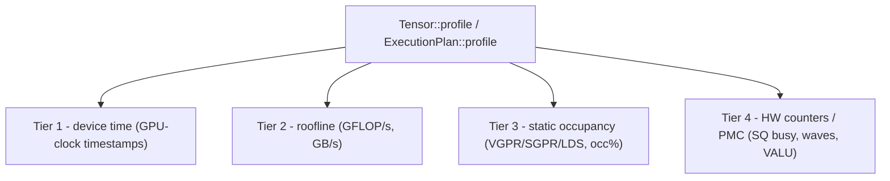

# Профилирование и бенчмаркинг ядер

[Отладка](./debugging) одним аппаратным таймстампом отвечает на вопрос «верно ли считает это
ядро и примерно насколько быстро?». Эта глава — о следующем вопросе: *куда уходит время и где
узкое место?* В составе Svod едет **многоуровневый профайлер ядер**, который раскладывает ответ
на четыре уровня — время на устройстве, roofline, статическая занятость и аппаратные счётчики
AMD, — и всё это за одним вызовом.

Профайлер живёт в крейте `runtime`, а не в `tk`, и в этом весь смысл: он работает с
**любым** `Tensor` или `ExecutionPlan` — неважно, получены ли составляющие его ядра из графового
оптимизатора или написаны руками на `tk`. Графовый matmul, слитый feed-forward-блок и написанный
руками Flash Attention — все они попадают в одну и ту же таблицу, замеряются и анализируются
одинаково. В этом разделе он задокументирован лишь потому, что именно те, кто пишет ядра руками,
с наибольшей вероятностью к нему потянутся.

:::note На уровне всего фреймворка, а не только tk
Всё, что ниже, относится к любому реализуемому `Tensor`. Возможным это делает
[дизайн единого IR](./lowering): `tk`-ядро — это просто ещё немного UOp-ов, поэтому оно несёт своё
`name` в профиль устройства и замеряется ровно тем же путём, что и автотюненное ядро.
:::

---

## Четыре уровня

Каждый уровень добавляет в отчёт группу столбцов. Нижние уровни дёшевы и доступны всегда; верхним
нужно больше (прикидка, декодирование дескриптора, стабильный GPU). Дорогие вы включаете сами.



| Уровень | Что сообщает | Источник | Нужно исполнение? |
|------|-----------------|--------|------------------|
| **1 — время на устройстве** | время исполнения на GPU по каждому ядру | таймстампы диспатча по часам GPU | да |
| **2 — roofline** | производные **GFLOP/s** и **GB/s** | прикидка FLOP по IR ядра; байты — по буферам плана | да (для скоростей нужно время) |
| **3 — статическая занятость** | расход VGPR / SGPR / LDS / scratch и ограниченная по VGPR **занятость в %** | декодируется из дескриптора ядра AMD | нет — чисто статическое декодирование |
| **4 — аппаратные счётчики (PMC)** | счётчики блока SQ: занятые циклы, запущенные волны, выданные инструкции VALU | пакеты счётчиков производительности PM4, просуммированные по вычислительной сетке | да, на стабильном GPU |

Несколько деталей, которые стоит знать:

- **Уровень 2** прикидывает FLOP, обходя IR ядра (AST). У ядер, построенных планировщиком,
  диапазоны ограничены, поэтому прикидка оказывается точным подсчётом, и столбец GFLOP/s
  заполняется. Цифра GB/s учитывает каждый отдельный буфер LOAD/STORE один раз, поэтому доступна
  всегда, когда отработал уровень 2.
- **Уровень 3** смоделирован для RDNA3.5 (wave32), у которой геометрия регистрового файла известна,
  поэтому он сообщает занятость в %. На CDNA3 (wave64) ресурсы (VGPR/SGPR/LDS/scratch) всё равно
  декодируются и показываются, но в столбце занятости стоит `-`, потому что эта геометрия не
  смоделирована. Занятость здесь — это только ограничитель первого порядка **по VGPR**; пределы по
  LDS и по размеру рабочей группы в неё не входят.
- **Уровень 4** программирует счётчики блока SQ через пакеты PM4 и суммирует их по сетке. Три
  реализованных счётчика — это `sqbusy` (занятые циклы), `waves` (запущенные волны) и `valu`
  (выданные инструкции VALU); вместе они отвечают на вопрос об ILP/занятости, на который одни лишь
  замеры времени ответить не могут.

Столбцы отчёта подстраиваются под то, что собрано: прогон только с уровнем 1 печатает лишь время, а
столбцы GFLOP/s, ресурсов и счётчиков появляются, только когда отработал их уровень.

---

## API: `profile` на `Tensor` или `ExecutionPlan`

Точки входа две. Обе принимают `&ProfileOptions` и возвращают `RunProfile`.

```rust
// tensor/src/realize.rs — realizes the tensor as a side effect, like realize()
pub fn profile(&mut self, opts: &ProfileOptions) -> Result<RunProfile>

// runtime/src/execution_plan.rs — profile an already-prepared plan
pub fn profile(&self, opts: &ProfileOptions) -> Result<RunProfile>
```

`Tensor::profile` — это удобный вариант: он готовит план, прогоняет профилируемый путь и финализирует
результат, так что тензор оказывается реализован ровно так, как его оставил бы `realize()`.
`ExecutionPlan::profile` — для случая, когда у вас уже на руках готовый план (именно его под капотом
вызывают и бенчмарки, и `Tensor::profile`).

```rust
use svod_runtime::ProfileOptions;

// Any Tensor — a tk kernel here, but a pure graph computation works identically.
let mut out = svod_tk::flash_attention(&q, &k, &v)?;
let report = out.profile(&ProfileOptions::default())?;

// The library NEVER prints. render_table() returns a String; the caller decides.
print!("{}", report.render_table());
```

Или — для плана, который вы подготовили сами:

```rust
let plan = out.prepare()?;
let report = plan.profile(&ProfileOptions::from_env())?;
print!("{}", report.render_table());
```

`RunProfile::render_table()` возвращает `String` — таблицу по ядрам (ядра агрегированы по точке
входа, отсортированы по суммарному времени) с теми столбцами уровней, что оказались заполнены.
Профайлер — это чистый форматтер: он сам никогда не пишет в stdout или stderr, поэтому логирование,
файлы и эхо в stderr всегда остаются на выбор вызывающего.

---

## `ProfileOptions` и `from_env`

```rust
// runtime/src/profiler.rs
pub struct ProfileOptions {
    pub iters: u32,             // replays; the per-kernel minimum device time is kept
    pub static_analysis: bool,  // Tier 2/3 (flops/bytes/resources) — cheap, on by default
    pub counters: PmcSelection, // Tier 4 hardware counters
    pub origin_depth: Option<usize>, // origin rollup depth; None keeps the full path
}
```

`ProfileOptions::default()` — это `{ iters: 1, static_analysis: true, counters: PmcSelection::None, origin_depth: None }`
— уровни 1–3, один проход. Чтобы управлять явно, конструируйте его напрямую:

```rust
use svod_runtime::{ProfileOptions, PmcSelection};

let opts = ProfileOptions {
    iters: 50,
    static_analysis: true,
    counters: PmcSelection::Default, // add Tier 4
    origin_depth: Some(3), // roll the origin rows up to three frames
};
```

`PmcSelection` — это `None` (только уровни 1–3), `Default` (реализованные счётчики SQ) или
`Custom(Vec<PmcCounter>)` (явный список).

`ProfileOptions::from_env()` — единственное место, где читаются переменные окружения для
профилирования:

| Переменная окружения | Эффект |
|---------|--------|
| `SVOD_PROFILE_ITERS` | число повторов для слияния по минимуму (но не меньше 1) |
| `SVOD_PMC` | выбор уровня 4: пусто или `0` → выключено; `1` → набор счётчиков по умолчанию; иначе список токенов через запятую (`sqbusy`, `waves`, `valu`) |
| `SVOD_ORIGIN` | `1` записывает скоуп, в котором построена каждая операция (путь модуля, место вызова, узел ONNX), см. ниже |
| `SVOD_ORIGIN_DEPTH` | сколько сегментов пути оставляют сводки по происхождению (`origin_depth`); не задано или `0` — полный путь |

```bash
# Profile with 20 replays and the default hardware counters.
SVOD_DEVICE=AMD:0 SVOD_PROFILE_ITERS=20 SVOD_PMC=1 ...

# Only VALU instructions and SQ-busy cycles.
SVOD_DEVICE=AMD:0 SVOD_PMC=valu,sqbusy ...
```

### Накопление и минимум

Когда `iters > 1` (или на множестве запусков criterion), профайлер **не** усредняет. Каждый проход
даёт `RunProfile`, и проходы сливаются через `RunProfile::merge_min`: по каждому ядру побеждает более
быстрый образец (с минимальным временем на устройстве), унося с собой счётчики и статический анализ
*именно этого* образца. Минимум — это устойчивая оценка собственной стоимости ядра: он отбрасывает
выбросы от джиттера планирования, конкуренции и разгона тактовой частоты, которые раздувают среднее.

## Привязка ядер к коду модели {#attributing-kernels-to-model-code}

Имя ядра вроде `r_128_3_32_4_2_2_2_4_4_192_2` описывает его форму, но не называет слой,
которому оно служит. С `SVOD_ORIGIN=1` каждая тензорная операция запоминает скоуп, в котором
её построили, — путь модуля вроде `encoder.layers.3.ffn1`, место вызова публичной операции
или индекс узла ONNX, — а планировщик переносит объединение на каждый запуск. Шестнадцать
одинаковых слоёв по-прежнему компилируются в одну программу; она запускается шестнадцать
раз с шестнадцатью разными привязками.

Модели открывают скоупы по путям своего state-dict (`OriginScope::module`), импортёр ONNX —
по одному на узел, а имена стадий (`vad`, `encoder`, `ctc_head`) становятся метками в корне.
Рукописные ядра `tk` привязываются так же, как остальные: происхождением становится скоуп,
активный в момент построения ядра.

Если прогон несёт происхождение, `render_table()` добавляет две сводки:

- **exclusive** относит каждый запуск ровно один раз — к его основному происхождению (скоуп,
  породивший сохраняемое значение), поэтому строки не пересекаются и в сумме дают целое;
- **inclusive** относит каждый запуск ко всем предкам каждого слитого в него происхождения,
  поэтому родительская строка включает дочерние, а строки пересекаются.

Обе обрезаются до `origin_depth` сегментов; кадры вызова (`@ add tensor/src/arithmetic.rs:31`)
остаются деталью в строках ядер и ключами сводки не становятся никогда. Ядра, построенные
вне любого скоупа, попадают в строку `<unattributed>`. Глубина хранится в самом `RunProfile`,
поэтому `render_table()`, `Display` и `to_json()` режут на той глубине, с которой профиль был
снят (в том числе заданной через `SVOD_ORIGIN_DEPTH`); `render_table_at(d)` / `to_json_at(d)`
её переопределяют.

```
origin rollup (depth 3, exclusive; rows sum to the total):
  total ms  count    mean µs      %  origin path
    23.045      2    11522.6    5.3  ctc_head.GigaAmCtcJit.subsampling
     8.231      3     2743.7    1.9  ctc_head.GigaAmCtcJit.layers.6
```

`RunProfile::to_json()` выгружает строки ядер — каждая несёт сырые `origin_id` /
`origin_ids` рядом с отрисованным путём, — обе сводки и только те записи арены, до которых
достают эти идентификаторы, в виде `{ id, parent, frame }`. Пути благодаря этому разрешаются
офлайн, без вшитой в файл арены всего процесса; такой файл пишет
`gigaam_infer --profile-json out.json --origin-depth 3`.

Включение захвата меняет идентичность узлов: два одинаковых подграфа, построенные в разных
скоупах, больше не сливаются до разреза на ядра. Программ ядер это не касается, но
вспомогательная функция, которая заново строит одно и то же выражение на каждом месте вызова,
должна работать под `OriginScope::suspend()` либо отдавать свои входы уже
материализованными.

---

## Интеграция с criterion: `--profile-time`

Бенчмарки `tk` замеряют каждое ядро через его публичный интерфейс `Tensor`, отсчитывая время по тем
же поядерным GPU-таймстампам, что использует профайлер (`tk/benches/common.rs`). Обычный `cargo bench`
сообщает лишь время на устройстве GPU по каждому бенчмарку. Но у criterion есть режим
`--profile-time <seconds>`, и бенчмарки подключают к нему **полный многоуровневый профайлер** через
пользовательский трейт `Profiler` из criterion — ту же точку расширения, что использует генерация
flamegraph.

Точка подключения — `PlanProfiler` в `tk/benches/common.rs`. Пока бенчмарк профилируется, `bench_plan` на
каждом вызове захватывает план бенчмарка через глобальный для процесса `bench_profiler()`; каждый
захват профилируется через `ProfileOptions::from_env()` и сливается в накопитель сессии по минимуму
на ядро. При остановке слитая таблица рендерится через `render_table()`, записывается в файл в
выходном каталоге criterion и дублируется в stderr:

```
target/criterion/<id>/profile/svod-profile.txt
```

Вся обвязка — одна строка в `criterion_group!` каждого бенчмарка: она задаёт общий профайлер в
качестве конфигурации criterion (из `tk/benches/kmeans.rs`):

```rust
criterion_group! {
    name = benches;
    config = Criterion::default().with_profiler(common::bench_profiler());
    targets = bench_kmeans
}
criterion_main!(benches);
```

Запускайте как любой бенчмарк criterion, добавив `--profile-time` (и любые переменные окружения
для уровней):

```bash
# Plain bench: GPU device time per benchmark, profiler dormant.
SVOD_DEVICE=AMD:0 cargo bench -p svod-tk --bench kmeans

# Drive the layered profiler for ~5s per benchmark, with hardware counters.
SVOD_DEVICE=AMD:0 SVOD_PMC=1 cargo bench -p svod-tk --bench kmeans -- --profile-time 5
```

Поскольку `bench_profiler()` дремлет, пока criterion не профилирует, обычный `cargo bench` остаётся
совершенно нетронутым — те же числа, никаких лишних проходов.

---

## Честные ограничения

:::caution Две вещи, которых профайлер вам не даст
**GFLOP/s уровня 2 пуст для написанных руками ядер.** Прикидка FLOP обходит IR ядра и автоматически
считает скорость только у ядер, **построенных планировщиком**. Написанное руками `tk`-ядро использует
неограниченные символьные диапазоны, поэтому обход AST *насыщается* вместо того, чтобы сформировать
точный подсчёт, — и профайлер трактует это как «надёжной прикидки нет», а не печатает мусорный
roofline, так что для таких ядер в **столбце GFLOP/s стоит `-`**. (GB/s по-прежнему работает, ведь
байты берутся из буферов плана, а не из IR.) Roofline для написанных руками ядер считайте сами — по
известному числу FLOP алгоритма и времени на устройстве с уровня 1.

**Уровню 4 нужно стабильное состояние питания.** Аппаратные счётчики PM4 осмысленны, только когда
GPU держит фиксированную тактовую частоту. В выбранном по умолчанию состоянии питания `auto`
профайлер *не* падает — он деградирует: сообщает лишь время и печатает однострочное замечание, что счётчикам нужно
состояние `profile_standard`. Сначала переведите GPU в это состояние (например,
`amd-smi set -l stable_std`), затем перезапустите с `SVOD_PMC`.
:::

---

## Какой вызов под какой вопрос

| Вы спрашиваете… | Используйте |
|----------------|-----|
| «Сколько времени занимает каждое ядро на этом GPU?» | `Tensor::profile` с `ProfileOptions::default()`, читайте столбец времени на устройстве |
| «Это ядро упирается в вычисления или в пропускную способность?» | столбцы GFLOP/s и GB/s уровня 2 (графовые ядра) или посчитайте roofline вручную (tk-ядра) |
| «Почему занятость низкая — регистры или LDS?» | столбцы VGPR/SGPR/LDS/occ% уровня 3 (прогон не нужен) |
| «Выдаёт ли ядро достаточно работы VALU на занятый цикл?» | уровень 4 `SVOD_PMC=1`, на GPU в состоянии `profile_standard` |
| «Как это сравнивается с графово-нативной базовой линией на множестве прогонов?» | `cargo bench --profile-time` — см. [Отладка → Замеры на реальном оборудовании](./debugging) |

Для проверок корректности и структуры, а не производительности, оставайтесь в
[Отладке](./debugging); для проблем *ниже* ядра (очереди, сбои, драйвер) см.
[AMD-бэкенд → Отладка](../backends/amd/debugging).
