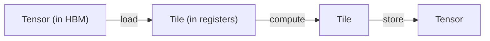
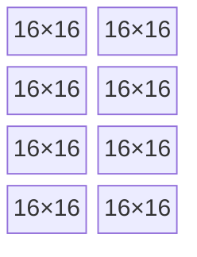

# Что такое тайлинг

[Где прячутся FLOPS](./where-flops-hide) заканчивалась на задаче: между каждыми двумя матричными
инструкциями оборудование жжёт такты на адреса, память и разметку. Тайлинг — абстракция, которая
заставляет эти такты исчезнуть. Это важнейшая идея во всём `tk`.

---

## Тензоры живут в памяти, тайлы — в регистрах

**Тензор** — большой массив, которым вы мыслите на уровне модели, например весовая матрица
`[4096, 4096]`. Он лежит в глобальной памяти (HBM), он далёкий и медленный, и он живёт всю программу.

**Тайл** — маленький кусок этого тензора фиксированного размера, скажем `16×16`, который вы
затягиваете *в регистры*, чтобы над ним считать. Он крошечный, он прямо рядом с математическим
блоком и существует всего несколько инструкций, после чего перезаписывается.

| | Тензор | Тайл |
|--|--------|------|
| **Живёт в** | глобальной памяти (HBM) | регистрах (или разделяемой памяти) |
| **Размер** | огромный, часто динамический | маленький, фиксирован на этапе компиляции |
| **Время жизни** | вся программа | несколько инструкций |
| **С ним можно** | загрузить / сохранить | умножить, редуцировать, преобразовать |

Тогда ядро — это просто цикл, который проходит большой тензор по одному тайлу за раз:

Это та же модель, которой мыслят CuTile от NVIDIA и ThunderKittens от HazyResearch, и её перенимает
`tk`. Затянул тайл, провёл над ним матричную математику в регистрах, записал результат обратно.

---

## Тайл — это сетка фрагментов матричного блока

Почему `16×16`, а не какое-нибудь круглое `100×100`? Потому что матричный блок работает с
*фрагментом* фиксированного размера, зашитым в железо, — обычно `16×16` или `32×32`. Тайл размеряют
так, чтобы он содержал целое число таких фрагментов:

*Регистровый тайл `64×32` — это сетка 4×2 из фрагментов матричного блока `16×16`: едва его данные попадают в регистры, они уже в разметке MMA.*

Раз тайл собран из фрагментов, его данные оказываются в нужной матричной инструкции разметке *уже*
в момент попадания в регистры. Никакой перетасовки перед умножением — узкого места 1 из прошлой
главы больше нет.

---

## Три рода тайлов, три пространства памяти

`tk` различает тайлы по тому, где живут их данные, ведь именно это определяет, как их перемещать и
как к ним обращаться:

| Род тайла | Пространство памяти | Назначение |
|-----------|--------------|---------|
| **Регистровый тайл** | регистры (на лейн) | операнды и аккумуляторы, которые матричный блок читает и пишет |
| **Разделяемый тайл** | разделяемая память / LDS | площадка для размещения данных, которую вся волна (или рабочая группа) заполняет сообща, без конфликтов |
| **Глобальная разметка** | глобальная память (HBM) | типизированное *представление* над сырым указателем тензора, чтобы загрузки вычисляли верный адрес |

Типичное ядро задействует все три: **глобальная разметка** описывает большой тензор, волна
сообща потоково загружает его блоки в **разделяемый тайл** (без конфликтов, через свизл), а каждый
лейн затягивает свой кусок в **регистровый тайл** и загружает им данные матричный блок.

---

## Почему тайлинг — правильная абстракция

Тайлинг — это не просто «разбить цикл на блоки». Это абстракция, которая позволяет закрыть разом
все три узких места со стороны памяти:

- **Разметка (узкое место 1):** тайлы размером с фрагмент, поэтому регистровые данные рождаются
  сразу в разметке MMA.
- **Перемещение памяти (узкое место 2):** тайл — это единица потоковой передачи: грузишь следующий
  тайл, пока считаешь над текущим.
- **Банковые конфликты (узкое место 3):** разделяемый тайл несёт свой свизл, поэтому совместное
  заполнение и чтение бесконфликтны по построению.

И это компонуется вверх: поэлементная математика, редукции, маски — всё это просто операции
*над тайлами*, с теми же гарантиями разметки. Вы пишете `tile_a * tile_b`, а не считаете индекс лейна.

:::tip[Для экспертов по GPU]
`tk` отделяет *форму* тайла от *буфера*, к которому тот привязан.

Чистые дескрипторы формы живут в `tk/src/tiles.rs`. Базовый фрагмент — это
`BaseShape { rows, cols, ept }`, где `ept` (элементов на поток) хранится **явно**, а не выводится
как `rows*cols / wave_size`. Причина в том, что на RDNA матричная инструкция *реплицирует* операнды
по лейнам, и число элементов операндного тайла, делённое на размер волны, даёт неверный ответ.
Регистровые тайлы добавляют `LaneMap` (`RTBaseShape`) — замкнутую формулу отображения
`(lane, j) → (row, col)` для фрагмента, — чтобы закодировать разметки, которые простым stride не
выразить: чередование чётных/нечётных строк у аккумулятора RDNA и тайл `16×16` у `mma.sync` на CUDA,
хранимый как две половины `m16n8`.

Обёртки, привязанные к буферу, живут в `tk/src/tile.rs`: `GL` (глобальная разметка), `ST`
(разделяемый / LDS, при желании с двойной буферизацией), `RT` (регистровый тайл), `RV` (регистровый
вектор, для редукций по строкам/столбцам, нужных softmax). Каждая — это плоский буфер `Arc<UOp>`
плюс логическая форма плюс dtype.

Важно, что ядра никогда не называют фрагментную константу вроде `RT_16X16` напрямую. Они
запрашивают **роль** — `FragRole::{Accumulator, Operand, AccumulatorT}`, — а `ArchCaps::frag(role)`
в `tk/src/arch.rs` разрешает её в верную физическую форму под целевую платформу (CDNA, RDNA или
`mma.sync` на CUDA). Эта косвенность и делает одно ядро переносимым между размерами волн и разметками
фрагментов; см.
[Wave32 против Wave64](./wave-portability). Само матричное умножение опускается в операцию `WMMA`,
описанную в [Бестиарии операций](../architecture/op-bestiary).
:::

---

## Куда это ведёт

Теперь у вас есть словарь: тензоры в памяти, тайлы в регистрах, фрагменты в матричном блоке. Глава
[Пишем прямо в IR](./lowering) показывает, что происходит, когда вы и вправду *пишете* ядро из этих
частей — как билдер `Kernel`/`Group` превращает операции над тайлами в тот самый UOp IR, который
компилирует остальной Svod.
