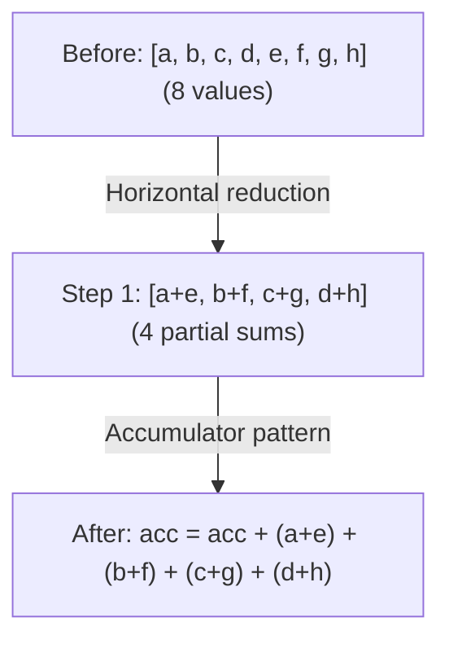

# 阶段 3：Devectorizer

**目标**：从硬件无关的向量降低到硬件特定的指令。

---

## Stage 11：移除 Reduce

> **阶段速览**
>
> **目标**：将声明式 REDUCE 转换为命令式累加
> **关键模式**：Reduce 到累加器、水平规约
> **影响**：映射到硬件规约指令

**做了什么**：将高层 REDUCE 转换为累加器模式。

**为什么重要**：声明式的"对这些值求和"需要变成命令式指令：初始化累加器、循环、逐个相加。

**模式**：`pm_reduce + gep_pushing`

```text
// Before: declarative reduction
REDUCE(Add, values, range)

// After: imperative accumulation
acc = DEFINE_REG(0.0)
for i in range:
    acc = ADD(acc, values[i])
```

**水平规约**：

在循环遍历规约维度之前，我们先合并相邻的值。这样可以创建更大的规约，更好地映射到硬件指令。



**GEP 推送**将 GEP（get element pointer）操作推过 ALU 以改善向量化：

```text
GEP(ADD(ptr_a, ptr_b), idx) → ADD(GEP(ptr_a, idx), GEP(ptr_b, idx))
```
*为什么？* 使得两个 GEP 可以使用 SIMD（并行计算）。

**WMMA 张量核心融合**：
```text
// Fuse tensor core accumulation inline
WMMA(a, b, c) + add → WMMA(a, b, c + add)
```
该模式实现了 NVIDIA 张量核心上高效的 FMA 式累加。

**Svod**：`devectorize.rs`

---

## Stage 12：添加 GPU 维度

> **阶段速览**
>
> **目标**：将抽象 range 映射到 GPU 线程索引
> **关键模式**：Range 到 SPECIAL 的替换
> **影响**：在 GPU 上实现并行执行

**做了什么**：将 range 替换为 GPU 线程索引。

**为什么重要**：GPU 有硬性限制：每个块最多 1024 个线程、共享内存最多 48KB。如果你的计算需要 2000 个线程，编译器必须将其分割成多个块。维度限制会自动处理这些。

**模式**：`pm_add_gpudims`

```text
// Before: abstract range
RANGE(end=256, Global)

// After: GPU-specific
SPECIAL(gidx0)  // global thread index
```

**映射**：

| Range 类型 | GPU 等价物 |
|------------|-----------|
| Global, THREAD | `gidx`（全局索引） |
| Local, WARP, GROUP_REDUCE | `lidx`（本地/工作组索引） |
| Reduce | 循环（不映射） |

**维度限制**：

GPU 有硬件限制（如每个块最多 1024 个线程）。当 range 超过这些限制时，编译器会：

1. **分组**相邻维度：`[256, 256, 256]` 限制为 `[256, 256]` → `[65536, 256]`
2. **分割**过大维度：`[2048]` 限制为 `[1024]` → `[2, 1024]`
3. 通过 divmod **重建**索引

**Store 掩码**：

不使用所有本地维度的全局 store 会被掩码：
```text
// If STORE doesn't use lidx1, mask it:
STORE(INDEX(...), value) → STORE(INDEX(..., gate=(lidx1 == 0)), value)
```
这确保 store 仅在未使用的本地索引为 0 时执行。

**Svod**：`gpudims.rs`

---

## Stage 13：添加 Load

> **阶段速览**
>
> **目标**：用显式 LOAD 包装 INDEX 操作
> **关键模式**：添加 LOAD、移除冗余 load
> **影响**：为代码生成显式化内存操作

**做了什么**：用显式 LOAD 包装 INDEX 操作。

**为什么重要**：INDEX 操作计算地址。LOAD 才真正读取内存。将这一点显式化有助于代码生成器理解需要哪些内存访问。

**模式**：`pm_add_loads`

```text
// Before: bare index
INDEX(ptr, i)

// After: explicit load
LOAD(INDEX(ptr, i))
```

同时移除 store 中的冗余 load（仅写访问）。

注意：并非所有 INDEX 操作都会被包装成 LOAD。指针类型（已经是地址）和 image texture（特殊硬件）使用不同的访问方式。

**Svod**：`devectorize.rs`

---

## Stage 14：Devectorize

> **阶段速览**
>
> **目标**：将抽象向量转换为匹配硬件能力的操作
> **关键阶段**：4 个协调的 pass
> **影响**：向量与实际硬件宽度匹配

**做了什么**：处理从抽象向量到硬件操作的转换。

**为什么重要**：Devectorize 通过 3 次 `graph_rewrite` 调用运行 4 个概念阶段（阶段 3 和 4 共享一次调用）——构建 PTRCAT 分组、将 GEP 移过 LOAD/STORE、分发为 CAT(LOADs)，并分割到硬件宽度。逐阶段的契约见 `schedule/src/lib.rs` 模块 docstring。

**PTRCAT 构建**：

PTRCAT 分组连续的指针访问：
1. 为每个向量元素生成独立的索引
2. 提取 (valid, root_src) → [offsets] 映射
3. 按有效性和源分组连续偏移
4. 从分组的指针创建 PTRCAT
5. 返回带 GEP 排列的结果以保证元素顺序正确

这减少了内存总线事务。

**设备特定的折叠长度**：

| 设备 | 折叠长度 | 备注 |
|------|----------|------|
| GPU（标准） | 4, 2, 1 | 标准 GPU 向量化 |
| Image | 4, 1 | 固定用于 image texture |
| 无折叠 | 1 | 标量回退（强制） |

**环境变量**（仅 Tinygrad）：`DEVECTORIZE`
- `0`：仅跳过 `devectorize`（保留 `correct_load_store`）
- `1`：完整 devectorization（默认）
- `≥2`：同时跳过 `devectorize` 和 `correct_load_store`

注意：Svod 始终运行 devectorizer，不暴露此环境变量。

**模式**：`devectorize + load_store_folding + correct_load_store + load_store_indexing`

**分割向量化 ALU**：
```text
// If hardware doesn't support vec4 add
ADD(vec4_a, vec4_b) → [ADD(a[0], b[0]), ADD(a[1], b[1]), ...]
```

**Load/store 块分割**：匹配硬件内存宽度。

**Image 修复**：image tensor buffer 的特殊处理。

**Svod**：`devectorize.rs`

---

## Stage 15：降低 Index DType

> **阶段速览**
>
> **目标**：将抽象 Index 类型转换为具体整数
> **关键模式**：基于值范围的操作特定降低
> **影响**：索引使用硬件原生整数类型（i32 或 i64）

**做了什么**：将抽象 `Index` 类型转换为具体整数。

**为什么重要**：Index 类型是抽象的——硬件没有这个类型。我们需要转换为硬件实际支持的 i32 或 i64。

**模式**：`pm_lower_index_dtype`

```text
// Before: abstract index type
idx: Index

// After: concrete type
idx: i32  // or i64, based on bounds
```

**操作特定的降低**：

Index 类型降低使用 3 阶段级联方法：

1. **为叶节点创建具体包装器**（CONST、DEFINE_VAR）——用具体 dtype 包装
2. **向上处理包装值**（Binary、WHERE、RANGE 等）——在树中传播具体类型
3. **在终端节点剥离包装器**（INDEX、SINK、END）——移除包装产生最终的具体类型

每种操作类型有特定的模式：

| 操作 | 之前 | 之后 |
|------|------|------|
| 二元操作 | `ADD(Index, Index)` | `ADD(i32, i32)` 带类型转换 |
| CONST | `CONST(5): Index` | `CONST(5): i32` |
| WHERE | `WHERE(c, Index, Index)` | `WHERE(c, i32, i32)` |
| RANGE | `RANGE(end: Index)` | `RANGE(end: i32)` 带类型转换 |
| SPECIAL | `SPECIAL(gidx)` | 始终 i32（GPU 索引是 32 位） |
| DEFINE_VAR | `DEFINE_VAR: Index` | 如果范围适合则 i32，否则 i64 |
| VECTORIZE | `VECTORIZE(Index...)` | 将每个转换为具体标量 |
| CAST 清理 | `CAST(i32, Index)` | 直接 `i32`（移除冗余 cast） |
| BIND | `BIND(var, val)` | `BIND(var.cast(dt), val.cast(dt)).cast(Index)` |

`select_concrete_dtype()` 函数使用 vmin/vmax 范围分析来确定 i32 还是 i64：
```text
dtype = i32 if bounds fit in [-2^31, 2^31-1] else i64
```

**Svod**：`symbolic/index_lowering.rs`

---

## 额外的 Devectorizer Pass

Svod 在 Stage 14 和 15 之间运行了几个额外的 pass，没有直接对应的 Tinygrad 等价物：

| Pass | 用途 |
|------|------|
| `pm_bool_devectorize` | 处理布尔向量模式（扩展/收缩） |
| `pm_reduce_devectorize` | 处理向量规约（K-vec、布尔、水平） |
| `bool_storage_patterns` | bool 与 uint8 之间的内存操作转换 |
| `linearize_multi_index` | 将多维索引展平为线性偏移 |
| `merge_sibling_ends` | 合并共享相同 range 的相邻 END 操作 |
