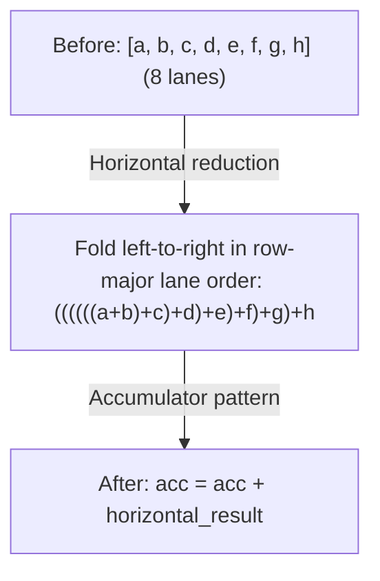

# 阶段 3：Devectorizer

**目标**：从硬件无关的向量降低到硬件特定的指令。

---

## Stage 11：移除 Reduce

> **阶段速览**
>
> **目标**：将声明式 REDUCE 转换为命令式累加
> **关键模式**：Reduce 到累加器、水平规约
> **影响**：映射到硬件规约指令

**做了什么**：将高层 REDUCE 转换为累加器模式。

**为什么重要**：声明式的"对这些值求和"需要变成命令式指令：初始化累加器、循环、逐个相加。

**模式**：`movement_cleanup_patterns + pm_reduce_local`

`pm_reduce_local` 打包了 WMMA-add 融合、`pm_group_for_reduce`、
累加器和水平规约规则，以及 group-SINK 清理。

```text
// Before: declarative reduction
REDUCE(Add, values, range)

// After: imperative accumulation
acc = placeholder(AddrSpace::Reg)   // initialized to the reduce identity
for i in range:
    acc = STORE(acc, ADD(LOAD(acc), values[i]))
```

累加器循环是一条 AFTER / STORE / END 链，由一个覆盖规约 range 的 `END` 收尾——
在这一层没有单独的循环构造。

**水平规约**：

在循环遍历规约维度之前，我们先合并一个带形状值的各条 lane。这样可以创建更大的规约，更好地映射到硬件指令。



**WMMA 张量核心融合**：
```text
// Fuse tensor core accumulation inline
WMMA(a, b, c) + add → WMMA(a, b, c + add)
```
该模式实现了张量核心上高效的 FMA 式累加。另有两条分支分别穿过 `PERMUTE` 包装器以及 `PERMUTE(RESHAPE(...))` 包装器进行融合。

**Svod**：`devectorize.rs`

---

## Stage 12：添加 GPU 维度

> **阶段速览**
>
> **目标**：将抽象 range 映射到 GPU 线程索引
> **关键模式**：Range 到 SPECIAL 的替换
> **影响**：在 GPU 上实现并行执行

**做了什么**：将 range 替换为 GPU 线程索引。

**为什么重要**：GPU 有硬性限制：每个块最多 1024 个线程、共享内存最多 48KB。如果你的计算需要 2000 个线程，编译器必须将其分割成多个块。维度限制会自动处理这些。

**模式**：先是 `pm_lower_device_ranges`，然后是 `pm_add_gpudims`（仅当渲染器有 local 或 thread 维度时）

```text
// Before: abstract range
RANGE(end=256, Global)

// After: GPU-specific
SPECIAL(gidx0)  // global thread index
```

**映射**：

| Range 类型 | GPU 等价物 |
|------------|----------------|
| Global, Thread | `gidx`（全局索引） |
| Local, Warp, GroupReduce | `lidx`（本地/工作组索引） |
| Device | PARAM 变量 `"_device_num"`（在启动时绑定） |
| Reduce | 循环（不映射） |

Warp range 会被排到本地维度的最前面，因此它们占据线程索引的低位。

**维度限制**：

GPU 有硬件限制（如每个块最多 1024 个线程）。当 range 超过这些限制时，编译器会：

1. 当相邻维度的乘积仍然放得下时把它们**分组**：`[16, 16, 256]` 在上限 `[256, 256]` 下 → `[256, 256]`
2. **分割**过大维度：`[2048]` 在上限 `[1024, 1024, 1024]` 下 → `[1024, 2]`
3. 通过 divmod **重建**索引

**Store 掩码**：

不使用所有本地维度的全局 store 会被掩码：
```text
// If STORE doesn't use lidx1, restrict its index validity:
STORE(INDEX(buf, idx), value) → STORE(INDEX(buf, WHERE(lidx1 == 0, idx, Invalid)), value)
```
这确保 store 仅在未使用的本地索引为 0 时执行。掩码留在索引表达式中，这样 RANGE 替换就会把它带到对应的硬件索引上。

**Svod**：`gpudims.rs`

---

## Stage 13：添加 Load

> **阶段速览**
>
> **目标**：用显式 LOAD 包装 INDEX 操作
> **关键模式**：为取值的操作数添加 LOAD
> **影响**：为代码生成显式化内存操作

**做了什么**：用显式 LOAD 包装 INDEX 操作。

**为什么重要**：INDEX 操作计算地址。LOAD 才真正读取内存。将这一点显式化有助于代码生成器理解需要哪些内存访问。

**模式**：`symbolic_simple + pm_expand_broadcast + pm_add_loads`

```text
// Before: bare index
INDEX(ptr, i)

// After: explicit load
LOAD(INDEX(ptr, i))
```

当 STORE 的值操作数本身就是一个地址时，也会为它加上 load。

注意：只有*作为值*被消费的操作数才会被包装——纯粹作为地址使用的 INDEX（STORE 的目标、WMMA 片段地址）保持裸露。

**Svod**：`devectorize.rs`

---

## Stage 14：Devectorize

> **阶段速览**
>
> **目标**：把带形状的操作变成标量操作
> **关键阶段**：一次合并的重写
> **影响**：每个操作都变成后端能够发射的东西

**做了什么**：处理从带形状的值到标量硬件操作的转换。

**为什么重要**：Devectorize 把 `STACK` 和 `INDEX` 的 lane 结构下降为
逐 lane 的标量操作，同时保留连续的内存访问。

**标量化是无条件的**：`devectorize_alu` 把静态形状的乘积作为
lane 数量，为每个坐标发射一个操作，然后用 `STACK` 重新组装结果
（store 则用 `GROUP`）。这里没有逐设备的折叠长度表——重新向量化
留给后端，在那里 LLVM 的 SLP 向量化器可以在有利时把标量重新拓宽。

注意：Svod 始终运行 devectorizer；没有跳过它的环境变量。

**模式**：`symbolic_simple + devectorize_patterns + bool_storage_patterns + indexing_simplify`

**分割带形状的 ALU**：
```text
// A shaped add becomes one op per lane
ADD(shaped_a, shaped_b) → STACK(ADD(a[0], b[0]), ADD(a[1], b[1]), ...)
```

**Bool 存储**：bool 的 LOAD/STORE 通过 `uint8` 进行，因为 LLVM 的 `i1` 高位可能带有垃圾数据。

**索引化简**：`indexing_simplify` 折叠标量化暴露出来的寻址运算。

**Svod**：`devectorize.rs`

---

## Stage 15：降低 Index DType

> **阶段速览**
>
> **目标**：将弱索引类型转换为具体整数
> **关键模式**：基于值范围的操作特定降低
> **影响**：索引使用硬件原生整数类型（i32 或 i64）

**做了什么**：将抽象的弱（`WeakInt`）dtype 转换为具体整数。

**为什么重要**：弱索引类型是抽象的——硬件没有这个类型。我们需要转换为硬件实际支持的 i32 或 i64。（Tinygrad 把这个 dtype 叫做 `Index`；在 Svod 中它是 `ScalarDType::WeakInt`。）

**模式**：`lower_index_patterns` = `symbolic_simple + pm_fold_cast_const + pm_lower_index_dtype + indexing_simplify`

```text
// Before: weak index type
idx: WeakInt

// After: concrete type
idx: i32  // or i64, based on bounds
```

**操作特定的降低**：

Index 类型降低使用 3 阶段级联方法：

1. **为叶节点创建具体包装器**（CONST、VCONST、PARAM）——每个都变成 `concrete.cast(weak)`
2. **向上处理包装值**（Unary、Binary、WHERE、RANGE、STACK、SPECIAL）——在树中传播具体类型
3. **在任何非弱类型的消费者处吸收这些 cast**，消费者在自己的边上采用具体 dtype

每种操作类型有特定的模式：

| 操作 | 之前 | 之后 |
|-----------|--------|-------|
| 二元操作 | `ADD(WeakInt, WeakInt)` | `ADD(i32, i32)` 带类型转换 |
| CONST | `CONST(5): WeakInt` | `CONST(5): i32` 包在 `.cast(WeakInt)` 中 |
| WHERE | `WHERE(c, WeakInt, WeakInt)` | `WHERE(c, i32, i32)`（条件被跳过） |
| RANGE | `RANGE(end: WeakInt)` | `RANGE(end: i32)` 带类型转换 |
| SPECIAL | `SPECIAL(gidx)` | 由该操作的取值范围得出的具体整数（实践中是默认整数类型） |
| PARAM（变量） | `PARAM: WeakInt` | 如果范围适合则 i32，否则 i64 |
| STACK | `STACK(WeakInt...)` | STACK 上是标量 dtype，每条 lane 单独转换 |
| 双重弱 CAST | `CAST(weak, CAST(weak, x))` | 内层 cast 落实为具体 dtype，外层弱 cast 保留 |

`select_dtype()` 函数使用 vmin/vmax 范围分析来确定 i32 还是 i64：
```text
dtype = default_int if bounds fit in [-2^31, 2^31-1] else i64
```
它同时还把 `WeakFloat` 解析为默认浮点类型，并为无符号和布尔范围提供了独立的分支。

**Svod**：`symbolic/index_lowering.rs`

---

## Devectorizer 周边的额外 Pass

Svod 在 Stage 14 和 index lowering 之间运行了几个 pass，22 阶段编号并没有为它们命名：

| Pass | 用途 |
|------|------|
| `sym()`（早期符号化） | 图变成标量之后做完整的符号化简 |
| `memory_coalescing` | 把相邻访问合并成更宽的访问 |
| `pm_simplify_add_image`（自底向上） | image 数据类型的地址化简，与 `no_vectorized_alu` 一起 |
| `extra_symbolic_patterns` | `sym() + indexing_simplify`，在索引有效性规则还能触发的时候让索引保持弱类型 |
