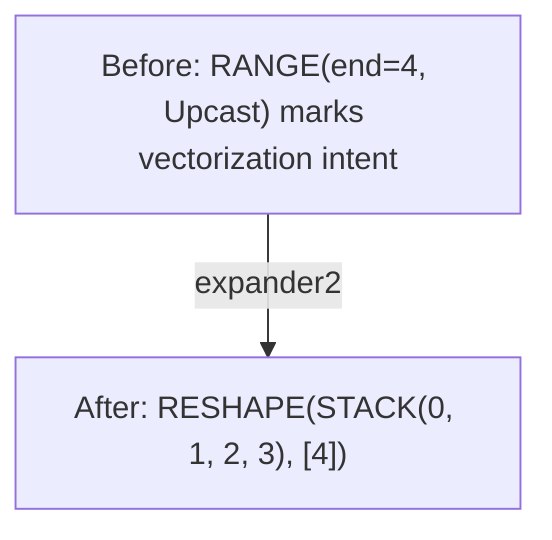
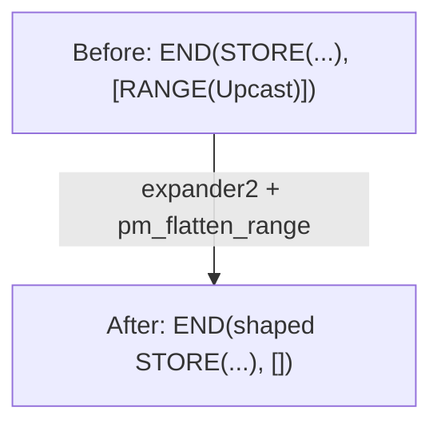
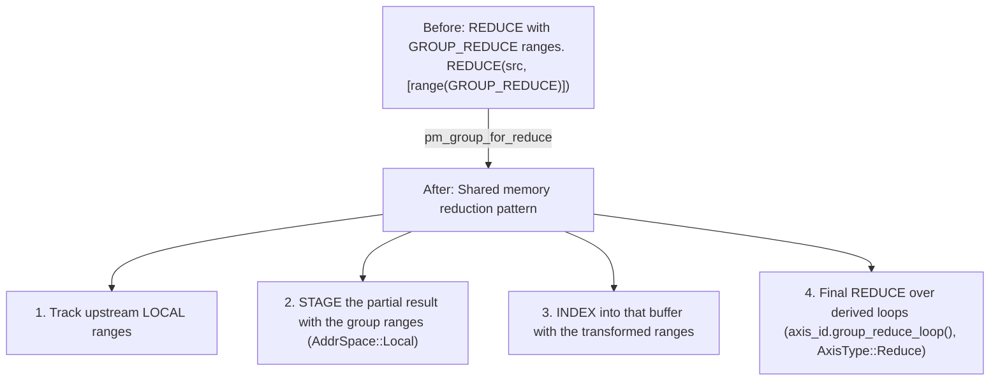

# 阶段 2：Expander

**目标**：将优化原语（UPCAST/UNROLL range）转换为显式的带形状操作。

---

## Stage 8：优化后符号化简

> **阶段速览**
>
> **目标**：优化之后的符号化简
> **关键模式**：WHERE 移动、常量折叠
> **影响**：改善 load 合并和向量化

**做了什么**：优化之后的符号化简，外加 WHERE 移动。

**为什么重要**：WHERE 操作类似于 `if` 语句。这个阶段把带索引读取外围的 `if` 检查移进索引表达式本身。硬件可以在条件为 false 时跳过加载，节省内存带宽。

**模式**：`sym + pm_move_where_on_load + pm_flatten_range + pm_reduce_unparented`（即 `POST_OPT_SYM` 匹配器）

```text
// Before: WHERE guards an indexed read
WHERE(cond, INDEX(buf, idx), 0)

// After: validity moved into INDEX
INDEX(buf, WHERE(cond, idx, Invalid))
```

将 validity 移入 INDEX 可以改善 load 合并和向量化。

**注意**：该模式仅在替代值为 `0` 时匹配；第二条分支用取反的条件处理颠倒形式 `WHERE(cond, 0, INDEX(...))`。变换涉及复杂的子句分析：重复检测、range 依赖检查和数据依赖 load 验证。

**注意**：Svod 把 validity 保留在索引表达式内部，形式为 `WHERE(cond, idx, Invalid)`。它要到很晚才在 `pm_move_gates_from_index`（`late/gater.rs`）中变成 LOAD/STORE 上的 `gate` 字段；INDEX 本身没有 gate 字段。

**Svod**：`symbolic/patterns.rs` 中的 `pm_move_where_on_load()`

---

## Stage 9：Expander

> **阶段速览**
>
> **目标**：将 UPCAST 和 UNROLL range 展开为带形状的 STACK 坐标
> **关键概念**：range 轴类型、STACK、INDEX、模式顺序
> **影响**：使向量化变得显式，为硬件做好准备

**做了什么**：将 UPCAST/UNROLL 的 range 分类转换为带形状的坐标。

**为什么重要**：UPCAST 和 UNROLL 标记的是意图——我们想做什么。这个阶段将意图变为显式，让硬件能够实际执行。

**模式**：`expander2 + pm_flatten_range + mop_cleanup_patterns`（入口点 `pre_expand()`）

注意：`pre_expand` 内部不运行任何符号化简匹配器。`sym` 已在 Stage 8 运行过，而 `symbolic_simple` 会在 Stage 13 和 14 再次运行。

⚠️ **重要：模式优先级**

这些模式被组合在一起运行直到不动点。顺序会影响当多个模式都能匹配时哪个先尝试：
1. `expander2` 优先（展开 UPCAST/UNROLL range、REDUCE 和 WMMA 操作数）
2. `pm_flatten_range` 其次（在 range 消失后重建 END 的 range 列表）
3. `mop_cleanup_patterns` 最后（清理展开留下的移动操作）

错误的优先级可能导致向量化或规约作用域不正确。

展开出来的 lane 用 `STACK` 收集，用 `INDEX` 选取。UPCAST 和
UNROLL 是 `RANGE` 上的 `AxisType`，而不是独立的操作。（`STACK` 是 Svod 对
Tinygrad 所称 VECTORIZE 的叫法；这里没有 VECTORIZE 操作。）

**UPCAST / UNROLL range → 带形状的坐标**：


Upcast 和 unroll range 走的是同一条路径——一条规则同时匹配这两种轴类型。
RANGE 节点本身被替换为一个带形状的常量坐标，于是每个消费它的操作都自然而然
变成带形状的。逐 lane 的操作要到 Stage 14 才由 `devectorize_alu` 具体化。

当我们说"操作被复制"时，听起来像是复制粘贴。但实际上不是。编译器创建的是单条 SIMD 指令，同时处理所有 N 个元素。把 SIMD 寄存器想象成一个装着 4 个数字的盒子；两个盒子相加就是 8 个数字同时相加。

**展开后的 END 交互**：


`pm_flatten_range` 会根据仍然可以通过 END 的源到达的 RANGE 节点，重建
END 的 range 列表。展开之后 upcast range 已经消失，因此这个列表变空。
逐 lane 的 store 会在 Stage 14 出现，并被包在 `GROUP` 里。

**GROUP_REDUCE 处理**（`pm_group_for_reduce`）：

GROUP_REDUCE 是张量核心规约的特殊轴类型：



这实现了通过共享内存进行高效的张量核心累加。虽然
`pm_group_for_reduce` 位于 `expand.rs` 中，但它被组合进了 `pm_reduce_local`，
因此是在移除规约期间触发，而不是在 `pre_expand` 内部。

**Svod**：`expand.rs`

---

## Stage 10：添加本地 Buffer

> **阶段速览**
>
> **目标**：为快速内存（共享 / L1）准备 buffer
> **关键模式**：本地 buffer 分配、移动操作下推
> **影响**：频繁访问的数据留在快速内存中

**做了什么**：把每个暂存的中间结果变成真正的本地 buffer。

**为什么重要**：**本地 buffer** = 靠近计算单元的快速内存：
- GPU：共享内存（LDS）——比全局内存快 100 倍
- CPU：L1 缓存——比主内存快 10 倍

编译器将频繁访问的数据移到本地 buffer，就像把重要文件放在桌面而不是网络驱动器上一样。

**模式**：`pm_add_local_buffers`

| 变换 | 用途 |
|-----------|---------|
| `add_local_buffer` | 为每个 STAGE 节点分配一个本地 `placeholder`，并把它重写成 INDEX / STORE / END / AFTER |
| `movement_op_patterns` | 下推移动操作，使新 buffer 的索引保持简单 |

**关于顺序的注意**：移除规约（Stage 11）实际上运行在本阶段*之前*——
`add_local_buffer` 消费的正是规约下降所产生的 STAGE 节点。
Tinygrad 对这两个 pass 的排序方式相同。

**Svod**：`optimizer/mod.rs`、`rangeify/patterns.rs`
