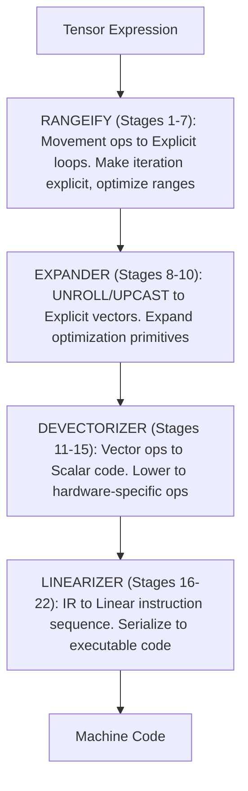

# UOp 之旅：22 阶段代码生成流水线

一个 UOp 从高层张量表达式出发。在到达硬件之前，它经历了 22 个不同的阶段——每个阶段都有特定的目的，每个阶段都建立在前一个之上。本章追踪这段旅程。

这条流水线是张量编译的成熟设计。理解它就是理解张量表达式如何变成机器码。

---

## 如何阅读本章

如果你不是编译器工程师，这一章可能看起来有些吓人。在深入之前，以下是你需要理解的关键概念。

### 关键概念

**UOp（微操作）**
- 把它想象成流程图中的一个节点，代表一次计算
- 例如：`ADD(a, b)` 表示"将 a 和 b 相加"

**Pattern（模式）**
- 针对代码结构（不是文本）的查找替换规则
- 例如："如果看到 ADD(x, 0)，替换为 x"
- 模式反复触发直到不再有匹配（不动点）

**Range（范围）**
- 一次循环迭代：`RANGE(0..10)` 表示"对 i 从 0 到 10"

**AxisType（轴类型）**
- 这是什么类型的循环？
  - Global：跨 GPU 块 / CPU 线程的并行
  - Local：工作组内的并行
  - Reduce：累加器（求和、求最大值等）
  - Loop：顺序迭代
  - Upcast / Unroll：被 expander 展开成一条条 lane

**Stage（阶段）**
- 对代码的一次变换 pass
- 模式触发直到不动点，然后进入下一个阶段

### 阅读策略

1. **第一遍**：只读"做了什么"和"为什么重要"部分
2. **第二遍**：看图示和示例
3. **第三遍**（如果你想深入细节）：阅读模式描述

### 要问的问题

对于每个阶段，问自己：
- 这个阶段完成了什么？（高层目标）
- 为什么需要这个阶段？（动机）
- 没有它会怎样？（后果）

---

## 概览

22 个阶段分为四个大的阶段：

每个阶段应用基于模式的重写。模式触发直到不动点，然后开始下一个阶段。

### 额外的 Pass

有几个 pass 在编号阶段之间运行，没有自己的阶段编号：

| Pass | 运行位置 | 用途 |
|------|---------------|------|
| `bool_storage_patterns` | Stage 14 内部 | 为内存操作在 bool 与 uint8 之间转换 |
| `indexing_simplify` | Stage 14 和 15 内部 | 折叠标量化暴露出来的寻址运算 |
| `sym()`（早期符号化） | 14–15 | 图变成标量之后做完整的符号化简 |
| `memory_coalescing` | 14–15 | 把相邻访问合并成更宽的访问 |
| `pm_simplify_add_image` | 14–15（自底向上） | image 数据类型的地址化简 |
| `pm_float_decomp` / `pm_long_decomp` | Stage 18 内部 | 模拟目标平台缺失的数据类型（FP8/BF16、64 位整数） |
| `pm_move_gates_from_index` | 18–19 | 把索引有效性移到 LOAD/STORE 的 `gate` 字段上 |
