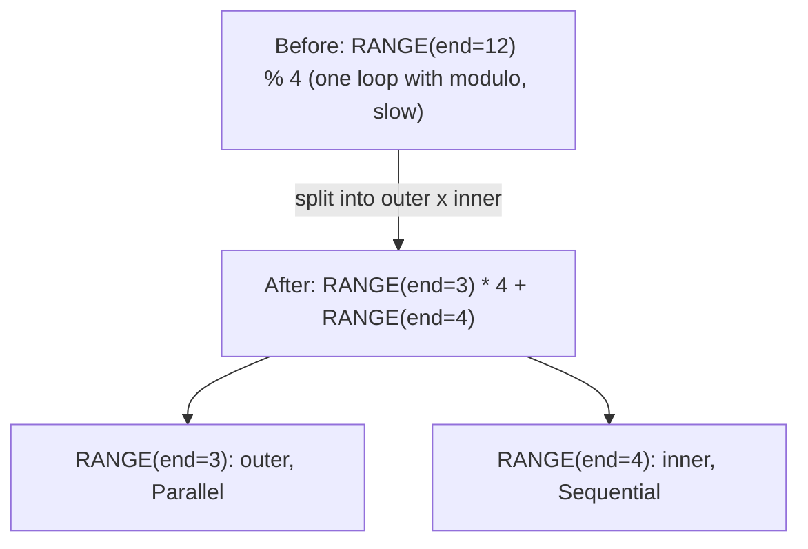
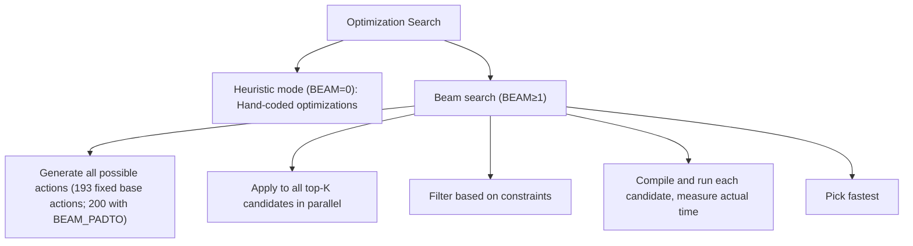

# 阶段 1：Rangeify

**目标**：将高层移动操作转换为显式循环结构，并优化 range。

---

## Stage 1：早期移动操作

> **阶段速览**
>
> **目标**：在 range 分配之前清理移动操作
> **关键模式**：INDEX 上的移动操作、穿过包装器的移动操作、嵌套 INDEX 简化
> **影响**：防止流水线后续阶段遗漏优化

**做了什么**：此阶段通过将索引操作推到实际需要的位置来清理移动操作。可以类比为在整理文件之前先清理桌面——把指令挪到数据实际使用的地方。

**为什么重要**：移动操作（RESHAPE、PERMUTE 等）是方便的抽象，但硬件需要具体的索引计算。尽早清理它们，可以确保后续阶段的模式能正确匹配。

**模式**：`movement_op_patterns()`（自底向上）

| 模式 | 变换 | 示意 | 位置 |
|----------|---------------|--------|----------|
| INDEX 上的移动操作 | 将移动应用到索引表达式 | `INDEX(PERMUTE(arr), [i, j]) → INDEX(arr, [j, i])` | `movement_op_patterns()` |
| 穿过 AFTER 的移动操作 | 将移动操作（或 INDEX）穿过时序包装器，保留每一个依赖 | `AFTER(RESHAPE(x, arg), deps) → RESHAPE(AFTER(x, deps), arg)` | `movement_op_patterns()` |
| 穿过 END 的移动操作 | 从 END 包装器中解除移动操作 | `END(RESHAPE(x), ranges) → END(x, ranges)` | `movement_op_patterns()` |

**为什么自底向上？** 子节点必须先清理好，父节点才能匹配。移动操作嵌套很深；从底部开始清理可以防止遗漏模式。

**注意**：`is_movement()` 恰好涵盖 RESHAPE、PERMUTE、EXPAND、PAD、SHRINK 和 FLIP。嵌套 INDEX 的展平（`INDEX(INDEX(ptr, i), j) → INDEX(ptr, i, j)`）*不*属于这个阶段；它位于 `mop_cleanup_patterns()` 中，随 Stage 9 的 expander 和 devectorizer 一起运行。

**Svod**：`rangeify/patterns.rs` 中的 `movement_op_patterns()`

---

## Stage 2：Load Collapse

> **阶段速览**
>
> **目标**：通过检测与 range 无关的计算来消除 REDUCE 操作
> **关键模式**：有界求和、门控 load collapse、通用 reduce 消除
> **影响**：将循环迭代转换为算术运算

**做了什么**：通过识别何时可以不迭代直接完成计算来消除 REDUCE 操作。使用与 range 无关的计算检测和符号化简。

**为什么重要**：将迭代转换为算术运算可以消除循环开销。与其运行 1000 次循环，不如直接算出答案。

**模式**：`pm_load_collapse`

```text
// Before: Sum with bounds check
sum(1 for k in 0..64 if k >= length)

// After: Compute count directly (NO LOOP!)
count = clamp(64 - length, 0, 64)
```

其机制是：
1. 识别不依赖 REDUCE range 的子表达式
2. 用携带其已证明的 vmin/vmax 的合成标量 PARAM 变量替换这些外部输入
3. 把替换后的主体包进一个在同一 range 上的合成 REDUCE，并运行 reduce-collapse 匹配器
4. 如果化简后的表达式不再包含 range，则 REDUCE 被消除（临时的 PARAM 会被替换回去）

**注意**：WHERE 穿过 INDEX 的移动（`pm_move_where_on_load`）是一个独立的优化，它在 Stage 8 运行，把条件以 `WHERE(cond, idx, Invalid)` 的形式嵌入到 `INDEX.indices[0]` 中。它不会消除 REDUCE 操作。

**Svod**：`rangeify/patterns.rs` 中的 `pm_load_collapse()`

---

## Stage 3：分割 Range

> **阶段速览**
>
> **目标**：通过 divmod 分解实现更好的优化
> **关键模式**：带取模的 range 分割、range 展平
> **影响**：内层 range 可向量化，外层可并行化

**做了什么**：通过将一个 range 分成外层和内层两部分来处理取模模式。

**为什么重要**：分割 range 就像分工——如果有 12 项任务，每人做 4 项，就变成 3 人 × 4 项。内层循环（一个人的 4 项）可以很快；外层循环（3 个人）可以并行运行。

**模式**：`pm_split_ranges + pm_flatten_range`



这使得：
- 内层 range 可向量化（SIMD）
- 外层 range 可并行化（GPU 块 / CPU 线程）

`pm_flatten_range` 会根据仍然可以通过 REDUCE 和 END 节点的源到达的 RANGE 节点，重新推导它们的 range 操作数列表。（合并 range 是 Stage 5 的工作。）

**上下文**：`SplitRangesContext` 标记每一处 `RANGE % const`；divmod 替换只在 SINK 处执行一次。

**注意**：分割仅在 `end % mod == 0`（整除检查）时适用。Warp 和 Device range 永远不会被分割，并且被 image STORE 索引的每一个 range 都会被固定住，不参与分割。

**Svod**：`rangeify/transforms.rs` 中的 `pm_split_ranges()` + `pm_flatten_range()`

---

## Stage 4：初始符号化简

> **阶段速览**
>
> **目标**：使用代数规则简化表达式
> **关键模式**：常量折叠、恒等消除、div-mod 重组
> **影响**：消除昂贵的操作，减少代码量

**做了什么**：应用 100 多条常量折叠和代数化简规则。

**为什么重要**：计算机擅长简单运算。除法和取余是慢操作。这个阶段用代数规则尽可能消除慢操作。

**模式**：`sym() + pm_fold_cast_const() + pm_flatten_range()`

注意：`symbolic()`（第 2 层）是 `sym()`（第 3 层）的严格子集；同一个 `sym` 会在 Stage 8 再次运行。

**常量折叠**：
```text
ADD(CONST(2), CONST(3)) → CONST(5)
MUL(x, CONST(1)) → x
ADD(x, CONST(0)) → x
```

**Div-mod 重组**：
```text
(x / c) * c + (x % c) → x
```
*为什么？* 用 3 个操作计算出与 `x` 相同的值。这个模式找到并消除这种冗余（常见于步长计算）。

**布尔代数**：
```text
x AND x → x
x OR FALSE → x
NOT(NOT(x)) → x
```

**其他类别**：
- 恒等消除（自折叠、冗余操作）
- 比较简化
- Cast 优化
- ALU/STACK 重排（`ALU(STACK, STACK) → STACK(ALU)`）
- Where 折叠（合并相同条件的 WHERE）
- Reduce mul 链（将乘法移到 reduce 外面）

**Svod**：`symbolic/patterns.rs` 中的 `sym()`

---

## Stage 5：简化 Range

> **阶段速览**
>
> **目标**：合并相邻 range 以减少循环开销
> **关键模式**：带成本分析的 range 合并
> **影响**：更少的循环 = 更少的开销

**做了什么**：在有利可图时合并相邻 range。

**为什么重要**：合并 range 就像把多趟小跑腿合成一趟。与其跑 4 趟买 4 样东西，不如一趟全买了。省去了启动和停止的开销。

**模式**：`pm_flatten_range() + pm_simplify_ranges()`

```text
// Before: two separate ranges
RANGE(0..4), RANGE(0..8)

// After: merged (if compatible)
RANGE(0..32)
```

`pm_simplify_ranges` 还会收窄那些被每个 INDEX 有效性门证明有界的 range。

合并条件：
1. 轴类型必须兼容（都是输出、都是 reduce 等）
2. REDUCE 作用域必须保持一致
3. **基于成本**：仅在 divmod 操作数量不增加时才接受

编译器只在能节省操作时才合并。合并可能需要除法/取模来重算索引。如果代价大于收益，就跳过合并。

**Svod**：`rangeify/transforms.rs` 中的 `simplify_merge_adjacent()`

---

## Stage 6：分割 Store

> **阶段速览**
>
> **目标**：在 STORE 边界分割图为独立内核
> **关键函数**：`split_all_stores()` + `split_store()`
> **影响**：支持逐内核优化

**做了什么**：在 STORE 边界分割 UOp 图，为每个输出创建独立的内核。

**为什么重要**：bufferization 之后，图可能包含多个 STORE 操作。每个 STORE 变成自己的内核，拥有自己的 buffer、range 和依赖集合。

**函数**：`schedule/src/rangeify/kernel.rs` 中的 `try_get_kernel_graph()`

在 `kernel_graph_pre_cut` 内部，当 STAGE 节点变成 STORE 之后，会在**整个图上执行一次** `pm_flatten_range` 预处理（自底向上）。这会在一次遍历中重新推导所有内核的 range 列表，避免在重叠子图上的重复工作。这个预处理是编译速度的关键优化——没有它，每个内核的 `split_store` 都会独立重新遍历共享子图。

预处理之后，`split_all_stores` 在 STORE 边界进行分割——每个内核通过 `LocalAddBufferContext::param_slot` 为自己的 PARAM 槽位编号——然后 `fix_assign` 连接内核之间的依赖，并拒绝依赖环。

---

## Stage 7：应用优化

> **阶段速览**
>
> **目标**：找到向量化、展开、内存使用的最优组合
> **关键算法**：Beam search 或启发式搜索
> **影响**：可以显著提升性能

**做了什么**：优化搜索——无论是 beam search 还是启发式——探索不同的优化动作组合。

**为什么重要**：编译器尝试不同的优化组合（这里向量化？那里展开？），然后选最快的。找到正确的组合可以让代码快 10 倍。

**函数**：`optimize_kernel(ast, renderer)`

**优化动作**：

| 动作 | 效果 | 硬件目标 |
|--------|--------|-----------------|
| TC | 启用张量核心 | NVIDIA、AMD、Apple Metal 与 Intel GPU |
| UPCAST | 向量化某个维度 | 全部（SIMD） |
| LOCAL | 使用本地/共享内存 | 仅 GPU（需要 `has_local`） |
| UNROLL | 展开某个循环维度 | 全部（避免循环开销） |
| GROUP | 分组 reduce 的内层分割 | GPU（共享内存；应用 TC 后被拒绝） |
| GROUPTOP | 分组 reduce 的外层分割 | GPU（共享内存；应用 TC 后被拒绝） |
| THREAD | 基于线程的并行 | CPU |
| NOLOCALS | 禁用本地内存使用 | 全部（约束，阻止后续 LOCAL 动作） |
| SWAP | 交换两个 Global range 分配 | GPU/CPU 全局轴（尝试不同 tiling） |
| PADTO | 对齐填充 | 全部（内存对齐） |

**优化搜索详解**：

编译器搜索最优组合：
- **启发式模式**（BEAM=0）：快速的手写优化模式，无需编译
- **Beam search**（BEAM≥1）：编译并运行候选方案来测量实际性能



**注意**：NOLOCALS 是一个约束，设置 `dont_use_locals = true`，阻止后续 LOCAL 动作并影响共享内存使用决策。它不属于基础动作列表——启用时会为每个候选方案追加。

**Svod**：`optimizer/mod.rs`、`optimizer/opts.rs`
