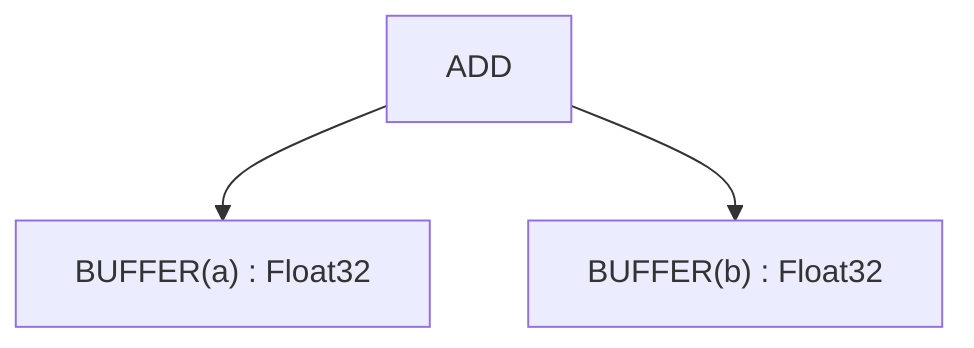
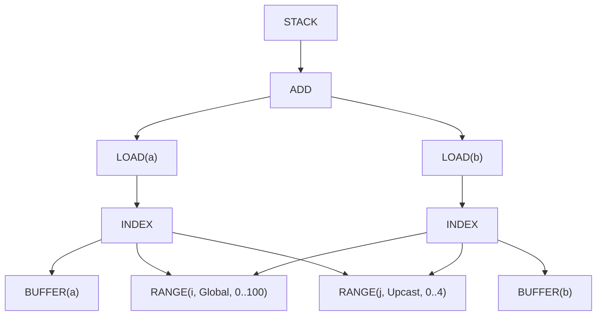
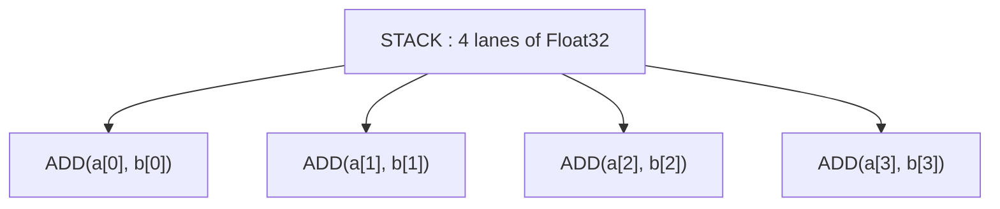

# 实例演练与参考

---

## 实例演练：遍历全部 22 个阶段

让我们追踪 `c = a + b`（其中 a、b 是 [100, 100] 的张量）在流水线中的全过程。

### 初始张量图


### Stage 1 之后：早期移动操作
（无变化——此示例中没有移动操作）

### Stage 2 之后：Load Collapse
（无变化——此示例中没有规约）

### Stage 3 之后：分割 Range
（无变化——没有取模运算）

### Stage 4 之后：初始符号化简
（无变化——不需要化简）

### Stage 5 之后：简化 Range
（无变化——还没有相邻 range）

### Stage 6 之后：分割 Store
（不适用——GPU 后端）

### Stage 7 之后：应用优化
应用的优化动作：
- 对 j 维度 UPCAST 4（向量化）
- 对输入 buffer 使用 LOCAL（如果有利）

### Stage 8 之后：优化后符号化简
无变化——符号已经是干净的。

### Stage 9 之后：Expander
UPCAST 展开直接用 STACK/INDEX 结构来表示：


注意：共享的 range 和索引表达式会通过 hash consing 去重。

### Stage 10 之后：添加本地 Buffer
（如果选择了 LOCAL 优化）

### Stage 11 之后：移除 Reduce
（无变化——没有规约）

### Stage 12 之后：添加 GPU 维度
```
[SPECIAL(gidx0)] : WeakInt  // replaces RANGE(i)
```

### Stage 13 之后：添加 Load
（无变化——load 已经存在）

### Stage 14 之后：Devectorize
devectorize 之后的向量结构（展示效果，不是精确的 UOp 结构）：


### Stage 15 之后：降低 Index DType
```
[SPECIAL(gidx0)] : i32  // concrete type
```

### Stage 16 之后：索引降低后符号化简
不需要变化。

### Stage 17 之后：Pre-Matcher
（标准后端没有模式）

### Stage 18 之后：分解
不需要分解——所有操作都支持。

### Stage 19 之后：最终重写
不需要变化。

### Stage 20 之后：添加控制流
依赖已追踪——没有问题。

### Stage 21 之后：线性化
线性指令序列（简化）：
```
1. PARAM(0)  // Output buffer c
2. PARAM(1)  // Input buffer a
3. PARAM(2)  // Input buffer b
4. RANGE(i, 0..100, Global)  // gidx0
5. LOAD(a, i*4+0..i*4+3)  // Vector load (vec4)
6. LOAD(b, i*4+0..i*4+3)  // Vector load (vec4)
7. ADD(vec_a, vec_b)  // Vector add (vec4)
8. STORE(c, i*4+0..i*4+3, result)  // Vector store
9. END(RANGE(i))
```

注意：UPCAST 已在 Stage 9（expander）中被消耗，所以没有单独的 RANGE(j) 循环。向量化隐含在 vec4 操作中。

### Stage 22 之后：清理 IF/ENDIF
不需要变化——没有门控 store。

**结果**：代码生成就绪！LLVM/CUDA 或其他后端会将其编译为实际的机器码。

---

## 模式应用策略

每个阶段使用以下两种重写策略之一：

**自顶向下**（默认）：先处理父节点再处理子节点。当变换会创建新的可匹配子项时使用。

**自底向上**：先处理子节点再处理父节点。当子节点状态影响父节点匹配时使用（Stage 1、20）。

两者都迭代到不动点——模式持续触发直到没有更多匹配。

---

## 调试流水线

当内核产生错误结果时，bug 在这 22 个阶段中的某一个。每个阶段都通过 `tracing` 记录自己的 UOp 树；`scripts/extract-ir.sh` 会把这些日志变成可读的转储：

```bash
# See IR after each transformation
./scripts/extract-ir.sh failing_test -p svod-tensor -o /tmp/ir.txt

# Or dump a single stage straight to stderr (no tracing subscriber needed)
SVOD_PER_STAGE_UOPS=1 SVOD_DUMP_STAGE=09 cargo test failing_test -- --nocapture
```

### 速查表

| 现象 | 可能的阶段 | 检查什么 |
|---------|---------------|---------------|
| 输出值错误 | 4, 9, 11, 18 | 符号化简、展开、devectorization |
| 性能差 | 7, 9, 14, 21 | 优化、展开、devectorization、线性化 |
| 崩溃/panic | 11, 12 | Reduce、GPU 维度 |
| 循环次数错误 | 3, 5, 12 | 分割 range、简化 range、GPU 维度 |
| 缺少向量化 | 9, 14 | Expander、devectorizer |

### 常见问题

1. **Stage 3-4**：Range 分割/符号化简可能丢失约束
2. **Stage 9**：展开顺序影响向量化正确性
3. **Stage 11**：累加器初始化必须匹配规约的单位元
4. **Stage 14**：硬件宽度不匹配——检查向量折叠长度
5. **Stage 18**：缺少分解——检查后端的 supported_ops 列表
6. **Stage 21**：优先级 bug 导致数据竞争——验证依赖关系

---

## 总结

22 阶段流水线通过系统化的精炼将张量表达式变换为机器码：

1. **Stages 1-7**：显式化迭代，优化 range
2. **Stages 8-10**：展开优化原语
3. **Stages 11-15**：降低到硬件特定操作
4. **Stages 16-22**：序列化为可执行指令

每个阶段有单一职责。每个阶段建立在前一个之上。结果是：高层张量代码在各种硬件上以接近最优的速度运行。

---

## Tinygrad 与 Svod：架构差异

本章描述的是基于 Tinygrad 实现的"理想" 22 阶段流水线。Svod 目前紧密遵循此设计，差异极小。

### 剩余的架构差异

| 阶段 | Tinygrad | Svod | 备注 |
|--------|-----------|-------|--------|
| 17: Pre-Matcher | 后端钩子集中在一个 `Renderer` 类上 | 拆成两个 trait：`svod_codegen::traits::Renderer` 负责渲染，`svod_device::device::Renderer` 承载 `decompositor()`、`extra_matcher()`、`pre_isel_matcher()`、`isel_matcher()` | 钩子相同，归属不同 |

### 已对齐的阶段（此前不同）

以下阶段在本次实现中已与 Tinygrad 对齐：

| 阶段 | 变更内容 |
|-------|--------------|
| 15: Index DType 降低 | Svod 现在有 `pm_lower_index_dtype()`，完整覆盖：Binary 操作、CONST/VCONST、WHERE、STACK、SPECIAL、PARAM、RANGE、双重弱 CAST |
| 18: 分解 | 新增：`fast_division_patterns()`、`pm_div_to_shr()`、`pm_fdiv_to_mul()`、`pm_comparison_negations()`、德摩根定律 |
| 19: 最终重写 | `renderer.extra_matcher()` 和 `pm_split_ends()` 被汇总进 schedule 流水线的最终重写，而不再在 codegen 中运行 |

### 仅 Tinygrad 的模式

Svod 有意不实现以下 Tinygrad 特有模式：

| 模式 | 用途 | Svod 为何不需要 |
|----------|-----------|-----------------------------|
| `pm_regalloc_rewrite` | 面向 ISA 后端的线性扫描寄存器分配 | Svod 发射的是 LLVM IR / 源码，寄存器分配属于后端编译器的工作 |

### Svod 增强

Svod 有一些 Tinygrad 没有的模式/增强：

| 增强 | 位置 | 用途 |
|-------------|---------|---------|
| 通过 `uint8` 存储 bool | `devectorize.rs` 中的 `bool_storage_patterns()` | LLVM 的 `i1` 高位可能带有垃圾数据，因此 bool 的 LOAD/STORE 通过 `uint8` 进行 |
| 宽浮点降级 | `late/dtype.rs` 中的 `demote_unsupported_floats()` | 没有宽浮点的渲染器（Metal、WebGPU）用 f32 计算内部的 f64 |

---

## 术语表

| 术语 | 简单定义 | 示例 |
|------|------------------|---------|
| **累加器** | 保存运行总和的变量 | `acc = acc + value`（在规约中） |
| **轴** | 张量的一个维度 | Shape [100, 200] 有 2 个轴 |
| **AxisType** | 循环的执行方式 | Global=并行，Reduce=累加 |
| **Buffer** | 保存数据的已分配内存 | 张量的数据存在 buffer 中 |
| **Bufferize** | 将结果存到内存而非按需计算 | 物化中间值 |
| **Devectorize** | 分割向量以匹配硬件 | `vec8 → vec4, vec4` |
| **Divmod** | 除法和取余运算 | `x // 7, x % 7` |
| **不动点** | 模式应用不再改变任何东西时 | 模式触发直到不动点 |
| **STACK** | 把多条 lane 收集成一个带形状的值（Tinygrad 的 VECTORIZE） | `STACK(a, b, c, d)` |
| **Hash consing** | 复用相同的表达式 | `ADD(x, 0) + ADD(x, 0)` 共享内存 |
| **WeakInt** | 索引使用的抽象整数类型，在 Stage 15 降低 | i32 或 i64，取决于已证明的取值范围 |
| **Load** | 从内存读取 | `value = arr[i]` |
| **Pattern** | 代码的查找替换规则 | `ADD(x, 0) → x` |
| **谓词写入** | 条件性写入内存 | 有效则写，否则跳过 |
| **Range** | 循环迭代规格 | `for i in 0..100` |
| **规约** | 将多个值合并为一个 | 求和、求最大值、求最小值 |
| **Store** | 写入内存 | `arr[i] = value` |
| **符号化简** | 使用代数规则简化 | `(x/4)*4 → x`（当 `x%4=0` 时） |
| **张量核心** | 快速矩阵乘法的硬件 | NVIDIA、AMD、Apple Metal、Intel Xe |
| **拓扑排序** | 按依赖排序节点 | 如果 B 用了 A 的结果，A 排在 B 前面 |
| **UNROLL** | 标记某个循环要被展开的轴类型 | `RANGE(0..4, Unroll)` |
| **UPCAST** | 标记向量化意图的轴类型 | `RANGE(0..4, Upcast)` |
| **向量化** | 同时处理多个值 | SIMD：一次加 4 个数 |
| **WHERE** | 条件选择 | `WHERE(cond, x, y) = x if cond else y` |
