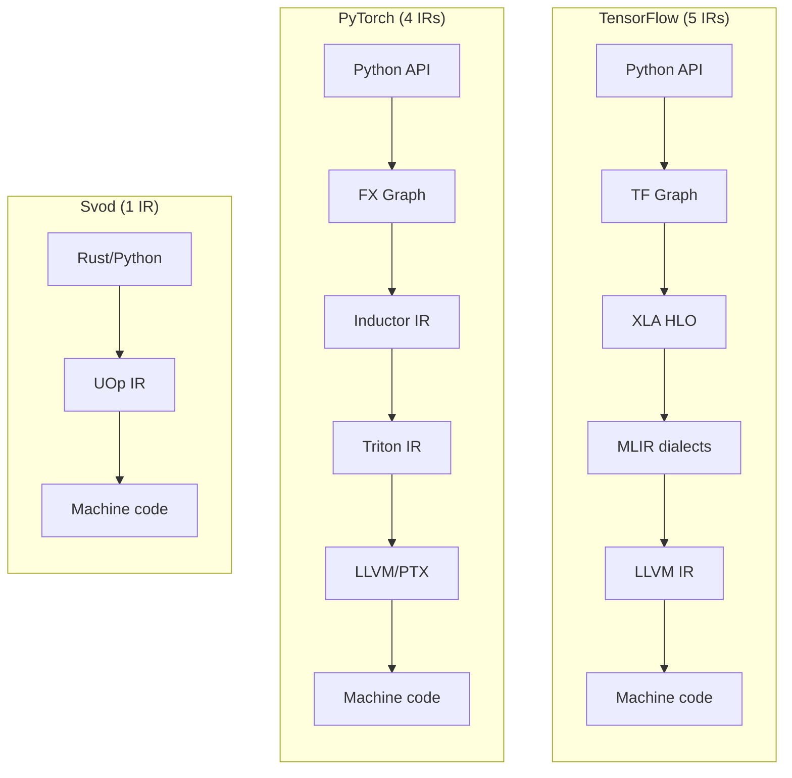
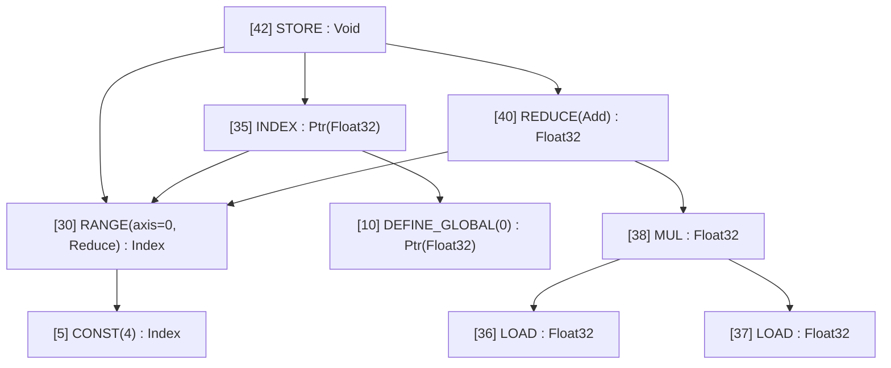
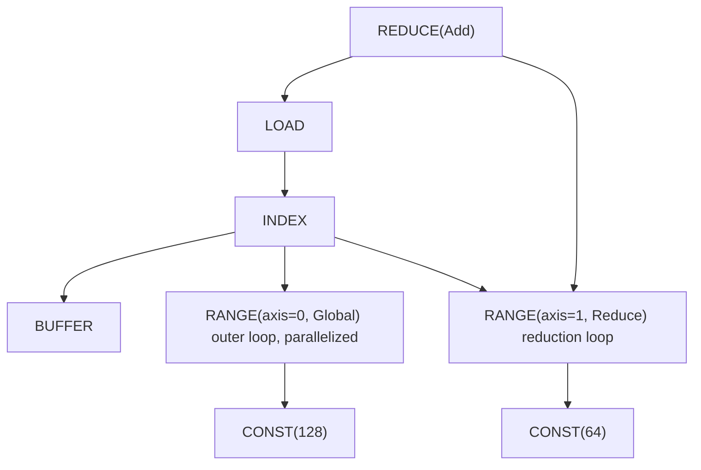
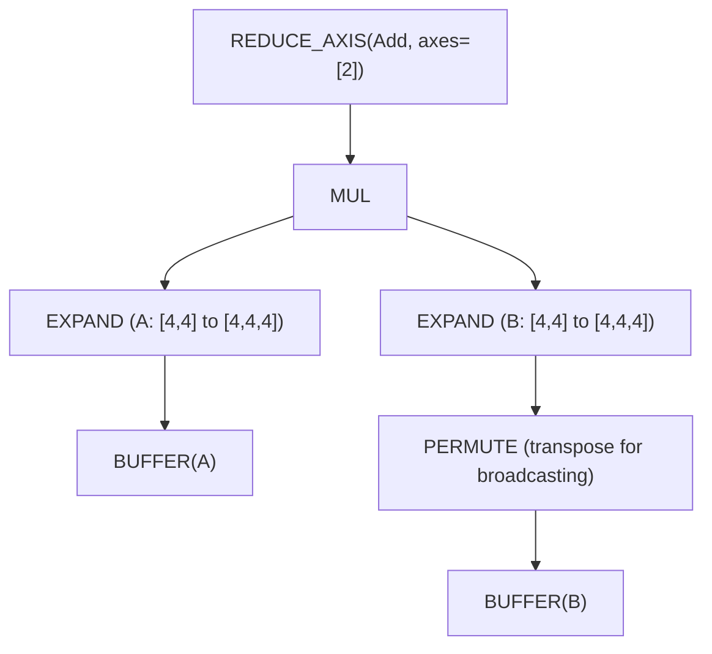
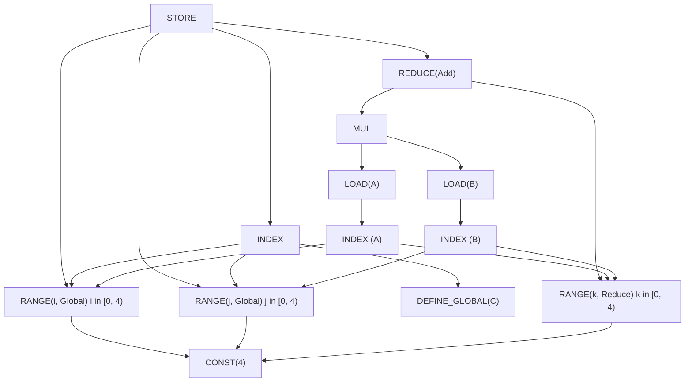

# 一个 IR 统治一切

你正在调试一个慢模型。Profiler 说"kernel X 花了 200ms"，但你完全不知道 kernel X 到底*做了什么*。你翻遍 PyTorch 的 dispatcher，然后是 ATen，然后是 TorchInductor，然后是 Triton IR，最后到达 LLVM IR。五种不同的表示，五种不同的心智模型，五种不同的调试工具。

这就是现代 ML 编译的现实。TensorFlow 的 XLA 也类似：Python → Graph → XLA HLO → MLIR → LLVM IR。每一层都是为了解决真实问题而添加的，但累积的复杂度令人咋舌。

Svod 采用了不同的方案，借鉴自 [Tinygrad](https://github.com/tinygrad/tinygrad)：**从张量到机器码，只用一个 IR**。



最简单的架构往往胜出。本章解释一个精心设计的 IR 如何替代整个编译器栈。

---

## UOp：通用节点

**UOp**（微操作）是计算图中的节点。但与其他 IR 中的节点不同，UOp 能表示*任何*抽象层级的操作——从高层张量 reshape 到底层 CPU 指令。

核心洞察是：与其为"张量操作"、"循环结构"和"内存访问"维护各自独立的 IR，不如把它们放进同一个 enum：

```rust
pub enum Op {
    // High-level tensor operations
    Reshape { src: Arc<UOp>, new_shape: Arc<UOp> },
    Permute { src: Arc<UOp>, axes: Vec<usize> },
    ReduceAxis { src: Arc<UOp>, reduce_op: ReduceOp, axes: Vec<usize> },

    // Loop-level control flow
    Range { end: Arc<UOp>, axis_id: AxisId, axis_type: AxisType },
    End { computation: Arc<UOp>, ranges: SmallVec<[Arc<UOp>; 4]> },

    // Memory operations
    Load { buffer: Arc<UOp>, index: Arc<UOp> },
    Store { buffer: Arc<UOp>, index: Arc<UOp>, value: Arc<UOp>, ... },

    // ALU operations (same as hardware)
    Binary(BinaryOp, Arc<UOp>, Arc<UOp>),  // Add, Mul, etc.
    Unary(UnaryOp, Arc<UOp>),              // Sqrt, Exp, etc.
}
```

这个 enum 包含约 80 个变体，按抽象层级组织：

| 类别 | 示例 | 表示什么 |
|----------|----------|-------------------|
| **变换** | `RESHAPE`, `PERMUTE`, `EXPAND`, `PAD` | 张量形状变换 |
| **规约** | `REDUCE_AXIS`, `REDUCE` | 数学聚合运算 |
| **控制** | `RANGE`, `END`, `IF`, `BARRIER` | 循环和分支结构 |
| **内存** | `LOAD`, `STORE`, `INDEX`, `BUFFER` | 硬件内存访问 |
| **ALU** | `ADD`, `MUL`, `SQRT`, `EXP`, `WHERE` | CPU/GPU 指令 |
| **高级** | `WMMA`, `CONTRACT`, `UNROLL` | Tensor core、向量化 |

打印 UOp 图时，你会看到它的树形结构：



注意到指向"same as above"的箭头了吗？这不仅仅是打印格式——它是一个叫做 **hash consing** 的基本属性。

---

## Hash Consing：结构共享

在 Svod 中创建同一个表达式两次，你会得到*同一个指针*。不是值相等——而是同一个内存地址。

```rust
let a = UOp::binary(Add, x.clone(), y.clone());
let b = UOp::binary(Add, x.clone(), y.clone());

assert!(Arc::ptr_eq(&a, &b));  // Same pointer!
```

:::note 来源是节点身份的一部分
开启 `SVOD_ORIGIN=1` 后，节点还会带上构建时所处的 `OriginScope`，并把它折进自己的内容哈希。于是在不同作用域下构建的两个相同子图成了*不同*的节点，在内核切分剥除来源之前一直不共享。字面量是例外，`BUFFER`/`PARAM`/`UNIQUE` 也一样：同一个常量本就由两个作用域各自独立构建，给它带上来源只会拆出一个切分之后又要合并回去的节点。相关取舍参见[剖析与基准测试内核](../tile-kernels/profiling.md#attributing-kernels-to-model-code)。
:::

这通过全局缓存实现。构造 UOp 时先检查是否已有相同的：

```rust
pub fn new(op: Op, dtype: DType) -> Arc<Self> {
    let key = UOpKey::new(&op, dtype);

    // Check cache first
    if let Some(existing) = CACHE.get(&key) {
        return existing;
    }

    // Create new and cache it
    let uop = Arc::new(UOp { op, dtype, ... });
    CACHE.insert(key, uop.clone());
    uop
}
```

这对 ML 工程师意味着什么？

- **指针相等即语义相等。** 检查两个子表达式是否相同，只需比较指针：`Arc::ptr_eq(&a, &b)`。无需遍历整棵树。

- **模式匹配是 O(1) 的。** 当优化器问"之前见过这个模式吗？"时，指针比较立刻给出答案。

- **内存高效。** 公共子表达式（例如 attention 和梯度图中的共享计算）只存储一次，不会被复制。

- **线程安全。** 不同线程中的相同计算会产生同一个对象——没有同步 bug。

树形打印展示了这一点：当你看到 `[10] → (same as above)` 时，那不是拷贝——而是从多处引用的*同一个节点*。

---

## 显式循环：`RANGE` 操作

大多数 ML IR 将循环隐藏在操作内部。在 ONNX 中，一个规约看起来是这样：

```python
ReduceSum(data, axes=[1], keepdims=0)
```

循环在哪里？它是隐式的——藏在运行时 `ReduceSum` 实现的某处。你看不到它，改不了它，也无法推理它。

Svod 用 `RANGE` 操作使循环*显式化*。同样的规约变成：



每个 `RANGE` 都有一个 **AxisType**，告诉代码生成器如何编译它：

| AxisType | CPU | CUDA | 含义 |
|----------|-----|------|---------|
| **Loop** | `for` 循环 | `for` 循环 | 顺序迭代；rangeify 默认 |
| **Global** | 线程池 | `blockIdx` | 外层并行维度 |
| **Thread** | 线程池 | — | CPU 并行 |
| **Warp** | (N/A) | warp/wavefront | 子组并行 |
| **Local** | (N/A) | `threadIdx` | 工作组并行 |
| **GroupReduce** | (N/A) | 共享内存 | 两阶段规约 |
| **Upcast** | SIMD 向量 | 寄存器 tile | 向量化 |
| **Reduce** | 累加器 | Warp reduce | 规约维度 |
| **Unroll** | 展开 | 展开 | 循环展开 |

AxisType 层次结构（Loop → Global/Thread → Warp → Local/GroupReduce → Upcast → Reduce → Unroll）映射到硬件执行模型——外层循环的优先级数值更小。`AxisType::Global` 的 `RANGE` 在 CUDA 中变成 `blockIdx.x`。`AxisType::Local` 的 `RANGE` 变成 `threadIdx.x`。

为什么显式循环重要：

- **优化是可见的。** 你能*看到*哪些循环会被并行化、哪些会被展开、哪些会使用 SIMD。

- **调度就是图重写。** 改变循环顺序、分块或展开只是模式变换——不需要专门的"调度 pass"。

- **每个阶段都是同一个 IR。** 在张量层面代表"遍历 batch 维度"的 `RANGE`，就是在生成代码中变成 `for (int i = 0; i < N; i++)` 的*同一个* `RANGE`。

---

## 图重写：统一的变换机制

传统编译器有几十个专用 pass：常量折叠、死代码消除、循环展开、算子融合。每个 pass 都有自己的逻辑、数据结构和 bug。

Svod 只用一种机制：**基于模式的图重写**。

```rust
patterns! {
    // Identity folding: x + 0 → x
    Add[x, @zero] => x,

    // Constant folding: 3 + 4 → 7
    Add(a @const(a_val), _b @const(b_val))
        => eval_add(a_val, b_val).map(|r| UOp::const_(a.dtype(), r)),

    // Self-folding: x / x → 1
    Idiv(x, x) => UOp::one(x.dtype()),

    // Dead code: if(true) { x } else { y } → x
    Where(Const(ConstValue::Bool(true)), t, _f) => t,
}
```

这个 DSL 表达力强：

- **`[x, y]` — 交换律。** 尝试两种顺序（用于 `ADD`、`MUL` 等）
- **`(x, y)` — 有序。** 严格匹配这个顺序。
- **`@zero`, `@one` — 语义常量。** 对任何 DType 有效。
- **`c @const(val)` — 提取值。** 用于编译期计算。
- **`x, x` — 同一操作数。** 检测指针相等。
- **`=>` — 重写。** 返回 `Arc<UOp>`、`Option<Arc<UOp>>`（`None` 表示放弃）或 `RewriteResult`。

重写引擎自底向上应用模式直到没有更多匹配：

```text
Original:       Add(Mul(x, 1), 0)
After Mul:      Add(x, 0)         # Mul(x, 1) → x
After Add:      x                 # Add(x, 0) → x
```

这一种机制处理了：

- **代数化简** — 常量折叠、恒等消除
- **Rangeify 变换** — 变换操作 → 显式循环
- **Kernel 优化** — 向量化、展开、tensor core
- **代码生成** — 降级到硬件原语

同样的模式，同样的引擎，不同阶段用不同的模式集。

---

## 完整示例：矩阵乘法之旅

追踪 `C = A @ B`（4×4 矩阵乘法）通过整个流水线。

### 阶段 1：张量构建

当你写 `A.matmul(&B)` 时，Svod 构建一个高层 UOp 图：



这是纯数学表达："扩展 A 和 B 以对齐维度，逐元素相乘，沿收缩轴求和。"

### 阶段 2：Rangeify

Rangeify pass 将变换操作（`EXPAND`、`PERMUTE`）转换为带有 `RANGE` 循环的显式索引计算：



现在可以看到循环结构：`i` 和 `j` 是 `Global`（并行化），`k` 是 `Reduce`（累加）。

### 阶段 3：符号化简

模式重写清理冗余操作，折叠常量，简化索引算术。

### 阶段 4：代码生成

最终 IR 直接转换为循环：

```c
// GPU kernel (conceptual)
__global__ void matmul(float* C, float* A, float* B) {
    int i = blockIdx.x;   // from RANGE(i, Global)
    int j = blockIdx.y;   // from RANGE(j, Global)
    float acc = 0.0f;
    for (int k = 0; k < 4; k++) {  // from RANGE(k, Reduce)
        acc += A[i*4 + k] * B[k*4 + j];
    }
    C[i*4 + j] = acc;
}
```

关键观察：**每个阶段的结构都是可见的**。没有神秘的融合 pass 把三个嵌套循环变成面目全非的东西。你在阶段 2 看到的 `RANGE` 结构，就是阶段 4 中变成循环的那些。

---

## 对比：其他 IR 的差异

不同的 IR 做了不同的取舍。以下是对比：

| 方面 | ONNX | XLA HLO | Triton | **Svod** |
|--------|------|---------|--------|-----------|
| **定位** | 模型交换格式 | 后端优化 | GPU kernel DSL | 完整编译 |
| **算子** | ~200 高层 | ~100–150 高层 | Tile 操作 | ~80 多层级 |
| **循环模型** | 隐式 | 隐式 | 基于 Tile | **显式 `RANGE`** |
| **内存** | 纯值 | 纯值 → buffer | 显式指针 | **显式 `LOAD`/`STORE`** |
| **优化** | 无 | 专用 pass | MLIR 模式 | **统一重写** |
| **目标** | 运行时引擎 | CPU/GPU/TPU | 仅 GPU | CPU/GPU |

**ONNX** 最大化可移植性。`Conv` 和 `MatMul` 等操作隐藏了所有实现细节。很适合模型交换，但看不到的东西没法优化。

**XLA HLO** 是函数式的、纯的——没有副作用，张量不可变。这使代数优化成为可能，但在代码生成前需要单独的"buffer 分配"阶段。从 HLO 到 LMHLO（基于 buffer）的转换是一个根本性的边界。

**Triton** 暴露的比 ONNX 多但比 Svod 少。你写"tile 级别"的代码——对数据块的操作——编译器处理线程级细节。内存是显式的（`tl.load`、`tl.store`），但 tile 内的并行化是隐式的。

**Svod** 暴露一切：循环是显式的（`RANGE`），内存是显式的（`LOAD`/`STORE`），并行化是显式的（`AxisType`）。这意味着需要学更多，但没有东西被隐藏。

---

## 为什么这很重要：实际好处

Svod 透明的 IR 对 ML 工程师有实际好处：

**调试是直接的。** 在任何阶段打印图：

```rust
println!("{}", tensor.uop().tree());
```

你会看到确切存在哪些操作、它们如何连接、计算在哪里发生。没有"kernel X"的谜团。

**性能调优有据可循。** 查看哪些循环被并行化了：

```text
[RANGE(batch, Global)]    # parallelized across GPU blocks
[RANGE(channel, Local)]   # parallelized within blocks
[RANGE(pixel, Loop)]      # sequential — might be slow!
```

如果某些东西应该并行但没有，你能看到。

**心智模型很简单。** 只有一个 IR、一种变换机制、一组操作。你不需要同时学习 XLA HLO *和* MLIR *和* Triton *和* LLVM。只需要 UOp。

**优化是可组合的。** 想添加自定义重写？加一个模式：

```rust
patterns! {
    // Your custom optimization
    MyPattern(x, y) => better_version(x, y),
}
```

它和常量折叠、融合以及其他所有优化使用同一个引擎。

---

## 更深层的洞察

Svod/Tinygrad 证明了编译器的复杂度通常是*偶然的*，而非本质的。TensorFlow 和 PyTorch 中的多层 IR 栈是有机积累的——每一层都解决了实际问题，但组合起来的系统比任何单个部分都更难理解。

一个设计精良的 IR、一种变换机制和有原则的组合，可以替代数千行专用 pass。这是 Unix 哲学在编译器中的应用：做好一件事，然后组合。

代价是显式性——你会看到其他 IR 隐藏的循环、内存访问和并行化提示。但可见性是特性，不是缺陷。当你的模型运行缓慢时，你想*看到*原因，而不是寄希望于编译器自己搞定。

这就是 Svod 的赌注：透明的复杂度胜过隐藏的复杂度。
