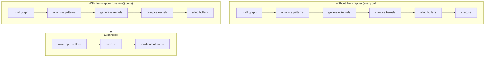

# JIT 图

一个流式 ASR 流水线会数百次调用同一个 encoder。每次调用都构建张量图、优化它、生成内核源码、通过后端的 [JIT 加载器](../backends/jit-loader.md) 编译，再分配设备缓冲区——这些工作并不依赖输入，纯粹是浪费。

`jit_wrapper!` 宏与 `model::jit` 运行时层把这种"构建一次 / 多次运行"的模式变成**一个带类型的 Rust 结构体**。你声明输入和图；宏生成的包装器在 `prepare()` 期间编译图一次，并在每次 `execute()` 时使用就地保存的设备缓冲区重放它。



该包装器与[模式引擎](./optimizations/pattern-system.md)（在 `prepare()` 时运行）和 [JIT 加载器](../backends/jit-loader.md)（将优化后的内核转换为内存中的机器码）协同工作。本页介绍位于两者之上的包装器层。

---

## `jit_wrapper!` DSL

一个包装器声明给出结构体名、build 闭包接收的模型类型、包装器对外暴露的输入、可选的符号化形状变量，以及一个用于构造图的 `build` 块：

```rust
jit_wrapper! {
    MyModelJit(MyModel) {
        input1: Tensor,
        input2: Tensor,

        vars {
            b: (1, max_batch),
            t: (1, max_time),
        }

        build(input1, input2, b, t) {
            model.forward(input1, input2, &b, &t)
        }
    }
}
```

| 区段 | 含义 | 是否必需 |
|---|---|---|
| `WrapperName(ModelType) { ... }` | 生成的结构体名以及 build 闭包接收的模型类型 | 是 |
| `input_name: Tensor` 行 | 每行声明包装器暴露的一个输入；`: Tensor` 标注仅作提示 | 可选（通常一个或多个） |
| `inputs { ... }` | 同样的输入槽，但写在一个块里，其中还可以使用 `#[unbatched]` 和 `[Tensor; N]` | 可选 |
| `vars { name: (min, max), ... }` | 带编译期边界的符号化形状变量 | 可选 |
| `batch_var name: (min, max)` | 一个变量，并且会把每个批量输入的第 0 维收缩到它 | 可选 |
| `state { name, ... }` | plan 同时也会写入的输入，在多次调用之间就地复用 | 可选 |
| `outputs { name, ... }` | 每个输出对应一个具名的缓冲区访问器；`build` 闭包随后按这个顺序返回同样数量张量的元组 | 可选 |
| `build(args...) { ... }` | 从输入和变量构造输出张量的闭包；`model` 在作用域内 | 是 |

`build` 的每个参数必须命名为一个输入或一个已声明的变量（宏会在展开时拒绝匹配不上的名字）。在块内部，每个输入是 `&Tensor`——数组槽则是 `[&Tensor; N]`——（宏会在 `prepare()` 运行时为每个缓冲区分配一个零初始化的占位符），每个变量是一个已绑定到其上界的 `svod_tensor::BoundVariable`——以 `&name` 的形式继续往下传——而 `model` 是对包装器所拥有的模型值的共享引用。闭包返回 `Result<Tensor, E>`，其中 `E: std::error::Error + Send + Sync + 'static`；失败会以 `JitError::Build` 形式呈现。

没有 `outputs` 块时，闭包返回单个 `Tensor`，通过 `output()` 取用。有 `outputs` 块时，闭包返回恰好那么多张量的元组，每个张量按声明顺序获得属于自己的具名 `&Buffer` 访问器。如果调度器把其中之一融合掉或消去了，这些按位置对应的访问器就会悄悄错位，因此 `prepare()` 转而以 `JitError::OutputCountMismatch` 失败。

---

## 数组槽、batch 变量与状态

块形式的声明补上了流式模型需要的三样东西。它们全都是可选的；按更早的扁平形式写成的包装器不加改动仍可继续工作。

```rust
jit_wrapper! {
    StepJit(StepModel) {
        inputs {
            x: Tensor,
            #[unbatched] bias: Tensor,
            taps: [Tensor; 3],
        }
        batch_var b: (1, 4),
        state { h: Tensor, tail: [Tensor; 2] }
        outputs { emitted }

        // 返回 (emitted, h, tail)：先是声明的输出，然后是状态
        build(x, bias, taps, h, tail) {
            model.step(x, bias, taps, h, tail)
        }
    }
}
```

**`[Tensor; N]` 槽**把 N 个缓冲区放在同一个名字之后：`prepare` 接收
`[InputSpec; N]`，build 闭包收到 `[&Tensor; N]`，而生成的访问器接收一个叶子
索引——`jit.taps_view_mut::<f32>(1)?`。输出同样可以是数组。

**`batch_var b: (min, max)`** 声明一个符号变量，*并且*在占位符 realize 之后
把每个批量输入的第 0 维收缩到它，于是一份 plan 就能服务一段 batch 大小的
范围。`#[unbatched]` 让某个输入不参与这一处理——比如共享的 bias，或者首轴
并非 batch 的查找表。用生成的 `execute_bound(4)` 在每次调用时绑定它。

**`state { ... }`** 槽是 plan 同时也会写入的输入。build 元组为每个状态槽带回
一个新值，宏把它直接赋回该槽自己的设备本地缓冲区，下一次 `execute()` 就在
那里读到它——一条永远不经过宿主往返的递推。状态槽不会作为输出暴露；
`reset()` 会把它们全部清零以开始新的序列。

build 元组的元素数等于声明的输出槽数加上状态槽数——而当两者合计恰好只有
一个时，则完全没有元组。

---

## 符号变量

`vars { ... }` 块声明的值以形状或索引表达式的形式参与图，但其确切值在执行时才提供。它们让一个准备好的 plan 能服务一段输入形状的范围，而无需重新编译。

每个 `name: (min, max)` 条目在包装器上生成三个配置 setter：

| Setter | 作用 |
|---|---|
| `with_<name>_bound(max)` | 只覆盖上界；当 `max < min` 时 panic |
| `with_<name>_min_bound(min)` | 只覆盖下界；当 `min > max` 时 panic |
| `with_<name>_fixed(value)` | 把两个边界都固定为 `value`，将该变量变成 JIT 期常量；当 `value == 0` 时 panic |

三者都返回 `Self`（builder 风格），并且必须在 `prepare()` 之前调用，因为 build 闭包运行时会捕获这些边界。

更宽的范围会生成更通用的内核，必须处理范围内的每一种形状；更紧的范围则让优化器可以特化。当某个值永不变化时，用 `with_<name>_fixed` 钉住该变量；当外层调用者声明的最大值比模型硬上限更小时，缩小上界。

执行时，通过 `execute_with_vars` 传入实际值，或者通过 `execute_bound`——它按声明顺序为每个已声明的变量接收一个 `i64`，并转发给前者：

```rust
jit.execute_with_vars(&[("b", batch as i64), ("t", time as i64)])?;
jit.execute_bound(batch as i64, time as i64)?;   // 同一件事，按位置传参
```

每个键值对绑定一个变量；未列出的变量保持它们当前持有的值——可能是 `prepare()` 时的上界，也可能是上一次 `execute_with_vars` 留下的值。绑定是粘性的，而不是逐次调用生效的。取值落在变量声明的 `[min, max]` 之外不会报错，而是一次越界访问：缓冲区是按 `max` 分配的。

---

## 生成的运行时 API

宏为包装器生命周期的每个阶段发出一组方法：

| 方法 | 阶段 | 说明 |
|---|---|---|
| `new(model)` | 构造 | 按值接收模型；此时尚未编译任何内核 |
| `with_<var>_bound` / `with_<var>_min_bound` / `with_<var>_fixed` | `new` 与 `prepare` 之间 | 配置形状包络 |
| `prepare(input1: InputSpec, ...)` | 一次性 | 构建图、运行模式、编译内核、分配缓冲区；读取 `PrepareConfig::from_env()` |
| `prepare_with_config(..., &PrepareConfig)` | 一次性 | 与 `prepare` 相同，但使用显式配置 |
| `<input>_mut() -> Result<&mut Buffer>` | 每一步 | 每个声明输入对应的原始缓冲区 |
| `<input>_view_mut::<T>() -> Result<ArrayViewMutD<T>>` | 每一步 | 针对该缓冲区的带类型写入视图，并做 dtype 校验 |
| `output() -> Result<&Buffer>` | 每一步 | 已准备图的输出 |
| `<output>_shape() / _view::<T>() / _to_vec::<T>()` | 每一步 | 实时的输出形状与读取，按当前的变量绑定解析 |
| `reset() -> Result<()>` | 每一步 | 把每个 `state` 槽清零 |
| `execute() -> Result<()>` | 每一步 | 使用当前输入缓冲区重放 |
| `execute_bound(v1, v2, ...) -> Result<()>` | 每一步 | 重放，并按位置绑定每个已声明的变量 |
| `execute_with_vars(&[(name, value)]) -> Result<()>` | 每一步 | 重放并重新绑定一个或多个符号变量 |
| `execute_profiled` / `execute_with_vars_profiled` | 可选 | 与非 profiled 版本相同，但额外返回 `Vec<KernelProfile>` |
| `execute_profiled_static()` | 可选 | 通过 `ExecutionPlan::profile` 做一次带 profiling 的运行，返回最后一个阶段的内核 |
| `copy_output_to_<input>(out_pos, dst_off, src_off, len)` | 每一步 | 在设备上把输出的一段区域拷回某个输入缓冲区；不走宿主往返 |
| `replicate() -> Result<Self>` | 可选 | 深拷贝一个已准备好的 JIT 以便并发执行：缓冲区分叉，模型与内核共享，各自持有自己的队列 |

另有四个更底层的访问器，为工具暴露 plan 细节：

| 访问器 | 返回值 |
|---|---|
| `buffers()` | plan 拥有的每个缓冲区 |
| `output_buffers()` | plan 声明为输出的缓冲区 |
| `input_buffer_ids()` | 包装器写入的设备缓冲区 id |
| `prepared_kernels()` | 已编译的内核 |

大多数调用者不需要它们。在 `prepare()` 之前调用任何每步方法会返回 `JitError::NotPrepared`。

---

## `InputSpec`

`InputSpec`、`JitError` 以及宏展开出来的缓冲区辅助设施都位于
`svod_tensor::jit`，因此承载 `jit_wrapper!` 的 crate 只需要这一个依赖
（`svod_model::jit` 为历史路径重新导出了它们）。

`prepare()` 为每个已声明的输入接收一个 `InputSpec`——数组槽则接收一组
`[InputSpec; N]`：

```rust
pub struct InputSpec {
    pub shape: Vec<usize>,
    pub dtype: DType,
    /// 把该输入分配为设备本地（不做宿主映射）。
    pub device_local: bool,
}

impl InputSpec {
    pub fn new(shape: &[usize], dtype: DType) -> Self { ... }
    pub fn f32(shape: &[usize]) -> Self { ... }
    pub fn i32(shape: &[usize]) -> Self { ... }
    pub fn i64(shape: &[usize]) -> Self { ... }
    pub fn device_local(mut self) -> Self { ... }
}
```

宏使用 shape 和 dtype 在调用 build 闭包之前分配一个零初始化的占位张量。调用者自己不要构造 `Tensor::zeros(...).realize()` 这样的占位符。该 shape 成为输入的最大尺寸；符号变量会在执行时通过 `try_shrink` 等操作把它缩小——这是一种编码模式，而不是由包装器强制执行的运行时约定。对于宿主只通过 `copyin` 写入、或者在设备上就地刷新的输入，`InputSpec::device_local()` 会去掉它的宿主映射；`state` 槽会自动以这种方式分配。在输出侧，`PrepareConfig::device_local()` 是针对 plan 输出的同一思路——它就是把 `device_local_outputs` 置位后的 `from_env()`。

---

## 循环执行

循环模型的状态留在设备上：把它声明在 `state { ... }` 里，于是每一步就是一次
`execute()`，既没有宿主往返，也不需要打包辅助函数。

```rust
jit.reset()?;                                    // 清零状态，开始新序列
for chunk in chunks {
    for (slot, v) in jit.x_view_mut::<f32>()?.iter_mut().zip(chunk) {
        *slot = v;                               // 每步的输入，就地写入
    }
    jit.execute()?;                              // 读取状态，并把它写回
    let frame = jit.emitted_to_vec::<f32>()?;    // 只有 emitted 这个 head 跨越边界
}
```

:::tip[先读后写的次序]
每个状态缓冲区都是就地复用的，因此在同一次 `build` 内，一个槽不能依赖另一个
槽的*新*值：只有当每个槽都从进入这一步时的那些值向前推进时，逐缓冲区的次序
才是无歧义的。请从输入和旧状态推导出所有新值，然后在 build 元组里一并返回。
:::

状态缓冲区被分配为设备本地，因此没有任何东西把它们映射到宿主。只把调用者真正需要的东西——也就是声明的输出——通过 `<output>_to_vec` 或 `<output>_view` 读回。

---

## 示例：GigaAM encoder

GigaAM Conformer encoder 以固定形状准备。batch 与梅尔帧数的上界在构造时计算一次并烘焙进 plan；更短的片段被零填充进同一批缓冲区：

```rust
jit_wrapper! {
    GigaAmEncoderJit(GigaAm) {
        mel: Tensor,
        lengths: Tensor,

        build(mel, lengths) {
            let out = model.encoder.forward_batch(mel, lengths)?;
            // 在设备上把 [B, d_model, T_sub] → [B, T_sub, d_model]：RN-T
            // decoder 消费的是按帧排布的行，在这里做完，就把宿主侧一次带
            // 步长的转置变成了一次连续的 copyout。
            Ok::<_, super::error::Error>(
                out.cast(svod_dtype::DType::Float32).try_permute(&[0, 2, 1])?
            )
        }
    }
}
```

该包装器接收一个梅尔频谱输入和一个每批长度向量，产出 `[B, T_sub, d_model]`。`GigaAmTranscriber` 只定一次 plan 的尺寸：梅尔长度向上取到下一个 2 的幂，好让代码生成看到干净的因子分解，并被夹到 `config.max_mel_frames`；batch 则设上限，使存活的 SDPA 分数分块保持在 `max_scores_mib` 以内。之后每个片段都通过 `execute()` 重放同一份 plan。

`cast` 不会失败，因此不需要 `?`，而模型自己的错误类型用一个普通的 `?` 就吸收了张量错误——build 闭包返回 `Result<_, E>`，其中 `E` 可以是任意的 `std::error::Error + Send + Sync + 'static`。

`out.cast(DType::Float32)` 是 encoder 与任何下游 head 之间的 fp32 边界。encoder 可以在 fp16 或 bf16 下运行以加速，但每个消费者（CTC log-softmax、RN-T predictor 与 joint）看到的都是统一的 fp32 输入。把这次 cast 放在 JIT 内部，可以让它融合进 encoder 的尾部内核。

---

## 示例：Silero VAD

Silero V5 是一个循环网络，但它的循环规模太小，不值得为每个窗口付一次启动的代价。因此 JIT 只覆盖批量化的卷积前端加上 LSTM 的输入投影；扫描本身留在宿主上：

```rust
jit_wrapper! {
    SileroVadFeatureJit(SileroVad) {
        chunks: Tensor,

        build(chunks) {
            // [FEATURE_BATCH, CHUNK_LEN] -> [FEATURE_BATCH, 4*HIDDEN] 的 LSTM
            // 门预激活（卷积特征 + 输入投影，偏置已折叠进来）。
            model.forward_gates(chunks)
        }
    }
}
```

最前面那一维是固定的 `FEATURE_BATCH`（4096），而不是一个变量：前端是逐行独立的，因此不满的一批只是填更少的行；而符号化的首维会绊住 reflect-pad 的下降过程。准备时要求一个设备本地的输出，因为 8 MiB 的门读回属于拷贝引擎，而不是宿主映射：

```rust
let mut jit = SileroVadFeatureJit::new(vad);
jit.prepare_with_config(
    InputSpec::f32(&[FEATURE_BATCH, CHUNK_LEN]),
    &svod_tensor::PrepareConfig::device_local(),
)?;
```

随后 `VadInference::probs` 以 `FEATURE_BATCH` 大小的 dispatch 走完整段波形——打包 `chunks_mut()`、`execute()`、对有效行做 `copyout_prefix`——再把这些门交给 `VadHead::scan`，那是宿主上一个 8 路 `f32x8` 的 LSTM 加 sigmoid head。这一拆分取代了原先每个窗口一次微小 dispatch 的路径，那条路径的往返延迟主导了整个模型。

---

## 数据无关性约定

包装器只编译图一次，并多次重放它。这种做法成立的前提是图的拓扑在 `prepare()` 时已经固定。任何可能在执行时变化的东西，都必须通过输入缓冲区（经 `*_mut`）或符号变量（经 `execute_with_vars`）流入。在 build 闭包里基于张量值进行分支会把图特化到那一个分支；这是一项构建期决定，而非运行时决定。

:::note[陷阱]
- 在 build 闭包里写 `Tensor::full(value).realize()` 会把该值烘焙进唯一一份已准备的 plan。任何按调用变化都需要从头重跑 `prepare()`——一次完整的图构建加内核编译。对于 JIT 不需要看到的每步准备工作，宿主侧的临时缓冲区（例如 `ndarray::Array3`）才是正确选择。
- 处理动态 batch 的惯用方式是 `batch_var`，它会替你收缩每个批量输入的第 0 维；用生成的 `execute_bound` 在每次调用时绑定它。ResNet 和 YOLO 都是一个 `images` 输入、一个 `batch_var b: (1, max_batch_size)` 和一个输出。对于其他任何动态轴，在一个最大尺寸的输入上用 `try_shrink` 配合由变量绑定的长度，再在调用点用 `execute_with_vars`，就是对应的手工做法。
:::

违反该约定会产生两种失败之一：结果错误，因为缓存的 plan 在重放时仍假设某个其实会变化的值保持不变；或者静默变慢，因为每次调用都进入了重新编译的路径。诊断这些问题靠重读 build 闭包，内核输出几乎帮不上忙。

---

## 错误

`JitError` 涵盖了包装器可能抛出的运行时失败。大多数都不可恢复，且表明是使用 bug 而非临时状况。

| 变体 | 触发条件 |
|---|---|
| `NotPrepared` | 在 `prepare` 之前调用了每步方法，或输出缓冲区不可用 |
| `InputBufferNotFound` | 在已准备的 plan 中输入索引解析失败 |
| `DuplicateInputBuffer` | 在 `prepare` 时两个声明的输入映射到了同一个设备缓冲区 |
| `InputAliased` | 某个输入解析到了别的 plan 的缓冲区——一次并发的 `prepare` 破坏了它的图身份 |
| `Build` | build 闭包返回了 `Err`；内部错误以 `Box<dyn Error + Send + Sync>` 保留 |
| `Tensor` | `prepare` 中或 build 闭包中的某个张量操作失败 |
| `Device` | 某个设备或缓冲区操作失败 |
| `OutputCountMismatch` | 包装器声明了 N 个输出加状态槽，但编译后的 plan 保留下来的数量与之不同 |
| `DtypeMismatch` | 带类型的视图或读取所要求的 dtype 与缓冲区实际持有的不符 |
| `ViewOutOfBounds` | 某个实时输出形状需要的元素数超过其缓冲区所能容纳的——绑定的变量超出了 plan 编译时的假设 |
| `InferredOutputDim` | 某个输出形状带有 `-1` 维，而它没有可供替换的实时值 |
| `Runtime` | 内核执行失败 |

符号变量 setter（`with_<var>_*`）上的配置错误会在调用点直接 panic 而非返回错误，因为它们发生在任何 plan 存在之前。

---

## 为什么这很重要

**生命周期是显式的。** `prepare` 是进入 prepared 状态的唯一途径，而每个每步访问器都要经过它。包装器把 plan 放在一个 `Option` 后面，因此次序不对的调用会立刻以 `JitError::NotPrepared` 失败，而不是去读一份只建了一半的 plan。

**重放很便宜。** 一次图构建、一次内核编译、一组分配——只付一次。之后每次调用都只是缓冲区写入加上一次 `execute`。

**约定是局部的。** 数据无关性这一规则是让包装器能够安全跳过每次调用工序的唯一不变量。其他每一项保证都由它推导而来。

**错误是显式的。** 运行时失败以 `JitError` 变体形式暴露；只有变量 setter 上的配置期误用仍会 panic。

包装器并未发明新的原语。它把 build / prepare / execute 这一周期变成一种类型系统能够把握的形态，让流式推理在没有每次调用开销的情况下，跑出与一次性求值相同的速度。
