# 操作图鉴：UOp 操作速查手册

调试 Svod IR 输出时，你会遇到一些从名字上看不太直观的操作。本章记录了那些需要解释的操作，包括签名、字段说明和示例。

**涵盖内容：** 需要解释的操作——循环控制、规约、内存操作、内核结构、向量化、张量核心。

**不涵盖：** 简单的 ALU 操作（`Add`、`Mul`、`Sqrt` 等），它们的行为完全符合直觉。

---

## 循环控制：RANGE 和 END

### RANGE — 循环作用域开启

```rust
Range {
    end: Arc<UOp>,           // loop bound (exclusive)
    axis_id: AxisId,         // identifier for deduplication
    axis_type: AxisType,     // scheduling behavior
    deps: SmallVec<[Arc<UOp>; 2]>,  // range dependencies
}
```

**字段：**

| 字段 | 类型 | 用途 |
|------|------|------|
| `end` | `Arc<UOp>` | 上界（不包含），通常是一个 `CONST` |
| `axis_id` | `AxisId` | 内核分割前为 `Unrenumbered(n)`，之后为 `Renumbered(n)` |
| `axis_type` | `AxisType` | 决定循环的调度方式（见下表） |
| `deps` | `SmallVec<[Arc<UOp>; 2]>` | 该 range 依赖的其他 range |

**AxisType 层级：**

| 类型 | 优先级 | GPU 映射 | 用途 |
|------|--------|----------|------|
| `Placeholder` | -3 | — | RESHAPE 缓存期间使用的临时规范化 range |
| `Device` | -2 | — | 设备选择维度，启动时按设备逐一绑定 |
| `Weak` | -1 | `for` 循环 | rangeify 产生的未并行化 range |
| `Loop` | -1 | `for` 循环 | 显式的常规循环；schedule 层的封装与 `END(Call)` 配对 |
| `Global` | 0 | `blockIdx` | 网格并行 |
| `Thread` | 0 | 线程池 | CPU 并行 |
| `Warp` | 1 | warp/wavefront | 子组并行 |
| `Local` | 2 | `threadIdx` | 工作组并行 |
| `GroupReduce` | 2 | 共享内存 | 两阶段规约 |
| `Upcast` | 3 | SIMD | 向量化 |
| `Reduce` | 4 | 累加器 | 规约维度 |
| `Unroll` | 5 | 展开 | 循环展开 |

优先级决定循环嵌套顺序——值越小越在外层。内核边界由 `Call`/`Function` 在结构上表达，没有专门的轴类型。

**示例：**
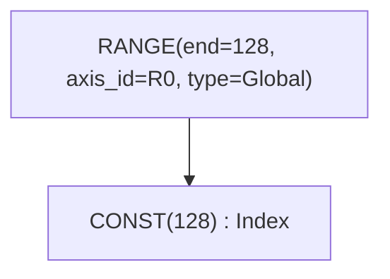

### END — 循环作用域关闭

```rust
End {
    computation: Arc<UOp>,              // value computed inside loop
    ranges: SmallVec<[Arc<UOp>; 4]>,    // ranges being closed
}
```

END 关闭一个或多个 RANGE 作用域，并将其从活跃集合中移除。可以同时关闭多个 range。

**示例：**
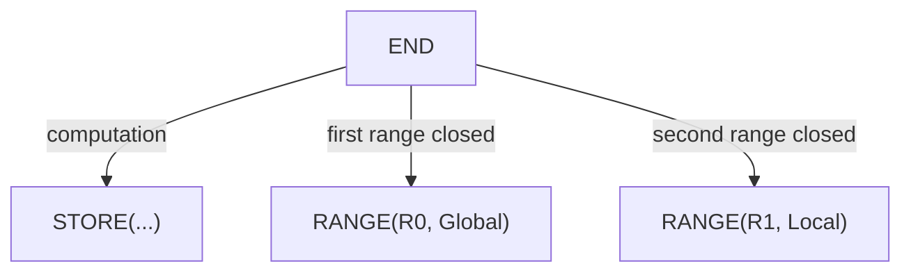

---

## 规约：REDUCE 与 REDUCE_AXIS

两个名字相似的操作，用途不同。

### REDUCE_AXIS — 张量维度规约（高层）

```rust
ReduceAxis {
    src: Arc<UOp>,           // input tensor
    reduce_op: ReduceOp,     // Add, Mul, Max, Min
    axes: Vec<usize>,        // axes to reduce
}
```

用于 rangeify **之前**。对张量维度进行操作，类似于 NumPy 的 `.sum(axis=0)`。

**示例：**
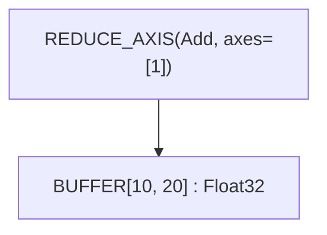

将一个 `[10, 20]` 的张量沿 axis 1 求和，规约为 `[10]`。

### REDUCE — Range 迭代规约（底层）

```rust
Reduce {
    src: Arc<UOp>,                      // value to accumulate
    ranges: SmallVec<[Arc<UOp>; 4]>,    // ranges being reduced
    reduce_op: ReduceOp,                // Add, Mul, Max, Min
    num_axes: usize,                    // reduced axes of the shaped source
}
```

用于 rangeify **之后**。在 RANGE 迭代中累加值，并关闭指定的 range。

**ReduceOp 变体：**

| 操作 | 单位元 | 运算 | Tinygrad |
|------|--------|------|----------|
| `Add` | 0 | `acc + value` | ✓ |
| `Mul` | 1 | `acc * value` | ✓ |
| `Max` | -∞ | `max(acc, value)` | ✓ |
| `Min` | +∞ | `min(acc, value)` | 仅 Svod |

> **兼容性：** Tinygrad 的规范将 REDUCE_AXIS 限制为 `{Add, Mul, Max}`。Svod 额外支持 `Min`。

**示例：**
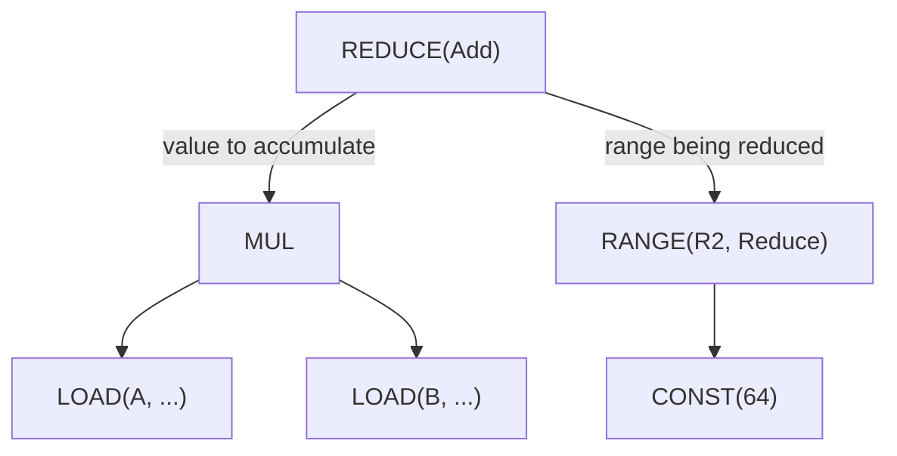

### ALLREDUCE — 跨设备规约

```rust
AllReduce {
    src: Arc<UOp>,           // local partial result
    device: DeviceSpec,      // device specification
    reduce_op: ReduceOp,     // reduction operation
}
```

在多个设备之间执行分布式规约，用于多 GPU 训练。

---

## Buffer 操作

### BUFFER — Buffer 声明

```rust
Buffer {
    shape: Arc<UOp>,         // flat storage shape (one element count)
    arg: Box<ParamArg>,      // slot, dtype, address space, device
}
```

声明一个用于张量存储的 buffer。`arg.slot` 字段确保即使 size/device 相同，不同 buffer 也能区分。`arg.addrspace` 决定 buffer 所在的内存：`Global` 表示设备内存，`Local` 表示 GPU 共享内存（LDS），`Reg` 表示寄存器/暂存分配。

### STAGE — 物化标记

```rust
Stage {
    compute: Arc<UOp>,                  // computation to materialize
    ranges: SmallVec<[Arc<UOp>; 4]>,    // output dimensions
    opts: Box<BufferizeOpts>,           // address space, device
}
```

标记计算结果应物化到内存的位置，触发内核分割。

**BufferizeOpts：**

| 字段 | 类型 | 用途 |
|------|------|------|
| `device` | `Option<DeviceSpec>` | 目标设备，`None` 表示本地 |
| `local_axis` | `Option<AxisId>` | 拥有 LOCAL 暂存 buffer 的 `GroupReduce` 轴 |
| `addrspace` | `AddrSpace` | `Global`（设备）或 `Local`（共享） |
| `removable` | `bool` | 为 `false` 时禁止 `buffer_removal` 内联此 STAGE——多消费者 realize 边界使用此设置，使得 buffer 在大型 pass 的不动点迭代中保持不变 |

**示例：**
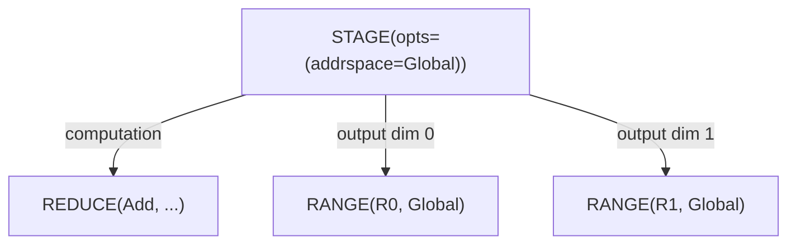

### INDEX — 多维 Buffer 访问

```rust
Index {
    buffer: Arc<UOp>,                   // BUFFER, PARAM or STACK
    indices: SmallVec<[Arc<UOp>; 4]>,   // index per dimension
}
```

从多维索引计算内存地址。返回元素 dtype（不是指针）。可以用 `idx.valid(cond)` 把索引变成条件式的，它会将索引包进 `WHERE(cond, idx, INVALID)`。对 `STACK` 使用 INDEX 选出的是一个通道而非地址：常量标量索引会直接折叠到被堆叠的那个源上。

**示例：**
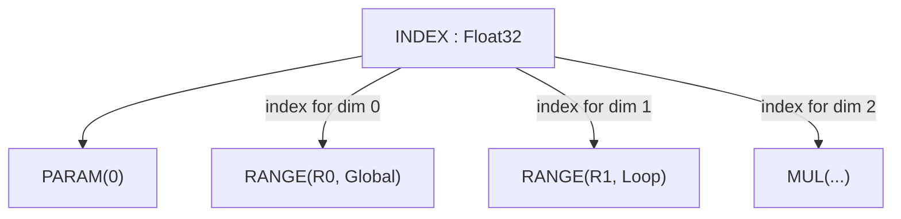

### LOAD — 内存读取

```rust
Load {
    index: Arc<UOp>,         // INDEX op (buffer accessed via the INDEX)
    alt: Option<Arc<UOp>>,   // alternative value for gated loads
    gate: Option<Arc<UOp>>,  // predicate for gated loads
}
```

从 buffer 的指定索引处读取值；没有单独的 `buffer` 字段，buffer 是通过 INDEX 节点到达的。对于门控加载，`gate` 为 false 时由 `alt` 提供取值（从而完全跳过内存访问）。`alt` 与 `gate` 总是成对设置：一次 load 要么两者都有，要么两者都没有。渲染器要求单轴的 `INDEX`，因此多索引访问必须在 rangeify 期间展平，才能让 load 进入代码生成。

**示例：**
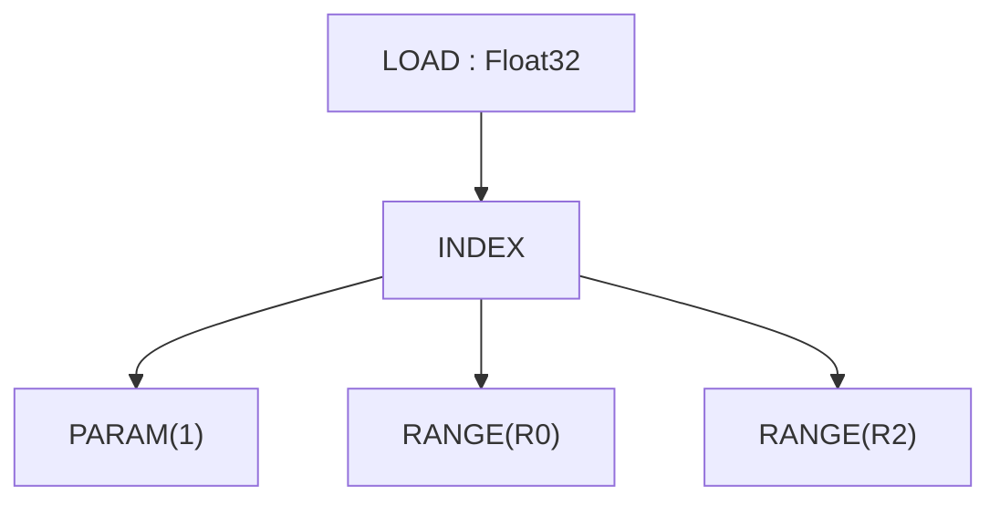

### STORE — 内存写入

```rust
Store {
    index: Arc<UOp>,                    // INDEX op (buffer accessed via index.src[0])
    value: Arc<UOp>,                    // value to write
    gate: Option<Arc<UOp>>,             // predicate for gated stores
}
```

向 buffer 写入值。Buffer 通过 INDEX 节点（`index.src[0]`）访问，而不是单独的字段。`UPCAST` 和 `UNROLL` 在展开期间仍然是 range 的轴类型分类。

对于门控写入，`store_gated` 会设置 `gate`；把 gate 从地址表达式上提到 LOAD/STORE 上的则是 `pm_move_gates_from_index`。

> **兼容性：** Svod 的 STORE 没有单独的 `buffer` 字段——源为：index=0, value=1。与 STAGE 或 REDUCE 不同，STORE 不关闭 range。

**示例：**
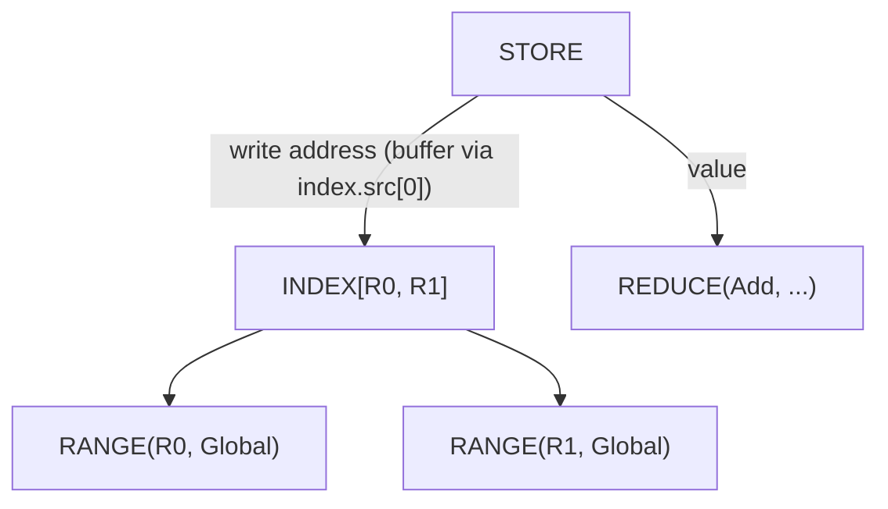

---

## 内核结构与可调用 IR

schedule 层的工作通过可调用 IR 表达，对应 tinygrad 的 `CALL`/`FUNCTION`/
`PROGRAM` 模型：`Function` 定义一个由参数化的体（通常是包含 store 的
`Sink`），`Call` 用具体参数调用它，`Program` 则按 `SINK → LINEAR →
SOURCE → BINARY` 的严格阶段把体送进编译流水线。

### CALL — 调用函数体

```rust
Call {
    body: Arc<UOp>,                     // FUNCTION（或其体）
    args: SmallVec<[Arc<UOp>; 4]>,      // 具体的参数值
    info: Box<CallInfo>,                // 注解（name、origin……）
}
```

用参数调用一个 callable 体。Range 关闭：关闭 `args` 中出现的任何 `Range`
（range_start_index = 1；`body=0`，`args=1+`）。

`CallInfo` 携带可作为缓存键的注解：

| 字段 | 类型 | 用途 |
|------|------|------|
| `name` | `Option<String>` | 可读的 callable 名称 |
| `grad_tag` | `Option<String>` | 为梯度回调的身份保留 |
| `origin` | `Option<OriginId>` | 所存储值根节点的来源——该内核记在谁的账上 |
| `origins` | `OriginSet` | 剥除之前体内可达的全部来源 |
| `precompile` / `precompile_backward` | `bool` | 预编译提示 |

一次 dispatch 的归属信息就落在内核 CALL 上，profiler 的汇总正是从这里读取；参见[剖析与基准测试内核](../tile-kernels/profiling.md)。

### FUNCTION — 可重用的体

```rust
Function {
    body: Arc<UOp>,                     // 计算
    args: SmallVec<[Arc<UOp>; 4]>,      // 形参
    info: Box<CallInfo>,
}
```

可重用的 callable。其 dtype 始终为 `Void`；返回多个值的体会被包进
`Tuple`，使函数边界保持 Void。Range 关闭形态与 `Call` 相同。

### TUPLE / GET_TUPLE — 多值返回

```rust
Tuple { src: SmallVec<[Arc<UOp>; 4]> }
GetTuple { src: Arc<UOp>, index: usize }
```

`Tuple` 打包异构值；其 dtype 始终为 `Void`。`GetTuple` 从 `Tuple`（或体
为 `Tuple` 的 `Function`）中提取索引为 `index` 的元素；其 dtype 与内部
元素一致。用于让多个输出穿过 Void 的函数边界。

### PROGRAM — 编译流水线容器

```rust
Program {
    sink: Arc<UOp>,                     // 根 SINK
    info: Box<ProgramInfo>,             // 名称、启动维度、ABI 槽位、目标
    linear: Option<Arc<UOp>>,           // LINEAR（线性化后）
    source: Option<Arc<UOp>>,           // SOURCE（渲染后）
    binary: Option<Arc<UOp>>,           // PROGRAM_BINARY（编译后）
}
```

把内核送过 `codegen/src/program_pipeline.rs` 强制的 `SINK → LINEAR →
SOURCE → PROGRAM_BINARY` 阶段（`do_linearize`/`do_render`/`do_compile`/
`get_program`），每一阶段填入下一字段。C/LLVM 渲染器期望 `Op::Linear`
作为输入，并通过上下文的 `pending_error` 报告 `Error::InvalidGraph`，不
再用 panic；抵达渲染器的多索引 `INDEX` 会以同样的方式被拒绝，因此索引
必须事先展平成单个轴。

### LINEAR — 线性化的操作流

```rust
Linear { ops: SmallVec<[Arc<UOp>; 8]> }
```

由线性化产生的扁平操作序列。消费者可以直接迭代 `ops`，无需重新遍历图。

### SOURCE / PROGRAM_BINARY — 编译产物

```rust
Source { code: String, identity: Option<Box<SourceStageIdentity>> }
ProgramBinary { bytes: Vec<u8>, identity: Option<Box<BinaryStageIdentity>> }
```

流水线的终结阶段。两者都是叶子（无子节点）。可选的 `identity` 是把某一
阶段与紧邻的前一阶段严格绑定的语义凭证（`SourceStageIdentity` 携带 ABI、
目标、入口名以及 LINEAR/SOURCE 的摘要；`BinaryStageIdentity` 在其之上再
包上编译器键与二进制摘要），因此缓存的产物不可能被跨越已变更的图复用。

### SINK — 多根收集器

```rust
Sink {
    sources: SmallVec<[Arc<UOp>; 4]>,
    info: Option<Box<KernelInfo>>,      // 内核 AST 的结构性标记
}
```

将多个输出收集到一个根节点。`Function` 的体通常是由 store 组成的 `Sink`。
`info` 字段是经过哈希 consing 的结构性标记，用来区分内核 AST 的 SINK
和具有相同源的普通 SINK，无需依赖类型擦除的旁路元数据通道。

**示例：**
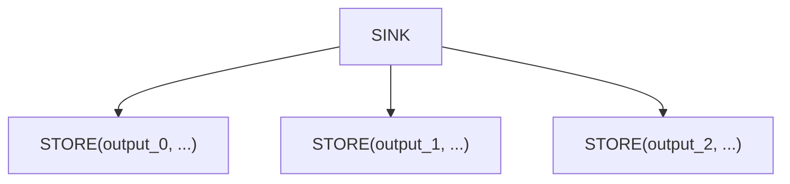

### AFTER — 依赖标记

```rust
After {
    passthrough: Arc<UOp>,              // value that flows through
    deps: SmallVec<[Arc<UOp>; 4]>,      // operations that must complete
}
```

表达内核之间的执行依赖，不涉及数据依赖。`passthrough` 值原样返回，但必须在所有 `deps` 完成后才执行。

**示例：**
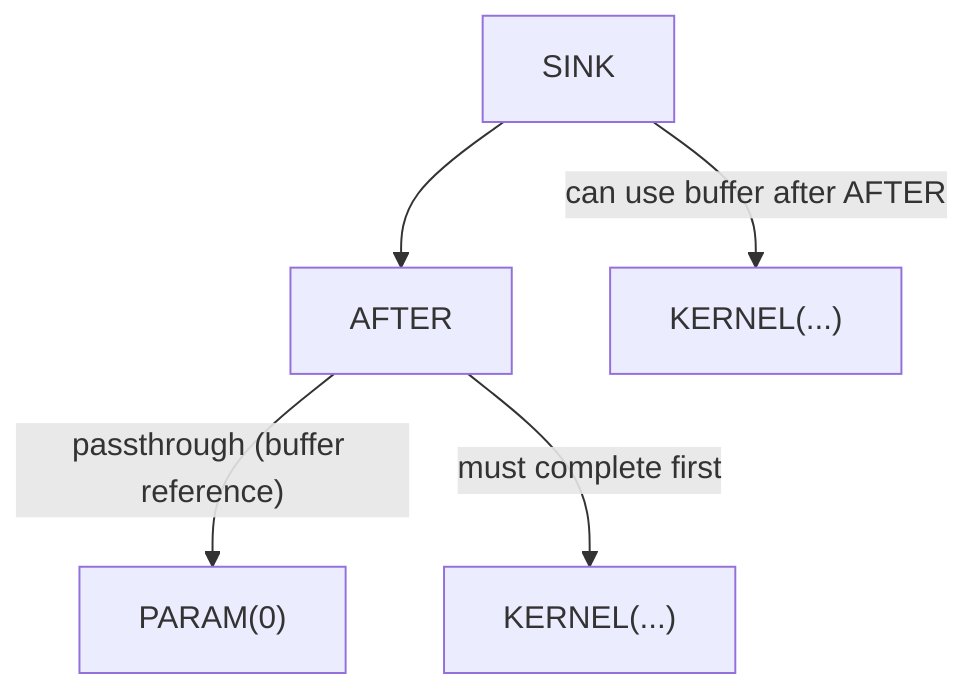

### BARRIER — 同步栅栏

```rust
Barrier {
    src: Arc<UOp>,                      // value passing through
    deps: SmallVec<[Arc<UOp>; 4]>,      // operations to wait for
}
```

GPU 工作组同步。确保工作组中的所有线程到达栅栏后才继续执行。

---

## 向量操作

### STACK — 用通道构建带形状的值

```rust
Stack {
    sources: SmallVec<[Arc<UOp>; 4]>,
}
```

将 N 个值组合成一个含 N 个通道的带形状值。元素 dtype 仍然是标量——通道数由 STACK 自身携带，而不是靠加宽 dtype——各个源在构造时会被转换到提升后的 dtype。

**示例：**
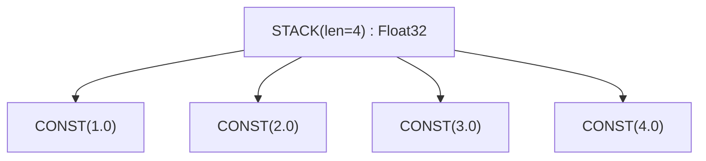

### 通道选择 — 对 STACK 使用 INDEX

没有单独的提取操作。`INDEX` 从 `STACK` 中选出一个通道，方式与它从 buffer 中选出一个地址完全相同；常量索引在构造时就直接折叠到被堆叠的那个源上。

**示例：**
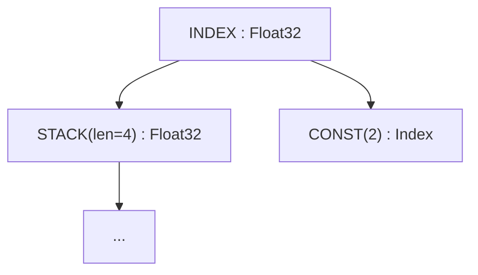

### VConst — 向量常量

```rust
VConst {
    values: Vec<ConstValue>,
}
```

编译期常量向量。比用 `CONST` 节点构建的 `STACK` 更高效。

通道聚合使用 `STACK`；通道选择与地址选择都使用 `INDEX`。循环展开由带 `AxisType::Unroll` 的 `Range` 表示，而不是一个单独的操作。张量核心的扩展轴则存放在 `WmmaMetadata` 中。

---

## 张量核心：WMMA

### WMMA — Warp 矩阵乘累加

```rust
Wmma {
    a: Arc<UOp>,             // matrix A fragment
    b: Arc<UOp>,             // matrix B fragment
    c: Arc<UOp>,                 // accumulator C fragment
    metadata: Box<WmmaMetadata>, // hardware configuration
}
```

硬件张量核心操作：`D = A × B + C`。需要特定的矩阵形状和数据布局。

**WmmaMetadata 字段：**

| 字段 | 类型 | 用途 |
|------|------|------|
| `name` | `String` | 指令名称（如 `"__hmma..."`） |
| `dims` | `(N, M, K)` | 矩阵维度（如 `(16, 16, 16)`） |
| `dtype_in` | `DType` | 输入矩阵精度（如 `Float16`） |
| `dtype_out` | `DType` | 输出精度（如 `Float32`） |
| `device` | `RendererDevice` | 产生此 WMMA 的渲染器 / TC 后端 |
| `threads` | `usize` | 每个 warp 的线程数（通常 32） |
| `upcast_axes` | `Option<WmmaUpcastAxes>` | 各个源的扩展轴（字段：`a`、`b`、`c`）；一旦 `expander2` 塑形完源与输出便被清空 |
| `reduce_axes` | `Vec<AxisId>` | TC 规约轴的 ID，在展开期间用作 `exclude_args` |

**示例：**
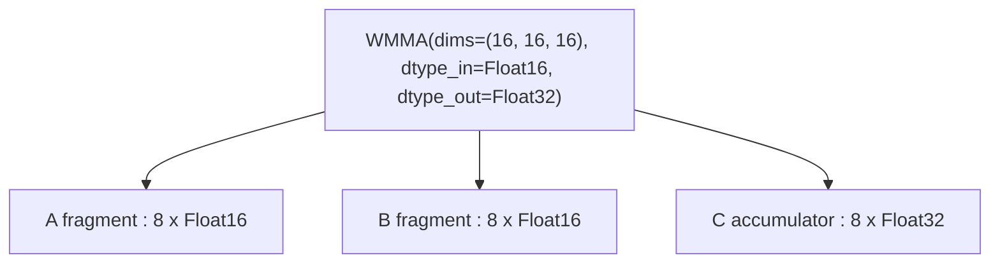

---

## 控制流

### IF / ENDIF — 条件执行

```rust
If {
    condition: Arc<UOp>,                // boolean predicate
    body: SmallVec<[Arc<UOp>; 4]>,      // operations to execute
}

EndIf {
    if_op: Arc<UOp>,         // corresponding IF op
}
```

仅在条件为真时执行 body。用于边界检查和稀疏操作。

**示例：**
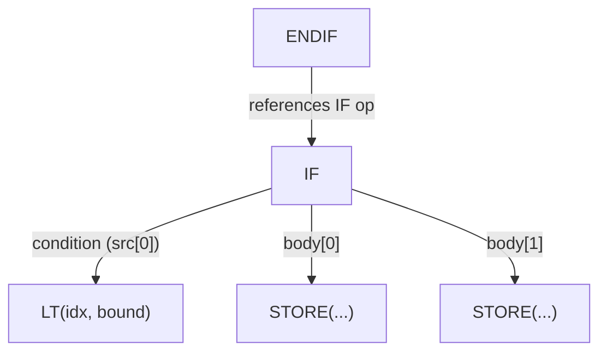

---

## 定义操作

### PARAM — Buffer 参数

```rust
Param { shape: Arc<UOp>, arg: Box<ParamArg> }
```

归一化的 buffer 参数——对输入/输出 buffer 的位置引用。
由预调度归一化（BUFFER→PARAM）创建，通过擦除 buffer 身份，
实现对不同 buffer 上相同计算的结构性去重。
`arg.slot` 是内核参数列表中的位置，`shape` 携带元素数量。
`ParamArg` 也涵盖标量参数（`UOp::scalar_param`），它们携带的是名称和
取值边界，而不是地址空间。

### 共享内存与寄存器

没有专门的 `DefineLocal` 或 `DefineReg` 操作。GPU 共享内存（LDS）以及
寄存器/暂存分配都是 `Buffer` 节点，其 `arg.addrspace` 为
`AddrSpace::Local` 或 `AddrSpace::Reg`；它们不携带设备，且只在工作组内
（LOCAL）或线程内（REG）可见。

### DEFINE_VAR — 符号运行时变量

```rust
DefineVar {
    name: String,            // variable name
    min_val: i64,            // minimum bound
    max_val: i64,            // maximum bound
}
```

带已知范围的运行时变量。用于已知边界的动态 shape。

**示例：**
```text
DEFINE_VAR(name="batch_size", min=1, max=128) : Index
```

### BIND — 变量绑定

```rust
Bind {
    var: Arc<UOp>,           // DEFINE_VAR
    value: Arc<UOp>,         // concrete value
}
```

在运行时将符号变量绑定到具体值。

---

## 特殊操作

### SPECIAL — 硬件提供的值

```rust
Special {
    end: Arc<UOp>,           // upper bound for this dimension
    name: String,            // e.g., "blockIdx.x", "threadIdx.y"
}
```

访问硬件提供的值（线程/块索引）。不是循环——硬件直接提供该值。

**示例：**
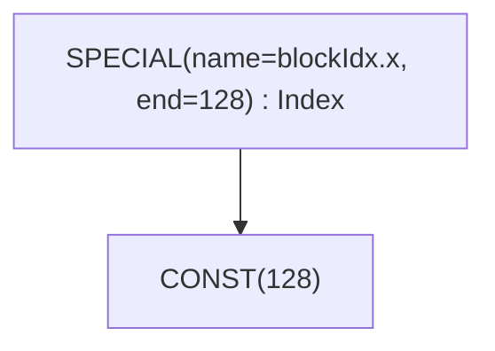

### UNIQUE / LUNIQUE — 标识标记

```rust
Unique(usize)                // 全局身份计数器
LUnique(usize)               // 局部作用域身份计数器
```

为 buffer 消歧创建唯一标识。具有不同 `Unique` 值的两个 buffer 即使其他
属性完全相同也是不同的。`LUnique` 在局部作用域（例如 `Function` 体内）
提供同样的消歧能力，且不与全局计数器冲突——这样 callable 体可以独立于
调用点进行哈希 consing。

设备本身不是一个节点：目标是那些需要它的操作上的一个 `DeviceSpec` 字段
（`Copy`、`GetAddr`、`AllReduce`、`ParamArg.device`、`BufferizeOpts.device`、
`ProgramInfo.target`）。

---

## 移动操作

高层张量 shape 变换。在 rangeify 阶段会被转换为显式的 INDEX 操作。

| 操作 | 签名 | 用途 |
|------|------|------|
| `Reshape` | `{ src, new_shape }` | 改变 shape，元素不变 |
| `Permute` | `{ src, axes: Vec<usize> }` | 转置/重排轴 |
| `Expand` | `{ src, new_shape }` | 广播到更大的 shape |
| `Pad` | `{ src, begin_pads, end_pads }` | 添加填充 |
| `Shrink` | `{ src, offsets, sizes }` | 提取子区域 |
| `Flip` | `{ src, axes: Vec<bool> }` | 沿轴翻转 |

**示例：** RESHAPE
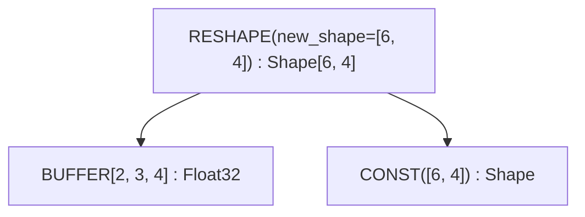

---

## 其他操作

以下操作存在于 `Op` 枚举中，但它们要么是内部实现，要么在调试中很少遇到：

| 操作 | 用途 |
|------|------|
| `Copy` | `{ src, device }` —— 把值显式复制到另一个设备 |
| `Slice` | `{ buffer, offset, size }` —— buffer 上连续的类型化切片元数据 |
| `GetAddr` | `{ src, device }` —— 某个类 buffer 源的 `UInt64` 地址 |
| `MStack` | `{ buffers }` —— 一个多设备张量在各设备上的 buffer |
| `MSelect` | `{ buffer, device_index }` —— 从多设备张量中取出某一个设备的 buffer |
| `Multi` | `{ src, axis }` —— 分片标记：多设备张量沿哪个轴切分 |
| `Group` | 用于调度的操作分组 |
| `Noop` | 无操作数、无副作用的占位符 |
| `Detach` | 从图中分离（阻止优化穿透） |
| `Contiguous` | 标记数据连续的提示 |
| `ContiguousBackward` | contiguous 提示的反向传播 |
| `Precast` | 类型转换的预转型 |
| `Custom` / `CustomI` | 内联自定义操作扩展（`Custom` 仅 C 后端支持） |
| `CustomFunction` | 运行时自定义函数钩子（种类：`EncDec`、`Graph`、`AllReduce`） |
| `Ins` | `{ sources, arg }` —— 由 ISA 渲染器选出的目标指令 |

---

## 速查表

### 按类别

| 类别 | 操作 |
|------|------|
| **循环控制** | `RANGE`, `END` |
| **规约** | `REDUCE_AXIS`, `REDUCE`, `ALLREDUCE` |
| **内存** | `BUFFER`, `SLICE`, `STAGE`, `INDEX`, `LOAD`, `STORE`, `GETADDR` |
| **内核与可调用** | `SINK`, `CALL`, `FUNCTION`, `TUPLE`, `GET_TUPLE`, `PROGRAM`, `LINEAR`, `SOURCE`, `PROGRAM_BINARY`, `AFTER`, `BARRIER` |
| **向量** | `STACK`, `INDEX`, `VCONST` |
| **展开** | 带 `AxisType::Upcast` 或 `AxisType::Unroll` 的 `RANGE` |
| **硬件** | `WMMA`, `SPECIAL` |
| **控制** | `IF`, `ENDIF` |
| **定义** | `PARAM`, `DEFINE_VAR`, `BIND`, `UNIQUE`, `LUNIQUE` |
| **移动** | `RESHAPE`, `PERMUTE`, `EXPAND`, `PAD`, `SHRINK`, `FLIP` |
| **ALU** | `Unary(...)`, `Binary(...)`, `Ternary(...)`, `Cast`, `BitCast` |

### Range 终止操作

关闭 RANGE 作用域（从活跃集合中移除 range）的操作：

| 操作 | Range 起始索引 |
|------|----------------|
| `STAGE` | 1 (compute=0, ranges=1+) |
| `REDUCE` | 1 (src=0, ranges=1+) |
| `WMMA` | 3 (a=0, b=1, c=2) |
| `END` | 1 (computation=0, ranges=1+) |
| `CALL` / `FUNCTION` | 1 (body=0, args=1+) |

### 可展开操作

通过计算图传播已展开通道的操作：

- ALU：`Unary`、`Binary`、`Ternary`
- 类型：`Cast`、`BitCast`
- 带形状的值：`Stack`
- 内存：`Load`、`Store`、`Index`
- 控制：`Reduce`、`End`、`After`
- Buffer：`Stage`
- 硬件：`Wmma`
