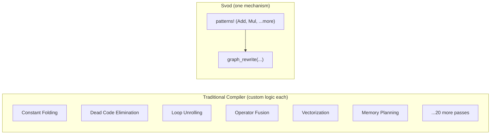
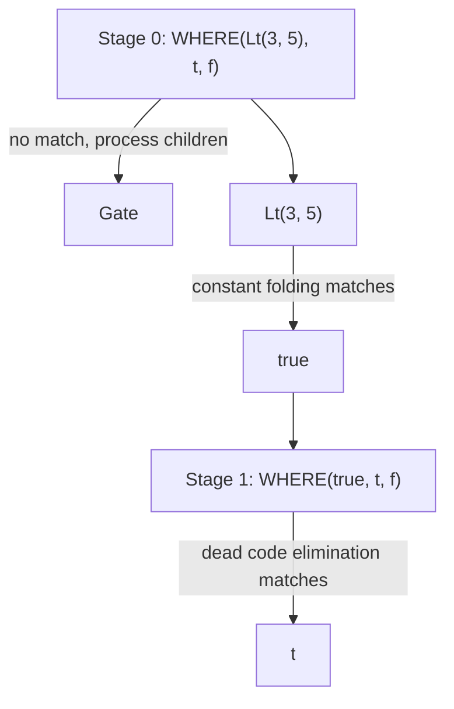

# 模式引擎

打开任何一个生产级 ML 编译器，你会发现几十个优化 pass：常量折叠、死代码消除、算子融合、循环分块、向量化、内存布局优化。每个 pass 都有自己的数据结构、遍历逻辑和 bug。

Svod 采用了不同的方案：**一种机制搞定一切**。



Svod 中的每一项优化都表达为一个**模式**："当你看到这种结构，就替换为那种结构。"同一个 `graph_rewrite()` 函数负责[代数化简](./algebraic-simplification.md)、[索引算术](./index-arithmetic.md)、[强度削减](./strength-reduction.md)和 [Range 优化](./range-optimization.md)。

---

## `patterns!` DSL

Svod 提供了一种领域特定语言来编写优化模式：

```rust
patterns! {
    // Identity folding: x + 0 → x
    Add[x, @zero] => x,

    // Constant folding: 3 + 4 → 7
    Add(a @const(a_val), _b @const(b_val))
        => eval_add(a_val, b_val).map(|r| UOp::const_(a.dtype(), r)),

    // Self-folding: x / x → 1
    Idiv(x, x) => UOp::one(x.dtype()),

    // Dead code elimination: if(true) { t } else { f } → t
    Where(Const(ConstValue::Bool(true)), t, _f) => t,
}
```

宏将这些模式编译为高效的 Rust 代码：

| 语法 | 含义 | 示例 |
|--------|---------|---------|
| `(x, y)` | **有序。** 按精确顺序匹配。 | `Sub(x, @zero) => x` |
| `[x, y]` | **交换律。** 尝试两种顺序。 | `Add[x, @zero] => x` |
| `@zero` | **零常量。** 匹配 0 或 0.0。 | `Mul[_, z @ @zero] => z` |
| `@one` | **一常量。** 匹配 1 或 1.0。 | `Mul[x, @one] => x` |
| `c @const(val)` | **提取常量。** 绑定值。 | `Add(a @const(av), _b @const(bv))` |
| `x, x` | **同一操作数。** 自动生成 ptr_eq 检查。 | `Idiv(x, x) => UOp::one(...)` |
| `=>` | **重写。** 返回 `Arc<UOp>`、`Option<Arc<UOp>>`（`None` 表示放弃）或 `RewriteResult`。 | `=> eval(...).map(...)` |
| `for op in binary [...]` | **模板。** 为多个操作生成模式。 | 见下文 |
| `@context Type` | **有状态。** 在模式中访问可变上下文。 | 见下文 |

### 模板展开

不必为每个二元操作写同样的模式，用 for 循环：

```rust
patterns! {
    for op in binary [Add, Mul, Sub, Idiv, Fdiv, Max] {
        op(a @const(a_val), _b @const(b_val))
            => eval_binary(op, a_val, b_val)
                .map(|r| UOp::const_(a.dtype(), r))
    }
}
```

这在编译期展开为六个独立的模式——每个操作一个。

### 有状态模式

某些优化需要上下文（比如当前在哪个 kernel、哪些范围是活跃的）：

```rust
patterns! {
    @context KernelContext;

    reduce @ ReduceAxis { src, .. } => {
        ctx.record_reduction(reduce);
        transform_reduce(reduce, src, ctx)
    }
}
```

### 上下文提升

组合不同上下文类型的匹配器时，使用 `.with_context()`：

```rust
let mega_pass = symbolic().with_context::<PcontigConfig>()
    + reduction_simplify_patterns().with_context()
    + buffer_removal_with_pcontig();
```

---

## 模式匹配的工作原理

`patterns!` 宏把一个块编译成一个函数，用 `match` 按根操作的种类分派，然后按源码顺序尝试该种类的模式。

### OpKey 索引

每个 UOp 都有一个操作类型（Add、Mul、Load 等）。宏生成一个 OpKey 枚举，将操作映射为可哈希的键：

```rust
match OpKey::from_op(tree.op()).index() {
    KEY_ADD => { /* rules rooted at Add, in source order */ }
    KEY_MUL => { /* rules rooted at Mul */ }
    _ => {}
}
// wildcard rules (`x if cond`) run as sequential steps between the matches
```

匹配一个 UOp 时：
1. 从 UOp 的操作中**提取 OpKey**
2. **跳转**到该种类的 `match` 分支
3. **逐一尝试闭包**直到有一个匹配
4. 如果没有索引模式匹配，**回退**到通配符

### 交换律处理

对于 `Add[x, @zero]` 这样的模式，宏生成尝试两种顺序的代码：

```rust
// Try (x, @zero)
if let Some(result) = try_match_ordered(&children[0], &children[1]) {
    return result;
}
// Try (@zero, x)
if let Some(result) = try_match_ordered(&children[1], &children[0]) {
    return result;
}
```

### 重复检测

当你写 `Idiv(x, x)` 时，模式只在两个操作数是*同一个* UOp（通过 `Arc::ptr_eq` 检查指针相等，而非结构相等）时匹配。这利用了 hash consing——相同的子表达式共享同一个指针。

---

## 重写引擎

仅有模式匹配还不够。考虑：

```text
WHERE(Lt(3, 5), t, f)
```

要化简它，需要两步：
1. `Lt(3, 5)` → `true`（常量折叠）
2. `WHERE(true, t, f)` → `t`（死代码消除）

但 `WHERE` 模式在子节点被化简之前不会匹配。重写引擎通过**两阶段算法**解决这个问题。

### 阶段 0：模式应用

对每个节点应用模式。如果没有模式匹配，发出信号先处理子节点。

### 阶段 1：源重建

子节点被重写后，用新的子节点重建节点，再次尝试模式：



重建阶段重新应用模式，使多步优化在一次遍历中完成。

### 重写策略

三种重写函数，与 Tinygrad 的 `graph_rewrite` 对应：

| 策略 | 模式看到的内容 | 适用场景 |
|----------|-------------|----------|
| `graph_rewrite(pm)`（默认） | **已优化**的子节点 | 代数化简、展开 |
| `graph_rewrite_bottom_up(bpm)` | **原始**子节点 | 嵌套结构匹配、缓冲区移除 |
| `graph_rewrite_with_bpm(pm, bpm)` | 两者（bpm: 原始, pm: 已优化） | 内核分割（门控 + 变换合一 pass） |

引擎始终自底向上遍历；区别在于模式*何时*触发：在阶段 0（子节点处理之前——看到原始节点）还是阶段 1（子节点处理之后——看到优化结果）。匹配器通过 `+` 运算符组合：`matcher_a() + matcher_b()` 将模式集合并为一个。

### 安全限制

为防止无限循环：
- 总计最多 **500,000 次迭代**
- 超限时 panic 并输出诊断信息

在实践中，良好的模式能快速收敛。

---

## 为什么这很重要

**调试是直接的。** 模式是可读的代码。在任何模式中加一个 `println!` 来追踪何时触发。

**扩展很容易。** 添加自定义优化只需两行——不需要理解编译器内部实现、编写 visitor 或修改 pass 管理器。

**正确性是局部的。** 每个模式都是一个小定理："如果出现这种结构，用那种结构替换可以保持语义。"可以独立验证每个模式。正确模式的组合产生正确的程序。

**性能可调。** O(1) 模式分派默认就很快。结合 [beam 搜索](./kernel-search.md)用于生产工作负载。

---

## 更深层的洞察

模式匹配用通用性换取了可组合性。

通用优化 pass 可以做任何事——但这恰恰是问题所在。它难以验证、难以扩展、难以与其他 pass 组合。顺序很重要。交互很微妙。

模式是受约束的：它匹配特定结构，产生特定替换。但约束使组合成为可能。对于良好设计的模式集合，将模式运行到不动点能产生确定性结果。新模式可以局部化地添加，删除不会产生级联故障——不过在实践中，模式之间的交互应当经过测试以确保收敛。

每个模式都是关于语义等价的定理。重写引擎是定理证明器，从输入到优化输出寻找推导路径。正确性来自每一步的正确性。

这是 Unix 哲学在编译器中的应用：小的、专注的工具进行组合。
