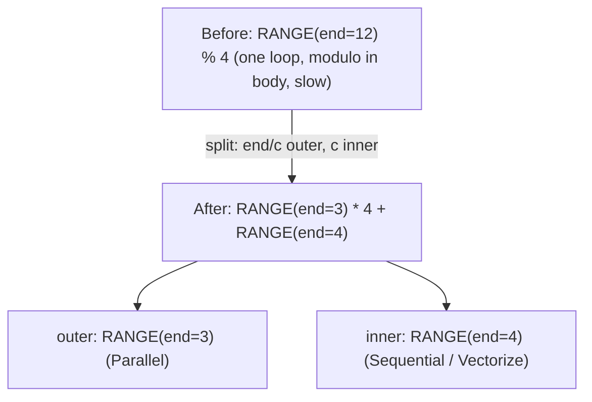
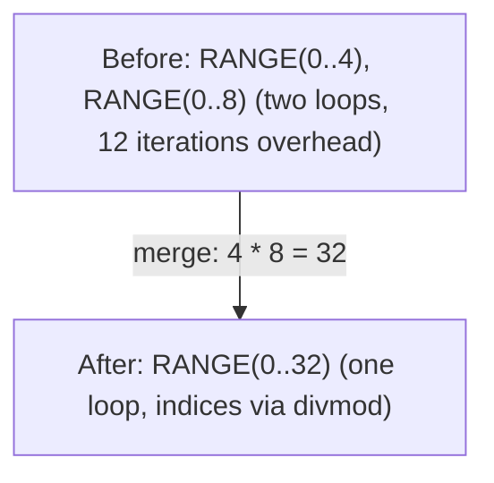
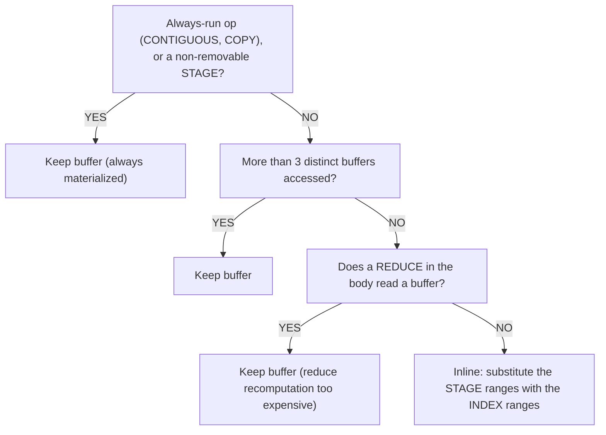

# Range 与 Reduce 优化

循环结构是张量编译器优化的首要目标。对两个 `[1024, 1024]` 张量的逐元素加法，朴素实现生成一个遍历 1M 元素的循环。优化后变为 1024 个并行线程，每个处理 1024 个元素并使用向量化加载/存储。Range 优化就是达成这一目标的手段。

这些模式位于 `schedule/src/rangeify/` 中，在[代码生成流水线](../codegen/overview.md)的阶段 1-5 运行。

Tinygrad 源码：`tinygrad/codegen/simplify.py`。

---

## Range 分割

**功能**：通过 divmod 将单个范围分解为外层和内层组件。

**触发条件**：范围变量与取模一起使用：`RANGE(end) % c`，其中 `end % c == 0`。



**原因**：分割后，内层范围可以向量化（UPCAST 到 SIMD 宽度），外层范围可以并行化（GPU 块、CPU 线程）。不分割的话，取模会阻止这两种优化。

**机制**：`pm_split_ranges` 模式匹配器收集带取模用法的范围但**不立即变换**。它等到看到 SINK 节点时再一次性执行所有替换（避免不一致的局部重写）。外层和内层范围在原有轴路径后分别追加 `0` 和 `1`，与 Tinygrad 一致，不分配全局范围 ID。

**守卫**：仅当 `end % c == 0`（精确整除）时触发。不可整除的情况保持不变。

Tinygrad：`simplify.py:60-64`。Svod：`rangeify/transforms.rs` 中的 `pm_split_ranges()`。

---

## Range 合并

**功能**：将两个相邻范围合并为一个，减少循环开销。



**原因**：循环开销（分支预测、计数器递增）是按迭代计算的。合并减少循环数量，代价是需要 divmod 操作来重建原始索引。

**决策标准**：仅当 divmod 操作总数不增加时才接受合并。编译器统计合并前后的 divmod 操作数——如果合并引入的除法多于消除的循环开销，则拒绝合并。

**约束条件**：
- 两个范围必须具有兼容的轴类型（都是输出、都是规约等）
- REDUCE 作用域必须保持一致
- 两个范围必须出现在相同的 REDUCE 作用域中

Tinygrad：`simplify.py:39-41`（`simplify_merge_adjacent`）。Svod：`pm_simplify_ranges()`。

---

## Range 展平

**功能**：将嵌套的 END/REDUCE/STORE 链展平为平坦的范围列表。

```text
Before:  END(END(END(comp, [r0]), [r1]), [r2])
After:   END(comp, [r0, r1, r2])
```

**原因**：嵌套 END 链产生于连续变换。展平将结构归一化，使其他模式（合并、分割）能在干净的范围列表上操作。

Tinygrad：`simplify.py:14-17`。Svod：`pm_flatten_range()`。

---

## 加载折叠

**功能**：当计算可以表达为闭合形式的算术时，完全消除 REDUCE 循环。

```text
Before:  sum(1 for k in 0..64 if k >= length)    // Loop: 64 iterations
After:   clamp(64 - length, 0, 64)                // Arithmetic: 3 ops
```

**工作原理**：
1. 识别独立于 REDUCE 范围的子表达式
2. 为这些子表达式创建 `DEFINE_VAR`（视为循环不变量）
3. 用 `DEFINE_VAR` 替换范围并运行符号化简
4. 如果化简后的表达式没有剩余范围，则 REDUCE 被消除

这是最强大的单项优化——它可以消除整个规约循环，将 O(N) 计算转换为 O(1)。

Tinygrad：`simplify.py:145-149`。Svod：`pm_load_collapse()`。

---

## Reduce 折叠

ADD 规约的解析消除。比加载折叠更精细——在规约体内应用代数变换。

### 边界模式

处理比较限制哪些迭代参与的门控规约：

| 模式 | 之前 | 之后 |
|---------|--------|-------|
| 下界 | `sum(r < cut ? 0 : val, r=0..N)` | `max(0, N - cut) * val` |
| 上界 | `sum(r < cut ? val : 0, r=0..N)` | `max(0, min(N, cut)) * val` |
| 双侧 | `sum(r >= lo & r < hi ? val : 0, r=0..N)` | `max(0, min(N,hi) - max(0,lo)) * val` |
| NE 门控（聚集） | `sum(idx != r ? 0 : expr, r=0..N)` | `in_bounds ? expr[r:=idx] : 0` |

NE 门控模式对聚集操作特别重要——它识别出对所有 `idx == r` 的索引求和等价于单次索引访问。

### 提升变换

将比较移到规约作用域外以暴露边界模式：

| 变换 | 之前 | 之后 |
|-----------|--------|-------|
| Lt 提升 | `(x + y) < c` | `x < (c - y)` |
| Ge 提升 | `(x + y) >= c` | `x >= (c - y)` |
| EQ 提升 | `(x + y) == c` | `x == (c - y)` |

### 分配律

`sum(x + y)` -> `sum(x) + sum(y)`——将规约在加法上拆分。这使得每一半都能被边界模式独立折叠。

### MUL-casted-bool

`x * bool.cast()` -> `WHERE(bool, x, 0)`——将布尔 cast 的乘法转换为 WHERE，然后可以被边界模式分析。

Tinygrad：`simplify.py:82-142`。Svod：`pm_reduce_simplify()` + `reduce_collapse_inner_patterns()`。

---

## 缓冲区移除（部分连续）

**功能**：通过把被缓冲的范围替换为读取方索引所用的范围，决定是否将中间结果物化到缓冲区还是内联计算。

当 rangeify pass 创建 `STAGE` 节点（标记"这需要一个缓冲区"）时，缓冲区移除 pass 评估实际分配内存是否值得。`STAGE` 是 Svod 在"这需要一个缓冲区"和最终 `STORE`+`BUFFER`+`AFTER` 之间的中间表示——它让这个 pass 决定物化是否真正必要。如果计算足够廉价，它替换范围变量并直接内联表达式。

### 决策树



:::caution[规约内部的缓冲区读取]
这条规约守卫看的不是操作有多廉价——只要函数体中任何 REDUCE 读取了缓冲区（`Param`、`Buffer` 或 `Stage`），它就会触发。原因：如果 `argmax(-x)` 内联取反，`-x` 会在每次规约迭代中被重新计算——N 次额外的读取和取反，而不是一次缓冲区读取。若规约所涉及的值不接触任何缓冲区，它仍然可以被内联。
:::

### 相关模式

| 模式 | 说明 |
|---------|------|
| STAGE 折叠 | `STAGE(CONST)` -> `CONST`——常量的 stage 就是常量本身 |
| 索引折叠 | `INDEX(CONST)` -> `CONST`——索引常量就是常量 |
| COPY 折叠 | `COPY(CONST)` -> `CONST`——常量的拷贝就是常量本身 |
| MSTACK 折叠 | `INDEX(MSTACK([CONST, ...]))` -> `CONST`——常量的多设备堆叠 |
| 恒等折叠 | `INDEX(STAGE(compute, ranges), ranges)` -> `compute`——相同范围消去 |

Svod：`rangeify/patterns.rs` 中的 `pm_remove_bufferize()` 和 `buffer_folding()`。

---

## 死轴移除

**功能**：从 STAGE 操作中移除未使用的维度。

维度为"死"的条件：
- 大小为 1（不贡献任何东西）
- 在索引中以常量出现（不是变量）
- 计算表达式不引用它

死轴从 STAGE 中移除，然后通过 RESHAPE（插入大小为 1 的维度）和 EXPAND（广播到原始大小）恢复形状。这减少了缓冲区分配的维度数。

:::caution[标量情况]
即使所有范围都为死（标量输出），STAGE 也必须以空范围保留——完全移除会导致 `NoKernelsFound`，因为内核分割期间不会创建 STORE。
:::

Svod：`rangeify/patterns.rs` 中的 `dead_axis_removal()`。

---

## Reduce 去父化

**功能**：从 REDUCE 中移除未被规约体引用的范围。

| 规约操作 | 未引用的大小为 N 的范围 | 变换 |
|-----------|------|-----------|
| ADD | 范围未在体内使用 | 结果乘以 N |
| MUL | 范围未在体内使用 | 结果取 N 次幂 |
| MAX / MIN | 范围未在体内使用 | 直接移除范围 |

示例：`sum(x, r=0..N)`，其中 `x` 不依赖于 `r` -> `x * N`。常量在 N 次迭代上的和是 N 乘以该常量。

Tinygrad：`simplify.py:82-86`。Svod：`pm_reduce_simplify()`。

---

## Split ReduceOp

**功能**：将大规约拆分为两阶段以获得更好的并行性。

**触发条件**：输入/输出比超过 32768。

```text
Before:  REDUCE(data, axes=[0])       // shape [65536] → scalar
After:   REDUCE(                       // shape [256] → scalar (second stage)
           CONTIGUOUS(
             REDUCE(                   // shape [65536] → [256] (first stage)
               RESHAPE(data, [256, 256]),
               axes=[1]
             )
           ),
           axes=[0]
         )
```

**原因**：单个大规约无法并行化。拆分为两阶段允许第一阶段并行运行（256 个线程各规约 256 个元素），然后第二阶段规约 256 个部分结果。

**守卫**：仅当规约维度可因式分解且输入/输出比超过阈值时应用。不可因式分解的维度被跳过。

Svod：`rangeify/kernel.rs` 中的 `split_reduceop()`。
