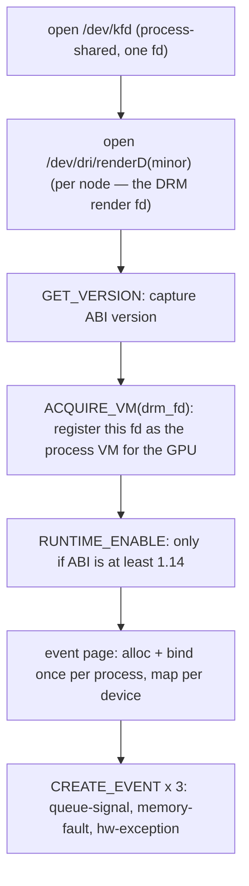

# KFD 绑定

后端通过对 `/dev/kfd` 的一小组固定 `ioctl` 调用与内核对话。
本页介绍这些调用如何绑定到 Rust、后端实际使用其中的哪些、GPU 节点如何被
发现，以及将一个 `ioctl` 变成已映射 GPU 缓冲区的分配流程。关于后端为什么是
KFD 直连而非基于 HIP 的*原因*，见 [概览](./overview.md)。

---

## 绑定是如何生成的

KFD 的 ABI 是一个 C 头文件 `kfd_ioctl.h`，从内核原样 vendored 进
`device/include/kfd_ioctl.h`（即上游 AMD 文件，连同其完整的 ABI
版本历史）。Rust 绑定由 `bindgen` 在构建时从它生成：

- `device/build.rs` **在每一台宿主上无条件**运行 `bindgen`——
  没有平台门控，也没有空桩分支。它是**封闭自洽的**：它不需要
  任何系统内核头文件。`kfd_ioctl.h` 传递性拉入的两个头文件
  （`<linux/ioctl.h>` 提供 `_IOC`/`_IO*` 宏，`<linux/types.h>` 提供
  `__uNN`/`__sNN` 别名）再加一个桩 `<drm/drm.h>`（残留——主体只用到
  `__u32 drm_fd` 字段）本身都被 vendored 在 `device/include/` 之下，
  而 `build.rs` 传入 `-Iinclude`，使 bindgen 解析它们而非
  `/usr/include`。切换到 vendored 头文件经验证为逐字节等价：
  重新生成的绑定与系统头文件基线的差异仅在于 8 处定宽
  类型别名的拼写（`__u32 = u32` 对 `c_uint`，尺寸相同）——全部
  60 个结构体和 34 个常量都相同。（bindgen 需要 `libclang`，
  在 macOS 上它随 Xcode CLT 一同发布。）

  它用 allow-list 精确圈定后端所需的 KFD 类型与常量：

  ```text
  allowlist_type:  kfd_ioctl_.*_args, kfd_process_device_apertures,
                   kfd_event_data, kfd_hsa_signal_event_data,
                   kfd_hsa_memory_exception_data, kfd_hsa_hw_exception_data,
                   kfd_memory_exception_failure, __u\d+, __s\d+
  allowlist_var:   KFD_IOC_.*, KFD_MMAP_TYPE.*, KFD_MAX_QUEUE_PERCENTAGE,
                   AMDKFD_IOC_.*
  ```

  （`AMDKFD_IOC_*` 请求码虽已列入 allow-list 却从不实体化：
  bindgen 无法常量折叠它们的 `_IOWR(...)` 宏展开，这正是
  ioctl 号在 Rust 一侧计算的原因——见下面的注记。）

  并带有 `.derive_default(true).layout_tests(false).generate_comments(false)`。
  输出被写入 `$OUT_DIR/kfd_sys.rs`。

- `device/src/amd/sys/kfd.rs` 是一行 `include!` 生成文件的代码。

- **第二遍 bindgen** 覆盖 AQL/HSA 那一侧：`include/amd_hsa_wrapper.h`
  拉入 vendored 的 ROCm `hsa/` 头文件，产出 `$OUT_DIR/hsa_sys.rs`
  （`hsa_kernel_dispatch_packet_t`、`hsa_queue_t`、`amd_queue_t`、`amd_signal_t`
  及其同伴），由 `device/src/amd/sys/hsa.rs` `include!`。这里 `layout_tests`
  被刻意**保持开启**：256 字节的 `amd_queue_t` 与 64 字节的 AQL
  数据包对布局极为敏感，因此一个尺寸不对的结构体必须让构建失败。

在每个平台上都编译这些绑定，正是使 AMD 后端成为一个
[运行时检测的执行提供者](./overview.md) 而非编译期 feature 的原因：
绑定在所有平台上都会生成，每一次 Unix 上的 `cargo check` 都对其上的
KFD 调用点做类型检查（`nix` 的 ioctl 包装器是唯一 `cfg(unix)` 的部分），
而一台没有 GPU 的宿主则根本不会注册那个工厂。

:::note[为什么手写 ioctl 宏]
`bindgen` 发出参数*结构体*但不发出 `_IOWR` ioctl 号宏。
那些宏在 `device/src/amd/sys/ioctl.rs` 中使用
`nix::ioctl_readwrite!` 手工声明，类型码为 `KFD_IOCTL_BASE = b'K'`。即便头文件写的是
`_IOR`/`_IOW`，每个 ioctl 也都声明为 `readwrite`——KFD
把参数结构体当作输入/输出，内核两个方向都容忍。
:::

---

## 后端使用的 ioctl

这些 `(group, opcode, args)` 三元组直接来自 `kfd_ioctl.h`。下面是
带有真实调用点的那些：

| 包装器 | Op | 用于 |
|---|---|---|
| `kfd_get_version` | `0x01` | 读取 KFD ABI 版本（控制 `RUNTIME_ENABLE`） |
| `kfd_create_queue` | `0x02` | `setup_ring` — 创建一个 compute/SDMA 队列 |
| `kfd_destroy_queue` | `0x03` | `teardown_ring` |
| `kfd_update_queue` | `0x07` | 取消映射再重新映射一个 AQL 队列，使 CP 固件重新读取其 `amd_queue_t` scratch 描述符 |
| `kfd_create_event` | `0x08` | 队列信号、内存故障与 hw-exception 事件；绑定事件页 |
| `kfd_destroy_event` | `0x09` | 在 `Drop` 时拆除这三个事件 |
| `kfd_wait_events` | `0x0C` | `wait_events` — 在完成/故障事件上阻塞 |
| `kfd_acquire_vm` | `0x15` | 将 DRM render fd 注册为本进程对该 GPU 的 VM |
| `kfd_alloc_memory_of_gpu` | `0x16` | `alloc_raw` — 分配 VRAM/GTT |
| `kfd_free_memory_of_gpu` | `0x17` | `free_raw` |
| `kfd_map_memory_to_gpu` | `0x18` | 将一个分配绑定进 GPU 页表 |
| `kfd_unmap_memory_from_gpu` | `0x19` | `free_raw` |
| `kfd_runtime_enable` | `0x25` | 启用运行时（仅 KFD ABI ≥ 1.14） |

另有五个（`set_memory_policy`、`get_clock_counters`、
`get_process_apertures`、`set_event`、`reset_event`）为完整性而声明，
但目前未被调用。

### 设备启动序列

`KfdIface::open`（`device/src/amd/iface.rs`）按顺序发出这些调用，
对应 tinygrad 的 `ops_amd.py`：



这条链是严格有序的：`ACQUIRE_VM` 必须先于任何分配，而事件页
必须在第一次 `CREATE_QUEUE` 之前完成绑定。

DRM render fd 很有意思：这里**没有任何 DRM ioctl**。`drm_fd` 仅以
两种方式使用——*按编号*传入 `ACQUIRE_VM`，以及作为宿主可见映射的
`mmap` fd。相比之下，doorbell 则是从 KFD fd `mmap` 出来的。

---

## 拓扑：找到 GPU

GPU 节点是从 sysfs 枚举的，而不是通过 ioctl。
`device/src/amd/topology.rs` 读取
`/sys/devices/virtual/kfd/kfd/topology/nodes/<N>/properties`——每行一个
`key value` 对——外加同级的 `<N>/gpu_id`，并返回一个 `Vec<AmdNode>`，
跳过 CPU 节点（`gpu_id == 0`）。它从不 panic：没有 `/dev/kfd` 的宿主会
产生一个空向量。

正是这同一套枚举在运行时门控了整个后端。
`topology::has_devices()`——「任何 `gfx_target_version` 能解析为
受支持的 `AmdArch` 的节点」——就是运行时调用、用于决定是否
压根注册 `"AMD"` 设备工厂的那个无副作用探测（即
[提供者模型](./overview.md)）。没有受支持的节点 ⇒ 没有 `"AMD"` 设备类型；
而如果向工厂请求一个并不存在的节点，它会返回一个明确的
`Err(NoAmdGpu)`。

每个 `AmdNode` 携带后端其余部分所需的字段：
`gpu_id`、`drm_render_minor`、`gfx_target_version`（如 `110000` → gfx1100）、
`simd_count`、`simd_per_cu`、`max_waves_per_simd`、`num_xcc`、`lds_size_in_kb`、
`max_slots_scratch_cu` 等等——这些用于 scratch 尺寸计算以及 PM4 与
AQL 的抉择。

:::tip[无硬件测试]
sysfs 根目录可用 **`SVOD_KFD_TOPOLOGY`** 覆盖，因此解析器可针对一个
没有 GPU 的伪造 nodes 目录进行单元测试。
:::

---

## 分配流程

每个缓冲区都遵循同样的四步路径，在
`KfdIface::alloc_raw` 中实现一次：

```text
1. reserve_va(size)                     mmap(PROT_NONE, …) — reserve host VA
2. ALLOC_MEMORY_OF_GPU(va, size, flags) → returns handle + mmap_offset
3. if host-visible:                     mmap(va, …, MAP_FIXED, drm_fd, offset)
4. MAP_MEMORY_TO_GPU(handle)            bind into the GPU page table
```

宿主 VA 先用一个匿名的 `PROT_NONE` 映射预留，使得第 3 步中宿主可见的
`mmap` 能恰好落在那个地址（`MAP_FIXED`）。
释放则反向进行：`UNMAP_MEMORY_FROM_GPU` → `munmap` → `FREE_MEMORY_OF_GPU`。

### 分配种类

`alloc_raw` 接收一个 `AllocKind`，它选定 KFD 标志集——这些标志被组装的
唯一位置：

| `AllocKind` | 标志 | 用于 |
|---|---|---|
| `DeviceVram { executable }` | `VRAM \| WRITABLE \| NO_SUBSTITUTE`（代码额外加 `EXECUTABLE`，宿主可见时额外加 `PUBLIC`） | 张量数据、code object、scratch |
| `UncachedGtt` | `GTT \| WRITABLE \| EXECUTABLE \| NO_SUBSTITUTE \| PUBLIC \| COHERENT \| UNCACHED` | 命令环、GART 页、信号槽、事件页 |

`UNCACHED | COHERENT` 的这种 GTT 变体很关键：命令环和信号
槽必须在 CPU 与 GPU 之间立即可见，否则宿主会永远自旋
等待一个卡在 GPU L2 中的完成值。KFD 会以 `EINVAL`
拒绝对一个纯 VRAM 环执行 `CREATE_QUEUE`。

### `cpu_access` 跟随复制队列

分配器（`device/src/amd/allocator.rs`）计算
`cpu_access = options.cpu_access || !self.dev.has_sdma_queue()`。当安装了一个
SDMA 复制队列时（在 CDNA 上即默认情形——见 [概览](./overview.md)），一个中间结果
可以是**仅设备的** VRAM，而复制走 DMA：`_copyin`/`_copyout` 经由复制
队列暂存，`_transfer` 是一次直接的 设备→设备 复制。当没有复制
队列存在时，`has_sdma_queue()` 为 `false`，因此每个缓冲区都被强制为
宿主可见，而复制回落到作用域化的 `wait_storage` 之后的普通宿主
`memmove`。通用的 `LruAllocator`（`device/src/allocator.rs`）按
`(size, BufferSpec)` 池化已释放的缓冲区；`nolru` spec 对 code object 以及
EOP / CWSR 上下文保存缓冲区绕过该池，而环、GART 页、信号槽与 scratch
则完全跳过池化分配器，经由 `alloc_uncached_tagged` /
`alloc_host_visible_tagged` / `alloc_scratch` 直达接缝。

:::note[进程共享状态]
`/dev/kfd` 每进程只打开一次，并由所有设备共享（事件
通过 id 针对该 fd 寻址）。0x8000 字节的 KFD **事件页**同样
每进程分配并绑定一次；后续设备只是将其 `MAP_MEMORY_TO_GPU`
进它们各自的 `gpu_id`。两者都对应 tinygrad 的每进程模型。
:::

---

## 为什么这很重要

整个面向内核的接口面就是**少数几个 vendored 头文件、十三个 ioctl，
以及一个 sysfs 解析器**。这正是后端能够避开 ROCm
用户态栈的全部原因：内核 ABI 小而稳定，因此直接绑定它比
集成 HIP 要少写代码——而且它让
[后端接缝](./overview.md) 可以自由地用用户态
[AM 驱动](./am-driver.md) 替换掉 KFD，而无需触碰其上的任何东西。
