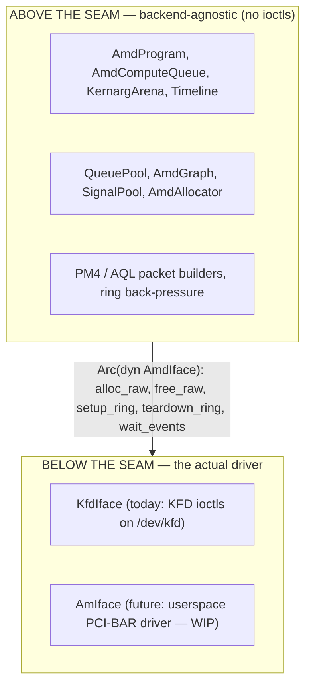
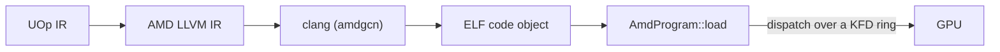

# AMD 后端

Svod 通过直接与内核驱动对话在 AMD GPU 上运行。这里没有 HIP，
没有 ROCr/HSA 运行时，也没有 `libamdhip64.so`——唯一的外部依赖是
`clang`（用于编译，与 [CPU JIT 加载器](../jit-loader.md)
使用它的方式完全一致）。其余的一切——分配 VRAM、构建命令环、调度
内核、等待完成——全都通过针对 `/dev/kfd` 的原始 `ioctl` 调用完成，
`/dev/kfd` 即 Linux 的 **KFD**（Kernel Fusion Driver，内核融合驱动）接口，它随
`amdgpu` 内核模块一同发布。

这是对 [tinygrad](https://github.com/tinygrad/tinygrad) 的
`ops_amd.py` 的忠实移植，后者本身就是 KFD 直连的。后端中几乎每个函数
都带有 `ops_amd.py:NNN` / `hcq.py:NNN` 引用，以便对照其参考实现核对设计。

代码位于 `svod-device` crate 的 `device/src/amd/` 之下。

---

## 一个运行时检测的执行提供者

AMD 后端**始终编译**（在每一台 Unix 宿主上——`cfg(unix)`，因为
`nix` 是仅 Unix 的），绝不藏在某个 cargo feature 之后。可用性是
**在运行时而非编译时**决定的，采取 ORT 风格：设备注册表用
`svod_device::amd::has_devices()` 探测硬件——一次仅 sysfs、无副作用的
KFD 拓扑读取——并*仅在*存在受支持的 GPU 时才注册 `"AMD"` 设备工厂。
一台没有 `/dev/kfd` 的宿主自然就没有 `"AMD"` 设备类型。

要点在于健壮性：因为后端处于每一次构建的类型检查中，通用 core
中的一次 API 改动（比如某个 `Program` 或 `PlanContext` trait）会在
每一台开发机上于 `cargo check` 时被捕获，而不只是在 GPU 宿主上。代价
是编译时间，我们接受这一点。相应地，bindgen 步骤是**封闭自洽的**——
它在所有平台上针对 vendored 头文件运行，不需要系统内核头文件
（见 [KFD 绑定](./kfd-bindings.md)）。

---

## 为什么用 KFD 直连而非 HIP

一个"正常人"在编写 AMD 后端时会去用 HIP（类 CUDA 的运行时）
或其底层的 HSA 运行时。Svod 刻意不这么做。理由如下：

- **没有用户态运行时依赖。** HIP/ROCr 是数百兆字节的
  共享库，且必须与内核驱动版本匹配。KFD 是一个稳定的
  内核 `ioctl` ABI；一个 Svod 二进制文件只链接 `libc` + `nix` 并外部调用
  `clang`，仅此而已。该后端可在任何带有足够新的
  `amdgpu` 以及 `clang` 的 `amdgcn` target 的宿主上运行——无需安装 ROCm。
- **确定性的控制。** 我们拥有命令环、doorbell、
  timeline 信号、页表可见的分配以及 scratch 缓冲区。
  在我们和硬件之间没有任何运行时去重排提交或
  隐藏状态，这对于后端所围绕构建的无锁多所有者调度至关重要
  （见 [队列与调度](./queues-and-dispatch.md)）。
- **一个经过验证的参考实现。** tinygrad 的 HCQ（Hardware Command Queue，硬件命令队列）模型是
  KFD 直连且久经考验的。移植它意味着我们继承其精确的数据包
  布局和启动序列，而不必逆向工程出自己的一套。

HIP 和 ROCr 二者都位于 KFD *之上*——它们打开同一个 `/dev/kfd` 并发出
与我们相同的 ioctl。直连去掉的是中间层，而不是某种能力。

:::note
KFD 直连之于 AMD，正如 [CPU JIT 加载器](../jit-loader.md)
之于 x86/ARM：跳过笨重的厂商工具链，在进程内驱动裸机制。
CPU 加载器通过 `clang` 管道传输并对结果 `mmap`；
AMD 后端通过 `clang` 管道传输并将结果经由
KFD 环调度出去。
:::

---

## 后端接缝

后端被 **`AmdIface`** trait 一分为二
（`device/src/amd/iface.rs`）：



每一样*不是*内核调用的东西——16 MiB 命令环、PM4/AQL
数据包构造、kernarg bump arena、timeline 计数器、程序
加载器——都位于接缝之上，并被每个后端共享。这个 trait 被
刻意做得很小：**五个必需方法**（`alloc_raw`、`free_raw`、
`setup_ring`、`teardown_ring`、`wait_events`），外加三个默认为空操作的
钩子方法（`queue_event_mailbox`、`publication_checkpoint`、
`update_queue_percentage`）。让它保持小巧的关键洞见在于：
环、GART 页、EOP 缓冲区和 MQD *只不过是 GPU 内存*——它们都在接缝之上
经由 `alloc_raw` 分配，而一个驱动真正必须做得不同的唯一一件事就是
**激活队列**（映射 doorbell，告诉调度器环已存在）：那就是 `setup_ring`。

实现者在设备打开时根据 `SVOD_AMD_BACKEND`
环境变量选择：

| `SVOD_AMD_BACKEND` | 后端 | 状态 |
|---|---|---|
| `kfd`（默认） | `KfdIface` — KFD 直连 | 生产可用 |
| `am` | `AmIface` — 用户态 AM 驱动 | 尚不可选——见下文 |

:::caution[AM 尚不可运行]
设置 `SVOD_AMD_BACKEND=am` 目前会返回错误（`device.rs` 只接受
`kfd`）——尚无 AM 类型实现接缝。用户态 **AM** 驱动的目标是
一块 **CDNA3 SR-IOV VF**（gfx9.4.3），仍在开发中：
discovery、VF↔GIM mailbox、间接寄存器访问、GMMU 与 GMC
启动均已实现并**在活动的 VF 上验证**，但尚无 GPU 引擎
消费工作（doorbell aperture 由宿主拥有）。关于当下确切存在什么、
边界又在何处，见 [AM 驱动](./am-driver.md)。
:::

---

## 设备本地内存与 SDMA 复制队列

后端在设备打开时会在 CDNA 硬件上安装一个 **SDMA 复制队列**
（`AmdCopyQueue`）——RDNA 保留宿主可见路径，而 `AMD_DISABLE_SDMA`
会彻底关掉这次尝试——这会把 `has_sdma_queue` 置为 true。有了它，中间结果就可以
存在于**仅设备的 VRAM** 中（`cpu_access = false`），而宿主↔设备的复制
走异步 DMA：`_copyin`/`_copyout` 经由 SDMA 队列暂存，
`_transfer` 做一次直接的 设备→设备 复制。当没有复制队列存在时，
分配器回落到更简单的模型——每个缓冲区都被强制为宿主可见
（CPU 可映射的 VRAM 或 GTT），而复制是一次 `synchronize()` 之后的
普通 `memmove`。分配与复制在
[KFD 绑定](./kfd-bindings.md) 中介绍。

---

## 在 AMD 上运行

用 `SVOD_DEVICE` 环境变量选择 AMD GPU——`AMD:0` 是
[KFD 拓扑](./kfd-bindings.md) 中的第一个 AMD 节点。例如，端到端地运行一个
模型：

```bash
SVOD_DEVICE=AMD:0 cargo run --release -p svod-model --example gigaam_infer -- ./audio.wav
```

除了一块受支持的 AMD GPU 之外，对宿主的唯一要求就是 `PATH` 上带有
`amdgcn` target 的 `clang`（用于编译内核——见
[编译与图](./compile-and-graph.md)）；无需安装 ROCm/HIP。
[队列与调度](./queues-and-dispatch.md) 页列出了每一个环境变量旋钮。

---

## 它在流水线中的位置

AMD 后端是编译器的设备这一半。前端将张量降低
为单一的 UOp IR；codegen 将该 IR 映射到 GPU 线程索引（
[「添加 GPU 维度」](../../architecture/codegen/devectorizer.md) 阶段将 range 变为
`gidxN`/`lidxN` SPECIAL 索引，参见 [IR 设计](../../architecture/ir-design.md)）；渲染器发出
AMD LLVM IR；而本后端则编译并运行它：



[JIT 图](../../architecture/jit-graphs.md) 层对其进行包装，使得一个模型图编译
一次即可多次重放。

---

## 阅读指南

| 页面 | 涵盖内容 |
|---|---|
| [KFD 绑定](./kfd-bindings.md) | 内核 ABI 如何被绑定（在 vendored 头文件上跑 bindgen）、实际使用的确切 ioctl、sysfs 拓扑，以及分配流程 |
| [队列与调度](./queues-and-dispatch.md) | 命令环、PM4 与 AQL 的对比、有界的计算通道池、发布与设备级排空、timeline，以及每一个配置用环境变量 |
| [编译与图](./compile-and-graph.md) | 一个内核如何从 LLVM IR 走到已加载的程序、它如何调度，以及图捕获/重放如何工作（AQL 默认启用，PM4 需选择启用） |
| [AM 驱动](./am-driver.md) | 开发中的用户态驱动：已构建什么、推迟了什么，以及它如何接入接缝 |
| [调试](./debugging.md) | 用于故障分诊的 VA→分配注册表、poison 闩锁，以及调度/追踪诊断 |
