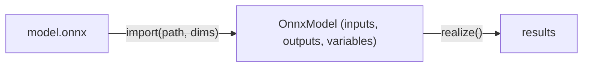

# ONNX 模型推理

Svod 的 ONNX 导入器是运行模型推理的推荐方式。它加载标准的 `.onnx` 文件，将算子分解为 Svod 的惰性张量操作，并通过完整的优化流水线编译执行——无需 C++ 运行时。

**当前状态：**

| 能力 | 状态 |
|------|------|
| 前向推理 | 已支持 |
| 162 / 200 个 ONNX 算子 | [算子对齐详情](https://github.com/npatsakula/svod/blob/main/onnx/PARITY.md) |
| CNN 架构（ResNet、DenseNet、VGG 等） | 已验证 9 个模型 |
| Microsoft 扩展（Attention、RotaryEmbedding） | 已支持 |
| 动态批大小 | 已支持（Variable API） |
| 训练 / 反向传播 | 不支持 |

**与其他框架的比较**

在纯 Rust 框架中，Svod 的 ONNX 算子覆盖面最广——162 个算子，两个 CPU 后端（Clang 与 LLVM）上通过 1357 项一致性测试；当 `SVOD_DEVICE` 选择了 AMD 或 CUDA 设备时，同一套测试也会在该设备上运行。`candle` 和 `burn` 支持的算子更少，也没有同等规模的测试套件。如果需要与生产环境 ONNX 模型的最大兼容性，用 `ort`——C++ ONNX Runtime 的 Rust 封装，覆盖完整的 ONNX 规范。

---

## 快速开始

在你的 `Cargo.toml` 中添加 `svod-onnx` 和 `svod-tensor`：

```toml
[dependencies]
svod-onnx = { git = "https://github.com/npatsakula/svod" }
svod-tensor = { git = "https://github.com/npatsakula/svod" }
```

### 简单用法：全初始化器模型

对于所有输入都内嵌在文件中（无运行时输入）的模型：

```rust
use svod_onnx::{OnnxImporter, OnnxModel};
use svod_tensor::Tensor;

fn main() -> Result<(), Box<dyn std::error::Error>> {
    let mut importer = OnnxImporter::new();
    let OnnxModel { outputs, .. } = importer.import("model.onnx", &[])?;

    // 一次性调度所有输出，统一执行
    let outs: Vec<&Tensor> = outputs.values().collect();
    Tensor::realize_batch(outs)?;

    for (name, tensor) in &outputs {
        println!("{name}: {:?}", tensor.as_ndarray::<f32>()?);
    }
    Ok(())
}
```

### 带运行时输入的模型

大多数模型需要运行时数据（图像、token、音频）。解构 `OnnxModel` 并使用 `remove()` 获取输入张量的所有权：

```rust
use svod_onnx::{OnnxImporter, OnnxModel};
use svod_tensor::Tensor;

fn main() -> Result<(), Box<dyn std::error::Error>> {
    let mut importer = OnnxImporter::new();
    let OnnxModel { mut inputs, outputs, .. } = importer.import("model.onnx", &[])?;

    // 分配输入数据（惰性——暂不分配内存）
    let input = inputs.remove("input").unwrap();
    input.assign(&Tensor::from_slice(&my_data));

    // 一次性调度所有输出，统一执行
    //（内部自动解析输入的 assign——无需单独 realize）
    let outs: Vec<&Tensor> = outputs.values().collect();
    Tensor::realize_batch(outs)?;
    Ok(())
}
```

---

## 架构

### 两阶段设计

导入器分两个阶段处理 ONNX 模型：

**`import(path, dim_bindings)`** 在一次调用中完成两个阶段：解析 protobuf，提取初始化器和输入规格，按拓扑顺序遍历图并将每个 ONNX 节点分派给对应的 Tensor 实现，返回 `OnnxModel { inputs, outputs, variables }`。不会执行任何计算——结果是一组惰性 `Tensor` 句柄，调用 `realize()` 时才会编译并执行。



对于高级用例（在导入前检查图结构），`import_model()` 接受预解析的 `ModelProto`。

### 算子分解

每个 ONNX 算子都会分解为 Svod Tensor 操作，复杂程度不一：

**直接映射** — 约 60 个算子与 tensor 方法一一对应：

```rust
// In the registry:
"Add" => x.try_add(y)?
"Relu" => x.relu()?
"Sigmoid" => x.sigmoid()?
"Equal" => x.try_eq(y)?
```

**Builder 模式** — 带有多个可选参数的复杂算子使用流式 API：

```rust
// Conv with optional bias, padding, dilation, groups
x.conv()
    .weight(w)
    .maybe_bias(bias)
    .auto_pad(AutoPad::SameLower)
    .group(32)
    .maybe_dilations(Some(&[2, 2]))
    .call()?
```

**多步分解** — BatchNormalization、Attention 和 Mod 等算子需要中间计算。`Mod` 会根据 `fmod` 属性和输入 dtype 从四种分解中挑一种；浮点的 Python 风格分支是 `x - floor(x / y) * y`：

```rust
let div = x.try_div(y)?;
x.try_sub(&div.floor().try_mul(y)?)?
```

注意 `floor()` 后面没有 `?`。一元舍入操作（`floor`、`ceil`、`round`、`trunc`），以及 `cast`、`neg`、`abs`、`square` 和 `sign`，都不会失败，直接返回普通的 `Tensor`。`BitwiseAnd`/`Or`/`Xor` 和 `BitShift` 用到的位运算是 `try_bitand`、`try_bitor`、`try_bitxor`、`try_shl` 和 `try_shr`（也可以写成 `&`、`|`、`^`、`<<`、`>>`，它们返回 `Result<Tensor>`）。

### 属性验证

`Attrs` 辅助工具使用弹出式提取——每次调用 `attrs.int("axis", -1)` 或 `attrs.float("epsilon", 1e-5)` 都会从映射中移除该属性。算子处理完成后，`attrs.done()` 断言映射为空。任何剩余属性都会触发错误，在 trace 时捕获不完整的算子实现，而不是产生静默的错误结果。

### Opset 版本管理

ONNX 模型按域声明 opset 导入。导入器跟踪这些信息并将版本传递给每个算子处理器。算子根据版本切换行为——例如，`Softmax` 的默认轴从 `1`（opset < 13）变为 `-1`（opset >= 13），而 `ReduceSum` 在 opset 13 时将其轴从属性移至输入张量。

---

## 使用模型

### 动态维度

ONNX 输入可以有符号维度，如 `"batch_size"` 或 `"sequence_length"`。在导入时通过 `dim_bindings` 参数绑定它们：

```rust
let model = importer.import("model.onnx", &[
    ("batch_size", 1),
    ("sequence_length", 512),
])?;

// Variables are auto-extracted from dim_param annotations
for (name, var) in &model.variables {
    println!("{name}: bounds {:?}", var.bounds());
}
```

未绑定的动态维度会在导入时产生明确的错误。你可以通过 `InputSpec::shape` 检查哪些维度是动态的：

```rust
for (name, spec) in &graph.inputs {
    for dim in &spec.shape {
        match dim {
            DimValue::Static(n) => print!("{n} "),
            DimValue::Dynamic(name) => print!("{name}? "),
        }
    }
}
```

### 外部权重与预构建输入

存放在 `.onnx` 文件之外的权重（`data_location = EXTERNAL`）无需额外调用：`import()` 会相对模型自身所在目录解析它们。

如果要自己把输入张量交给导入器——例如算子在 trace 阶段就要读取的具体值——请对预解析的 `ModelProto` 使用 `import_model_with_inputs()`：

```rust
let model_proto = ModelProto::decode(bytes)?;
let model = importer.import_model_with_inputs(
    model_proto,
    inputs,  // HashMap<String, Tensor>
    &[],
)?;
```

### Microsoft 扩展

导入器支持多个 `com.microsoft` 贡献算子，这些算子常见于从 ONNX Runtime 导出的 transformer 模型中：

| 扩展 | 功能说明 |
|------|---------|
| `Attention` | 打包的 QKV 投影，支持掩码和历史 KV cache |
| `RotaryEmbedding` | 旋转位置编码（交错/非交错） |
| `SkipLayerNormalization` | 融合的残差 + LayerNorm + 缩放 |
| `EmbedLayerNormalization` | Token + 位置 + 段落嵌入 → LayerNorm |

标准 ONNX transformer 算子（ai.onnx 域的 `Attention`）同样支持，包括分组查询注意力（GQA）、因果掩码、历史 KV cache 和 softcap。

---

## 控制流与局限性

### 语义 If：两个分支始终执行

ONNX 的 `If` 算子具有数据依赖的控制流——条件决定执行哪个分支。Svod 的惰性求值模型与此从根本上不兼容：由于 trace 时不执行任何计算，条件值是未知的。

**Svod 的解决方案：** 同时 trace *两个*分支，然后使用 `Tensor::where_()` 合并结果：

```text
ONNX:    if condition { then_branch } else { else_branch }
Svod:   then_result.where_(&condition, &else_result)
```

`where_` 读作"在条件成立的地方保留 `self`"；`condition.select(&then_result, &else_result)` 是同一个操作从掩码一侧的写法，两个分支中的任意一个都可以是裸标量。

这实现了**一次 trace，多次运行**——编译后的图在运行时可以处理任何条件值。但它有一个硬性约束：**两个分支必须产生相同的输出形状和 DType。** 形状多态的模型（即 then 分支产生 `[3, 4]` 而 else 分支产生 `[5, 6]`）无法 trace。

在实践中，大多数带有 `If` 节点的 ONNX 模型都满足此约束，因为它们使用条件逻辑进行值选择，而非改变形状的控制流。

### 不支持 Loop 和 Scan

迭代控制流（`Loop`、`Scan`）尚未实现。这些算子需要重复 trace 或展开，这与单次 trace 架构冲突。使用循环模式的模型通常通过展开的算子工作（LSTM、GRU、RNN 已作为原生算子实现）。

### 批处理执行

多个张量可以一起 realize，共享跨输出的计算（测试位于 `tensor/src/test/unit/batch.rs`）：

```rust
// Realize all outputs at once (shares compilation and execution)
let outputs: Vec<&Tensor> = model.outputs.values().collect();
Tensor::realize_batch(outputs)?;
```

对于重复推理，使用 prepare/execute 模式（测试位于
`tensor/src/test/unit/variable.rs::test_prepare_execute_loop`）：

```rust
let OnnxModel { mut inputs, outputs, variables } =
    importer.import("model.onnx", &[("batch", 1)])?;

// 1. Assign initial data (lazy — no allocation yet)
let input = inputs.remove("audio").unwrap();
input.assign(&Tensor::from_slice(&first_frame));

// 2. Compile the execution plan (resolves assigns, allocates buffers)
let outs: Vec<&Tensor> = outputs.values().collect();
let mut plan = Tensor::prepare_batch(outs)?;
plan.execute()?;  // first run

// 3. Fast loop: zero-copy writes via array_view_mut, no recompilation
for frame in audio_frames {
    input.array_view_mut::<f32>()?[..frame.len()].copy_from_slice(&frame);
    plan.execute()?;
}

// Re-execute with different variable bindings
let bound = variables["batch"].bind(8)?;
plan.execute_with_vars(&[bound.as_var_val()])?;
```

### 不支持训练

导入器仅支持推理。没有反向传播、梯度计算或优化器支持。

### 缺失的算子类别

| 类别 | 示例 | 原因 |
|------|------|------|
| 量化 | DequantizeLinear、QuantizeLinear | 需要 IR 中的量化 DType 支持 |
| 序列操作 | SequenceConstruct、SequenceAt | 非张量类型不在 Svod 的类型系统中 |
| 随机数 | RandomNormal、RandomUniform | 有状态 RNG 尚未实现 |
| 信号处理 | DFT、STFT、MelWeightMatrix | 尚未接入导入器（tensor crate 自身提供了 `stft` / `istft`） |
| 文本 | StringNormalizer、TfIdfVectorizer | 不支持字符串类型 |

用到这些算子的模型，可以用 `ort`（ONNX Runtime 封装），它覆盖完整规范。

---

## 调试

### 逐节点输出追踪

设置 trace 日志级别以输出中间结果：

```bash
RUST_LOG=svod_onnx::importer=trace cargo run
```

这会逐个 realize 每个节点的输出并打印前 5 个值——模型输出有误时可以用来做数值二分。注意这会破坏内核融合（每个节点单独运行），纯粹是调试用途。

### 检查图结构

用 `OnnxModel` 结构查看模型需要什么：

```rust
let model = importer.import("model.onnx", &[])?;

println!("Inputs:");
for (name, tensor) in &model.inputs {
    // Tensor's Debug prints shape, dtype, device and whether it is realized
    println!("  {name}: {tensor:?}");
}

println!("Outputs: {:?}", model.outputs.keys().collect::<Vec<_>>());
println!("Variables: {:?}", model.variables.keys().collect::<Vec<_>>());
```

---

## 总结

| 方面 | 详情 |
|------|------|
| **入口点** | `OnnxImporter::new()` |
| **简单导入** | `importer.import("model.onnx", &[])?` |
| **动态维度** | `importer.import(path, &[("batch", 4)])?` |
| **算子** | 162 / 200（[完整对齐表](https://github.com/npatsakula/svod/blob/main/onnx/PARITY.md)） |
| **已验证模型** | ResNet50、DenseNet121、VGG19、Inception v1/v2、AlexNet、ShuffleNet、SqueezeNet、ZFNet |
| **后端** | CPU 上的 Clang + LLVM（结果一致）；`SVOD_DEVICE` 选择 GPU 时为 AMD 与 CUDA |
| **扩展** | com.microsoft Attention、RotaryEmbedding、SkipLayerNorm、EmbedLayerNorm |
| **局限性** | 不支持训练、不支持 Loop/Scan、形状多态的 If |

**下一步：** [实践示例](./examples)——张量基础，或 [执行流水线](./architecture/pipeline)——了解编译工作原理。
