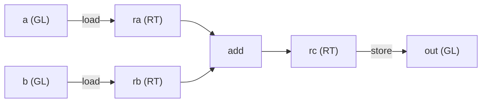

# 编写你的第一个内核

[向 IR 中编写](./lowering) 在抽象层面讲了构建器：`Kernel` 把原材料交到你手上，`Group` 携带计算词汇，`finish` 把一切包进一个 `SINK`。本章把这些落到实处，写出一个真正做事的最小内核（**加载两个 `16×16` tile，相加，存储结果**），并把它跑起来。

它是有意挑出来的、仍能演练出内核完整形态的最简之物：把 [什么是分块](./tiling) 里那条 load → compute → store 的弧线写成代码。没有矩阵乘法，没有共享内存，没有循环，刚好够你看清每一步。matmul 和 Flash Attention 内核，就是这同一副骨架再往上堆东西。



---

## 整个内核

端到端就是下面这样：声明缓冲区，构建内核体，运行，再把结果读回来：

```rust
use svod_dtype::DType;
use svod_tensor::Tensor;
use svod_tk::arch::FragRole;
use svod_tk::index::Idx;
use svod_tk::tiles::TileLayout;
use svod_tk::{run_kernel, MoveIdx};

// Two 16×16 inputs and an output, as flat f32 buffers.
let a: Vec<f32> = (0..256).map(|i| i as f32).collect();
let b: Vec<f32> = (0..256).map(|i| (2 * i) as f32).collect();
let ta = Tensor::from_slice(&a);
let tb = Tensor::from_slice(&b);
let mut out = Tensor::empty(&[1, 1, 16, 16], DType::Float32);

// One wave covers the tile; its width is 64 on CDNA, 32 on RDNA and CUDA.
let arch = svod_tk::target::resolve_arch(&ta.device()).expect("a GPU device");
let w = svod_tk::ArchCaps::for_arch(arch).wave_size as i64;

run_kernel("tile_add", [1, 1, 1], w, &mut [&mut out], &[&ta, &tb], |ker| {
    let warp = ker.warp();

    // Globals, in launch order: output first, then the two inputs.
    let o = ker.gl(&[1, 1, 16, 16], DType::Float32);
    let ga = ker.gl(&[1, 1, 16, 16], DType::Float32);
    let gb = ker.gl(&[1, 1, 16, 16], DType::Float32);

    // Ask for the 16×16 f32 fragment by role — arch-correct on wave32 and wave64.
    let frag = ker.caps.frag(FragRole::Accumulator);
    let blk = [Idx::Const(0), Idx::Const(0), Idx::Const(0), Idx::Const(0)];

    // global → register
    let ra = warp.load(ker.rt((16, 16), DType::Float32, TileLayout::Row, frag), ga, MoveIdx::block(&blk, 2));
    let rb = warp.load(ker.rt((16, 16), DType::Float32, TileLayout::Row, frag), gb, MoveIdx::block(&blk, 2));

    // the one compute op
    let rc = warp.add(ra, &rb);

    // register → global, then close the kernel around its single store
    let _ = warp.store(o, rc, MoveIdx::block(&blk, 2));
    ker.finish(1)
})
.expect("tile_add launch");

let result = out.as_vec::<f32>().expect("read out"); // result[i] == 3 * i
```

整个内核到此为止。本章余下部分逐行走过它。

---

## 一步一步

### 1. 声明这次启动

`run_kernel` 是 DEBUG 面孔的直接派发入口：它物化输入、分配输出、替你构建一个 `Kernel`、运行你的闭包以拿到 `SINK`，然后编译并派发，就地写入输出。

```rust
run_kernel("tile_add", [1, 1, 1], w, &mut [&mut out], &[&ta, &tb], |ker| { /* body */ })
```

`[1, 1, 1]` 网格与 `w` 块是这次启动的几何。我们用**一个工作组、一个 wave**：整个 `16×16` tile 装得进单个 wave 的寄存器，没有什么需要分散到多个块上。块大小取 `w`，即 **wave 宽度**，这是我们事先从设备查到的（`resolve_arch(&ta.device()).wave_size()`）；因为一个 wave 在 CDNA 上是 64 个 lane、在 RDNA 上是 32 个 lane，而块维度*就是*这个 lane 数。输出切片在前，输入在后，**这个顺序就是契约**，下一步要靠它。

### 2. 拿一个 wave 来干活

```rust
let warp = ker.warp();
```

`Group` 就是那群协作的 wave（`warp` 是同一事物的 NVIDIA 叫法）。每个计算操作（加载、加法、存储）都是它上面的一个方法。`ker.warp()` 给的是单 wave 组；`ker.group(n)` 则给你 `n` 个 wave，用来处理更大的 tile。

### 3. 声明全局

```rust
let o  = ker.gl(&[1, 1, 16, 16], DType::Float32);
let ga = ker.gl(&[1, 1, 16, 16], DType::Float32);
let gb = ker.gl(&[1, 1, 16, 16], DType::Float32);
```

**全局布局**（`GL`）是对某个缓冲区的一个带类型视图：它知道逻辑形状，于是加载能算出正确地址。每次 `gl()` 调用都按声明顺序绑定*下一个*缓冲区，而这个顺序必须与启动相符。我们传入的是 `&mut [&mut out]` 然后 `&[&ta, &tb]`，所以这里依次声明 `o`、`ga`、`gb`。顺序一旦搞错，内核就会读写错误的缓冲区。

`[1, 1, 16, 16]` 这个形状是 tk 内核所用的 4 维寻址约定；开头那两个 `1` 是批/头维度，真实内核会去迭代它们，这里留作平凡值。（输入*张量*本身可以是扁平的 256 元素缓冲区，逻辑形状由 `GL` 视图提供；只有输出张量为了分配而携带它的形状。）

### 4. 按角色索要 tile

```rust
let frag = ker.caps.frag(FragRole::Accumulator);
```

这是 [Wave32 与 Wave64](./wave-portability) 里那一招可移植性手法，即便在一个没有矩阵乘法的内核里它也很关键：同一个逻辑 `16×16` f32 tile，在两种 AMD wave 宽度上有着*不同的物理 lane 布局*，所以点名一个**角色**而非一个硬编码片段，才能让同一个内核体为两者都编译。我们向 `ArchCaps` 索要 `Accumulator` 角色，它说白了就是一个全精度结果 tile 的角色，而加法产出的恰恰也是这种 tile，并不只限于 MMA；然后让它替目标平台解析出物理片段：CDNA 上是 wave64，RDNA 上是偶/奇 wave32 布局。

### 5. 加载：全局 → 寄存器

```rust
let blk = [Idx::Const(0), Idx::Const(0), Idx::Const(0), Idx::Const(0)];
let ra = warp.load(ker.rt((16, 16), DType::Float32, TileLayout::Row, frag), ga, MoveIdx::block(&blk, 2));
let rb = warp.load(ker.rt((16, 16), DType::Float32, TileLayout::Row, frag), gb, MoveIdx::block(&blk, 2));
```

`ker.rt(...)` 在我们刚解析出的片段布局中分配一个寄存器 tile，`warp.load` 再从全局把它填满。`MoveIdx::block(&blk, 2)` 指明读取全局的*哪个* tile：`blk` 是 tile 沿四个维度各自的坐标，这里全是零，因为单个 `16×16` tile 只有 `(0, 0)` 这一个位置；而那个 `2` 是这些 tile 堆叠所沿的轴，即维度 2，也就是 `[1, 1, 16, 16]` 视图的行维度。（一个 `[1, 1, 32, 16]` 的全局会容纳两个行 tile，读取第二个就把那个坐标设为 `Idx::Const(1)`。）wave 协作着把这 256 个元素直接拉进寄存器，一进来便已是计算所要的布局。

这是那条*直接的* `全局 → 寄存器` 路径，中间不停共享内存这一站。一个流式处理大张量的内核会先经一个共享 tile 分阶段（为了合并访问和一个无冲突的 swizzle，即 [FLOPS 藏在哪里](./where-flops-hide) 里那些瓶颈）；这里跳过它，因为单个常驻 tile 两样都不需要。

### 6. 计算：就这一个操作

```rust
let rc = warp.add(ra, &rb);
```

内核里唯一的算术。`add` 对 tile 逐元素相加，没有 lane 索引，没有地址数学，就是「把这两个 tile 加起来」。（它按值取第一个操作数、按引用取第二个，返回结果 tile。）真实内核里，`mma`、规约、逐元素映射就出现在这个位置；它们周围的机制，恰恰就是你在这里看到的样子。

### 7. 存储并收尾

```rust
let _ = warp.store(o, rc, MoveIdx::block(&blk, 2));
ker.finish(1)
```

`warp.store` 把结果 tile 写回输出全局，索引和加载时一样，只是反过来。`ker.finish(1)` 围绕这**唯一一个**存储给内核收尾，产出那个 `SINK`（打上 `opts_to_apply: Some(vec![])`，好让优化器对手工降级的内核体原封不动，正如 [向 IR 中编写](./lowering) 所述）。你传给 `finish` 的数字，是要收进 `SINK` 的输出存储个数；我们只有一个输出，所以是 `1`。

### 8. 运行它，再读回来

`run_kernel` 在闭包返回的那一刻就编译并派发。输出是就地绑定的，所以我们直接从张量上读出它：

```rust
let result = out.as_vec::<f32>().expect("read out"); // result[i] == 3 * i
```

在 `a[i] = i` 且 `b[i] = 2i` 的情况下，每个元素都返回 `3i`。

---

## 不可违反的规则

有几条约束是承重的，搞错一条，你换来的就是编译错误、panic，或一个错误答案：

| 规则 | 为什么 |
|------|-----|
| **tile 维度是 `16` 的倍数** | 一个 tile 是整数个 `16×16` 矩阵核心片段；`ker.rt` 会断言这一点。 |
| **`gl()` 顺序 = 启动缓冲区顺序** | 输出在前，再到输入。绑定是位置式的；一处不匹配就会悄无声息地把缓冲区调换，数字错了却没有报错，编译器也抓不住。 |
| **按角色请求片段，而非按常量** | 正是 `caps.frag(role)` 让同一个内核体能在 wave32 *和* wave64 上都跑起来。 |
| **它是 GPU 内核** | 构建器铸出真实的 lane 索引（`Op::Special`），所以执行瞄准的是 GPU——AMD 或 CUDA——而非 CPU。 |

---

:::tip 面向 GPU 专家
内核体降级成的，恰好是 [向 IR 中编写](./lowering) 里那副 `RANGE` / `INDEX` / `LOAD` / `STORE` 形状，没有新节点类型。内核铸出一个 lane 索引 `Op::Special`，wave 的各次加载搭在它上面；每次 `warp.load` 在那个 lane 下变成一个全局 `LOAD`，`warp.add` 是单个 `Op::Binary(Add)`，存储则是 `SINK` 罩住的那唯一一个 `STORE`。这里**没有** `Wmma`，也**没有** `DefineLocal`：它是一次纯寄存器的往返，是 IR 所能表达的最精简内核。

因为内核发射 `Special` 操作，它*就是*一个完全手工降级的 GPU 内核：优化器和工作组维度遍把带 `Special` 的图当成已降级的来对待并直接放行（即 `opts_to_apply: Some(vec![])` 所把守的那同一道关卡）。这也正是它只在 GPU 后端（AMD 或 NVPTX）上渲染的原因：lane 索引在标量 CPU 路径上毫无意义。不过，*构建*那个 `SINK` 纯粹是 UOp 构造，不需要 GPU；只有执行它才需要。正是这道分割，让一个内核能在每次构建时由主机侧的形状检查把守，再由一个单独的、受门控的测试来检验设备上的数字。
:::

---

## 为什么这很重要

这个小内核是每个 tk 内核浇注其中的模板。matmul 内核加上一个 `mma` 和一个 K 循环；而实战范例 [Flash Attention](./flash-attention) 则让矩阵核心与一个在线 softmax 递推、双缓冲流式传输和一个 wave 大小分支一同运转。但骨架恰恰就是你刚写下的这些：按启动顺序声明全局，按角色请求 tile，在内存空间之间搬数据，对 tile 计算，`finish`。学会这副骨架，更难的内核是在它之上添东西，而不是另起炉灶。

而所有这些都是那一套 UOp IR。你构建的那个 `SINK`，与编译器为自动调优内核所产出的是同一类对象，这正是本节的全部要点。

接下来，是那个让 AMD 上手工编写真正变难的细节——让一个内核在不同 wave 大小间保持正确：[Wave32 与 Wave64](./wave-portability)。
</content>
