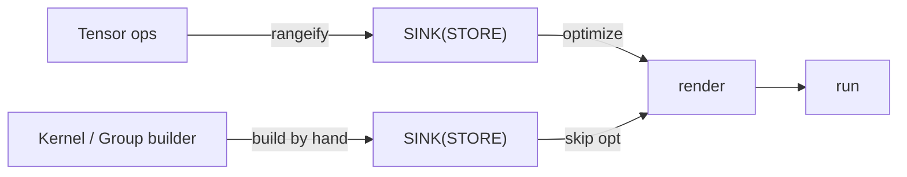
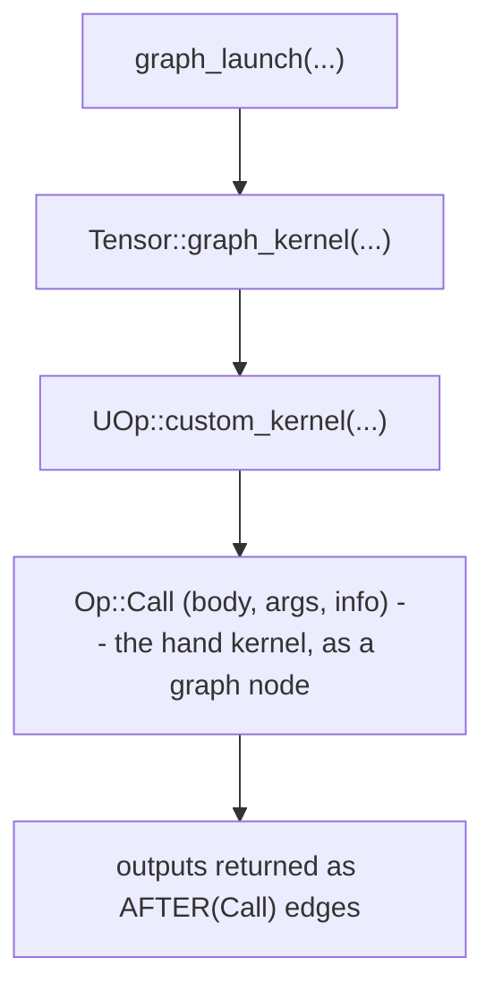
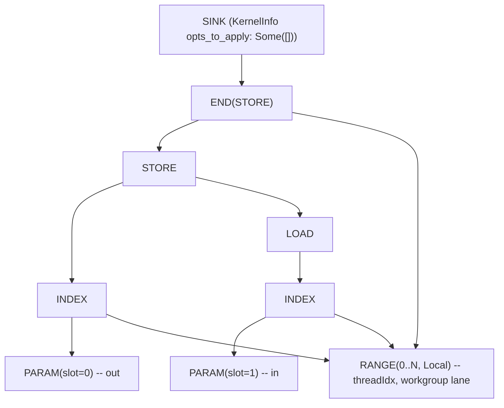

# 向唯一的 IR 中编写

多数 tile 框架在回答「怎么让用户手写内核」时，都会加一个*层*。这个层是一门新 DSL，自带编译器、调试器、profiler，外挂在框架旁边。`tk` 的标志性选择恰恰是**一个层都不加**。手写内核降级进的，是与其他一切相同的那套 UOp IR，于是它共享同一条渲染路径、同一个调试器、同一个 profiler；而构建 ML 应用的开发者要学的，自始至终只有**一套 IR**，从 `Tensor` 加法一路下到手工调优的 attention 内核。

本章讲清这是怎么做到的。它假定你读过 [一个 IR 统治一切](../architecture/ir-design) 和 [执行流水线](../architecture/pipeline)，也就是说你已经知道 UOp 是什么，以及惰性 `Tensor` 如何变成已编译的内核。那套理念我们不重讲，只展示手写内核如何嵌*入*它。

---

## 不加新层：内核只是一个子图

回想 [概览](./overview) 里的论断：`tk` 是构建器，不是后端。它不发射汇编，也不定义自己的 IR。它发射的，是普通 codegen 路径早已使用的*那一套完全相同*的降级后 IR：`RANGE` 循环、`INDEX`/`LOAD`/`STORE` 内存操作、`WMMA` 矩阵指令（需要时，还有以 `Op::Custom` 形式出现的原始 LLVM/ASM）。

所以编写内核，无非是*亲手构造一张 UOp DAG*，而不是让 `rangeify` 替你构造。它的产物是一个 `SINK` UOp，正是调度器为自动调优内核所产出的同一种东西。手写的和编译器生成的内核并非两类对象，而是同一类，只是用两种方式构建：



---

## 待在一套 IR 里给你换来了什么

这是本章的全部要点，所以值得讲具体。既然手写内核*就是*更多的 UOp，它便免费继承了编译器的全部基础设施，没有任何 tk 专属的东西要构建、要学习：

- **同一个渲染器。** 把图内核降级到 LLVM IR、再到 AMD 二进制或 PTX 的那条 `svod-codegen` 路径，同样渲染你的 `tk` 内核。没有第二个后端要写、要移植、要保持同步。
- **同一个调试器。** 检查 `tk` 内核的方式与检查任何计算完全一样：打印 UOp 树。手写的 Flash Attention 和自动调优的 matmul 以*相同*的文本形式出现，操作名也相同，没有另一种转储格式，也没有「内核 X 到底是什么」的谜题。
- **同一个 profiler。** `tk` 内核把它的 `name` 一路带进 IR，于是它*以那个名字*出现在设备 profile 里，而不是化作一团匿名数据，并由其他每个内核所用的同一条硬件时间戳路径计时。手写内核和图内核的性能剖析是同一套工作流。
- **只有一套 IR 要学。** 这是面向开发者的回报。要在 Svod 上构建、优化、调试、剖析一个 ML 应用，从 `Tensor` 加法下到手工调优的 attention 内核，你要学的就*一种*表示。脑子里不必同时盘着「张量 IR、内核 DSL、后端 IR」这三套，因为压根只有这一张 UOp 图。

而通常的做法恰恰相反：tile DSL 是一门*单独*的语言，自带编译器、调试器、profiler 视图，外挂在框架旁边。其中每一样，都是框架不得不构建的一个层，也是用户不得不学习的一样东西。`tk` 一样都不加，这就是它拒绝支付的代价。

---

## 构建器：`Kernel` 与 `Group`

你用两个类型来编写（来自 `tk/src/lib.rs` 里的 AUTHOR 面孔）：

- **`Kernel`**（`tk/src/kernel.rs`）是即时构建器。它把原材料交到你手上：网格/块维度（会变成 `SPECIAL` 操作）、循环范围（`RANGE`）、共享内存与寄存器缓冲区（两者都是 `BUFFER`，靠 `addrspace = Local` / `Reg` 区分），以及全局参数（`PARAM`）。你把张量绑定上去，再向它索要 tile。
- **`Group`**（`tk/src/group/`，每个关注点一个子模块：`movement`、`mma`、`reduce`、`shuffle`、`elementwise`）是那群协作的 wave（或一组 wave）。它携带*计算*词汇：内存空间之间的加载与存储、`mma` 矩阵乘法、规约、混洗、逐元素映射。

每个 `Group` 操作都直接构建 UOp 节点。一次加载会打开必要的若干 `RANGE`，发射一个把它们关闭的 `STORE`，再返回一个重新包装过、带依赖边的目标 tile，好让下一个操作排在它之后。你是在即时地编写一张图，一次一个 tile 操作。

写完后，你调用 `Kernel::finish(...)`，它关闭打开的范围，把一切包进一个终结性的 `SINK`。

---

## 改变一切的那一个标记

让手工编写得以成立的，是这个字段。`finish` 产出的 `SINK` 携带一个 `KernelInfo`，`tk` 给它打上：

```rust
KernelInfo { opts_to_apply: Some(vec![]), name: Some(...), .. }
```

那个 `opts_to_apply: Some(vec![])` 就是全部诀窍所在。优化器遇到一个内核时，会检查这个字段（在 `schedule/src/optimizer/` 中）：

| `opts_to_apply` | 含义 |
|-----------------|---------|
| `None` | 「你来定。」运行启发式，或在启用时运行 [beam search](../architecture/optimizations/kernel-search)。 |
| `Some(vec![])` | 「这个内核体**已经降级了**。一项进一步的优化都*别*应用。」 |
| `Some(non-empty)` | 「就按这个顺序，恰好应用这些优化。」 |

`tk` 内核用的是 `Some(vec![])`：调度是你亲手写的，优化器便一项调度优化都不应用。而每个内核在 codegen 之前都需要的那些共享重写（代数化简、索引 dtype 降级）仍会在这个内核体上跑；永远不会发生的是对它重新分块、重新向量化或重排。再往上，在图这一层，调度器的重写是*保持调用不变的*，它根本不会下探进一个手写内核的体内。你手工调优的循环原样存活到 codegen，但它仍是一张普通的 UOp 图，由*同一个*渲染器变成 LLVM IR，由*同一个*运行时执行。

而这不只是图个方便（「你既然优化过了，那就别费心」）。它是一份**安全契约**，因为优化器*根本无法*安全地碰一个手写内核体。这个体里可能含有以 `Op::Custom` 形式出现的原始 LLVM/ASM 内建函数，[FLOPS 藏在哪里](./where-flops-hide) 里那些机器调度器原语正是如此。优化器**对这些不透明操作的语义毫无模型**，所以跨它们重新分块、重排或融合，都可能悄无声息地改变内核的结果，或悄悄毁掉你亲手搭起来的性能。于是 `Some(vec![])` 告诉优化器：对一个你并不完全理解的内核体，唯一安全的做法就是别碰它。

---

## 两条入路：直接启动与图节点

从一个完成的 `Kernel` 到运行的代码，有两条路线，对应两类受众。

:::tip[面向 GPU 专家]
调度器把内核的 `Op::Call` 当成任何别的图节点对待：它沿 `AFTER`/`Call` 依赖链行走以找出内核边界，并把它作为一个被调度的内核发射；与此同时，重写遍以一种*保留 calls*的遍历方式运行，不下探进内核体。于是你手工降级的 `SINK` 被调度、被依赖跟踪的方式与自动调优内核完全一样，但它的内部从不被重写。
:::

### 直接启动（DEBUG 面孔）

`compile` / `launch` / `run_kernel`（`tk/src/launch.rs`）接收一个完成的 `SINK`，把它绑定到具体的设备缓冲区，渲染、编译并派发，完全绕开张量调度器。这就是你隔离测试、隔离基准测试一个内核的方式；见 [调试](./debugging)。

### 图节点（USE 面孔）

生产中你并不想要一次单独的启动，而是希望内核成为惰性图的一部分，这样它就像其他一切一样融入调度和依赖跟踪。那条路是：



完成的 `SINK` 成为一个 `Op::Call` 节点的 `body`（见 [操作图鉴](../architecture/op-bestiary) 中的 `Op::Call`）。每个输出张量都作为一条 `AFTER(Call)` 返回，也就是一条普通的依赖边。在调度器眼里，你的内核不过是 DAG 中又一个带输入输出的节点：它被调度，它的缓冲区被分配，它的依赖被跟踪，全由 [执行流水线](../architecture/pipeline) 所描述的那同一套机制完成。

这就是「一套 IR」的回报：手写内核与自动调优内核是平级的。

---

## 没有静默回退

内核库里有一种微妙的失败模式：你调用快速路径，它悄悄判定自己处理不了你的输入，于是把慢速路径塞给你却一声不吭，或者更糟，给你一个错误答案。`tk` 的公开内核（`tk/src/kernels/`：单输出的那些经 `tk/src/launch.rs` 里的 `launch_custom`，多输出的 k-means 与 k-NN 则内联同一套策略）从设计上就杜绝了这种情况。每个入口点都返回一个三态结果：

| 结果 | 含义 | 你该做什么 |
|--------|---------|-------------|
| `Ok(Some(tensor))` | 内核跑了。 | 用这个张量。 |
| `Ok(None)` | 「此处不适用」：架构不支持，或形状无法整齐地分块。 | 有意地回退到图实现。 |
| `Err(...)` | *请求*本身畸形：dtype 错误、维度不可整除、操作数非方形。 | 修正调用。这是一个 bug，被大声报出。 |

`Ok(None)`（一个正当的「这事不归我」）与 `Err`（调用者犯了错）之间的区分正是要点。硬件不支持就路由到回退；内核接受不了的 dtype 则是一个你立刻看到的错误，而不是一次悄悄绕到慢速路径的弯路。

---

## 它作为 IR 长什么样

这一切的回报是：手写内核打印出来与任何别的 UOp 图无异。一次平凡的 tile 存储（加载一个 tile，再写回去）降级成那副熟悉的 `RANGE` / `INDEX` / `STORE` 形状：



没有新节点类型，没有单独的方言，正是 [IR 章节里那段 matmul 历程](../architecture/ir-design) 所终结于的那些操作。真实内核会再加上 `WMMA`，以及位于 `Local`（LDS）和 `Reg`（寄存器）地址空间的 `BUFFER` 节点，但形状一样：一个 SINK 罩着一个 STORE，由若干范围限定作用域。

---

## 为什么这很重要

Svod 之所以能*同时*提供「让编译器找调度」和「我自己写调度」，又不用两个编译器，是因为两者产出的是同一个产物：一个由 UOp 组成的 `SINK`。优化器的 `opts_to_apply` 字段就是两者之间的接缝，它离 `None` 只差一个枚举值。[tk、HipKittens 与 CuTile 对比](./comparison) 会回过头来讲为什么这并不寻常。

接下来，把这个构建器端到端地用起来：[编写一个内核](./first-kernel) 会逐行走过最简单的真实内核的编写与运行。
