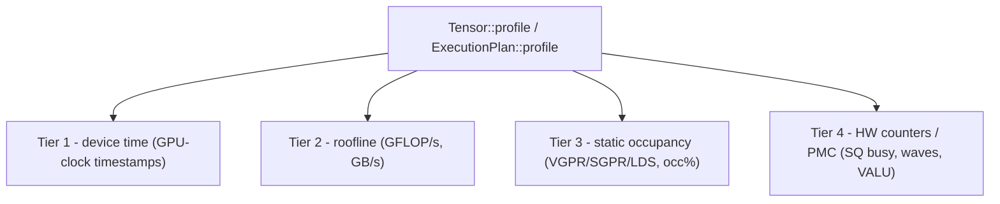

# 剖析与基准测试内核

[调试](./debugging) 用单次硬件时间戳回答「这个内核对不对、大致有多快」。本章则讲它之后的那个问题：*时间都花到哪去了，瓶颈在哪里？* Svod 附带一个**分层内核 profiler**，分四个层级来回答它——设备时间、roofline、静态占用率，以及 AMD 硬件计数器——全都统一到一次调用之后。

这个 profiler 位于 `runtime` crate 而非 `tk`，这一安放位置正是关键所在：它对**任何** `Tensor` 或 `ExecutionPlan` 都管用，无论其中的内核出自图优化器，还是由 `tk` 手写而成。一个图 matmul、一个融合的前馈块、一个手写的 Flash Attention，全都出现在同一张表里，以同样的方式计时、分析。之所以放在本节介绍，只是因为手写内核的作者最可能用到它。

:::note 框架级，而非仅限 tk
下文的一切都适用于任何可实现的 `Tensor`。[一套 IR 的设计](./lowering) 正是这一切的前提：一个 `tk` 内核不过是更多的 UOp，因此它把自己的 `name` 一路带进设备 profile，并由与自动调优内核完全相同的路径来测量。
:::

---

## 四个层级

每个层级都往报告里添上一组列。较低的层级开销小、随时可用；较高的层级则需要更多前提（一份估算、一次描述符解码、一块状态稳定的 GPU）。开销大的那些要你主动开启。



| 层级 | 报告什么 | 来源 | 需要执行吗？ |
|------|-----------------|--------|------------------|
| **1 — 设备时间** | 每个内核的 GPU 执行时间 | GPU 时钟派发时间戳 | 是 |
| **2 — roofline** | 推导出的 **GFLOP/s** 与 **GB/s** | FLOP 由内核的 IR 估算；字节数来自 plan 的缓冲区 | 是（速率需要时间） |
| **3 — 静态占用率** | VGPR / SGPR / LDS / scratch 用量，以及受 VGPR 限制的**占用率 %** | 从 AMD 内核描述符解码而来 | 否——纯静态解码 |
| **4 — 硬件计数器（PMC）** | SQ 块计数器：忙碌周期、启动的 wave 数、发射的 VALU 指令数 | PM4 性能计数器包，跨整个计算网格求和 | 是，需在状态稳定的 GPU 上 |

有几个细节值得了解：

- **第 2 层**通过遍历内核的 IR（AST）来估算 FLOP。对调度器构建的内核而言，其范围是有界的，于是估算就是一个真实计数，GFLOP/s 这一列也就有了值。GB/s 这个数字把每个不同的 LOAD/STORE 缓冲区各算一次，所以只要第 2 层在跑，它就可用。
- **第 3 层**针对 RDNA3.5 (wave32) 建模，其寄存器堆的几何结构是已知的，因此它会报告一个占用率 %。在 CDNA3 (wave64) 上，各项资源（VGPR/SGPR/LDS/scratch）仍会被解码并显示，但占用率这一列会显示 `-`，因为那种几何结构尚未建模。这里的占用率仅是**受 VGPR 限制**的一阶限制因素——LDS 与工作组上限并未折算进来。
- **第 4 层**通过 PM4 包对 SQ 块计数器编程，并跨网格求和。已实现的三个计数器是 `sqbusy`（忙碌周期）、`waves`（启动的 wave 数）和 `valu`（发射的 VALU 指令数）——它们合在一起回答的，是单凭计时无法回答的 ILP / 占用率问题。

报告的各列会随采集到的内容自适应：若只跑了第 1 层，便仅打印计时；GFLOP/s、资源和计数器各列只有在对应层级运行过后才出现。

---

## API：在 `Tensor` 或 `ExecutionPlan` 上的 `profile`

有两个入口点。两者都接收一个 `&ProfileOptions` 并返回一个 `RunProfile`。

```rust
// tensor/src/realize.rs — realizes the tensor as a side effect, like realize()
pub fn profile(&mut self, opts: &ProfileOptions) -> Result<RunProfile>

// runtime/src/execution_plan.rs — profile an already-prepared plan
pub fn profile(&self, opts: &ProfileOptions) -> Result<RunProfile>
```

`Tensor::profile` 是方便的那个：它会准备好 plan，跑一遍剖析路径，再敲定结果，使张量最终的实现状态与 `realize()` 所留下的完全一致。`ExecutionPlan::profile` 则适用于你已经握有现成 plan 的场合（基准和 `Tensor::profile` 底层调用的都是它）。

```rust
use svod_runtime::ProfileOptions;

// Any Tensor — a tk kernel here, but a pure graph computation works identically.
let mut out = svod_tk::flash_attention(&q, &k, &v)?;
let report = out.profile(&ProfileOptions::default())?;

// The library NEVER prints. render_table() returns a String; the caller decides.
print!("{}", report.render_table());
```

或者针对一个你自己准备好的 plan：

```rust
let plan = out.prepare()?;
let report = plan.profile(&ProfileOptions::from_env())?;
print!("{}", report.render_table());
```

`RunProfile::render_table()` 返回一个 `String`——一张按内核排列的表（内核按入口点聚合，按总时间排序），并带上所有有值的层级列。这个 profiler 是个纯格式化器：它自己从不写 stdout 或 stderr，所以日志、文件和 stderr 回显始终由调用者决定。

---

## `ProfileOptions` 与 `from_env`

```rust
// runtime/src/profiler.rs
pub struct ProfileOptions {
    pub iters: u32,             // replays; the per-kernel minimum device time is kept
    pub static_analysis: bool,  // Tier 2/3 (flops/bytes/resources) — cheap, on by default
    pub counters: PmcSelection, // Tier 4 hardware counters
    pub origin_depth: Option<usize>, // 来源汇总的深度；None 保留完整路径
}
```

`ProfileOptions::default()` 即 `{ iters: 1, static_analysis: true, counters: PmcSelection::None, origin_depth: None }`——第 1–3 层，单趟。想要显式控制就直接构造它：

```rust
use svod_runtime::{ProfileOptions, PmcSelection};

let opts = ProfileOptions {
    iters: 50,
    static_analysis: true,
    counters: PmcSelection::Default, // add Tier 4
};
```

`PmcSelection` 可取 `None`（仅第 1–3 层）、`Default`（已实现的那组 SQ 计数器），或 `Custom(Vec<PmcCounter>)`（一份显式列表）。

`ProfileOptions::from_env()` 是读取剖析环境变量的唯一地方：

| 环境变量 | 作用 |
|---------|--------|
| `SVOD_PROFILE_ITERS` | 用于取最小合并的重放次数（钳制为至少 1） |
| `SVOD_PMC` | 第 4 层的选择：空或 `0` → 关闭；`1` → 默认计数器组；否则为一份逗号分隔的 token 列表（`sqbusy`、`waves`、`valu`） |
| `SVOD_ORIGIN` | `1` 记录每个操作构建时所在的作用域（模块路径、调用点、ONNX 节点），见下文 |
| `SVOD_ORIGIN_DEPTH` | 来源汇总保留的路径段数（`origin_depth`）；未设置则保留完整路径 |

```bash
# Profile with 20 replays and the default hardware counters.
SVOD_DEVICE=AMD:0 SVOD_PROFILE_ITERS=20 SVOD_PMC=1 ...

# Only VALU instructions and SQ-busy cycles.
SVOD_DEVICE=AMD:0 SVOD_PMC=valu,sqbusy ...
```

### 累积取最小

当 `iters > 1` 时（或跨 criterion 的多次调用），profiler **不会**取平均。每一趟都产出一个 `RunProfile`，各趟由 `RunProfile::merge_min` 合并：对每个内核，更快（设备时间最小）的那个样本胜出，并带上*那个*样本的计数器和静态分析。最小值是内核内在开销的稳健估计量——它把调度抖动、争用以及时钟爬升这些会抬高均值的离群点都剔除掉。

## 把内核归属到模型代码

`r_128_3_32_4_2_2_2_4_4_192_2` 这样的内核名只说明它的形状，不说明它服务于哪一层。设置
`SVOD_ORIGIN=1` 后，每个张量操作都会记录构建时所在的作用域——`encoder.layers.3.ffn1` 这样的
模块路径、公开操作的调用点，或 ONNX 节点索引——调度器再把它们的并集带到每次 dispatch 上。
十六个完全相同的层仍然只编译一个程序；它被 dispatch 十六次，带着十六个不同的归属。

模型沿着 state-dict 路径打开作用域（`OriginScope::module`），ONNX 导入器为每个节点打开一个，
阶段名（`vad`、`encoder`、`ctc_head`）是根部的标签。手写的 `tk` 内核与其他内核一样被归属：
构建内核时处于活动状态的作用域就是它的来源。

当一次运行带有来源时，`render_table()` 会附加两份汇总：

- **exclusive** 把每次 dispatch 只计一次，记到其主要来源（产生被存储值的作用域）上，因此各行
  恰好划分总量；
- **inclusive** 把每次 dispatch 记到融合进来的每个来源的每个祖先上，因此父行包含子行，各行
  互相重叠。

两者都截断到 `origin_depth` 段；调用帧（`@ add tensor/src/arithmetic.rs:31`）作为细节留在内核
行里，绝不成为汇总键。在任何作用域之外构建的内核落到 `<unattributed>` 行。

```
origin rollup (depth 3, exclusive; rows sum to the total):
  total ms  count    mean µs      %  origin path
    23.045      2    11522.6    5.3  ctc_head.GigaAmCtcJit.subsampling
     8.231      3     2743.7    1.9  ctc_head.GigaAmCtcJit.layers.6
```

`RunProfile::to_json(depth)` 导出内核行、两份汇总以及来源 arena，便于离线解析 id；
`gigaam_infer --profile-json out.json --origin-depth 3` 会写出这样一个文件。

开启捕获会改变节点身份：在不同作用域下构建的两个相同子图，在内核切分之前不再合并。内核程序
不受影响，但每个调用点都重建同一表达式的辅助代码应在 `OriginScope::suspend()` 下运行，或者
接收已经物化好的输入。

---

## Criterion 集成：`--profile-time`

`tk` 的基准通过每个内核公开的 `Tensor` 接口来测量内核，计时用的是 profiler 所用的那同一批每内核 GPU 时间戳（`tk/benches/common.rs`）。普通的 `cargo bench` 只报告每个基准的 GPU 设备时间。但 criterion 有一个 `--profile-time <seconds>` 模式，而这些基准通过 criterion 的自定义 `Profiler` trait 把**完整的分层 profiler** 挂接了进去——这正是火焰图生成所用的那同一个扩展点。

这个挂钩就是 `tk/benches/common.rs` 里的 `PlanProfiler`。在剖析某个基准期间，`bench_plan` 会在每次调用时通过进程全局的 `bench_profiler()` 捕获该基准的 plan，每次捕获都经 `ProfileOptions::from_env()` 剖析，并按每内核最小值合并进会话累加器。停止时，合并后的表用 `render_table()` 渲染，写入 criterion 输出目录下的一个文件，并回显到 stderr：

```
target/criterion/<id>/profile/svod-profile.txt
```

接入它只需在每个基准的 `criterion_group!` 里加一行——这一行把共享 profiler 设为 criterion 的配置（取自 `tk/benches/kmeans.rs`）：

```rust
criterion_group! {
    name = benches;
    config = Criterion::default().with_profiler(common::bench_profiler());
    targets = bench_kmeans
}
criterion_main!(benches);
```

像跑任何 criterion 基准那样运行它，再加上 `--profile-time`（以及任何层级环境变量）：

```bash
# Plain bench: GPU device time per benchmark, profiler dormant.
SVOD_DEVICE=AMD:0 cargo bench -p svod-tk --bench kmeans

# Drive the layered profiler for ~5s per benchmark, with hardware counters.
SVOD_DEVICE=AMD:0 SVOD_PMC=1 cargo bench -p svod-tk --bench kmeans -- --profile-time 5
```

由于 `bench_profiler()` 在 criterion 不剖析时处于休眠，普通的 `cargo bench` 完全不受影响——还是同样的数字，没有额外的趟数。

---

## 如实交代局限

:::caution profiler 给不了你的两样东西
**第 2 层的 GFLOP/s 对手写内核是空白。** FLOP 估算会遍历内核的 IR，而它只会为**调度器构建的**内核自动计算速率。一个手写的 `tk` 内核用的是无界的符号范围，于是 AST 遍历会*饱和*，而非形成一个真实计数——profiler 把这当作「没有可靠估算」，而不是打印一份垃圾 roofline，所以对那些内核**GFLOP/s 这一列显示 `-`**。（GB/s 仍然有效，因为字节数来自 plan 的缓冲区，而非 IR。）手写内核的 roofline 请你自己来算：用算法已知的 FLOP 计数和第 1 层的设备时间。

**第 4 层需要稳定的电源状态。** PM4 硬件计数器只有在 GPU 保持固定时钟时才有意义。在默认的 `auto` 电源状态下，profiler *不会*失败——它会降级：只报告计时，并打印一行提示，说明计数器需要 `profile_standard` 状态。先把 GPU 置于该状态（例如 `amd-smi set -l stable_std`），再带上 `SVOD_PMC` 重新运行。
:::

---

## 哪个问题用哪个调用

| 你在问…… | 用 |
|----------------|-----|
| 「每个内核在这块 GPU 上要花多久？」 | `Tensor::profile` 配 `ProfileOptions::default()`，读设备时间那一列 |
| 「这个内核是计算受限还是带宽受限？」 | 第 2 层的 GFLOP/s 与 GB/s 两列（图内核），或手工算 roofline（tk 内核） |
| 「占用率为什么低——是寄存器还是 LDS？」 | 第 3 层的 VGPR/SGPR/LDS/占用率 % 各列（无需运行） |
| 「内核每个忙碌周期发射的 VALU 工作量够吗？」 | 第 4 层 `SVOD_PMC=1`，在 `profile_standard` 状态的 GPU 上 |
| 「跨多次运行，它与图原生基线相比如何？」 | `cargo bench --profile-time`——见 [调试 → 在真实硬件上计时](./debugging) |

若要做的是正确性与结构检查而非性能，请留在 [调试](./debugging)；至于内核*之下*的问题（队列、故障、驱动），见 [AMD 后端 → 调试](../backends/amd/debugging)。
