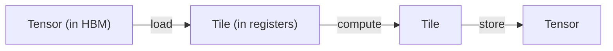
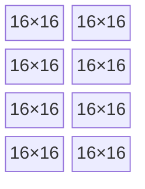

# 什么是分块

[FLOPS 藏在哪里](./where-flops-hide) 以一个难题收尾：每两条矩阵指令之间，硬件都要在地址、内存和布局上烧掉周期。分块（tiling）就是让这些周期消失的抽象，它是 `tk` 里最重要的一个理念。

---

## 张量驻留在内存，tile 驻留在寄存器

**张量**是你在模型层面打交道的那个大数组，比如那个 `[4096, 4096]` 的权重矩阵。它驻留在全局内存（HBM）里，又远又慢，且贯穿整个程序的生命周期。

**tile** 则是那个张量里一小块固定大小的切片，比如 `16×16`，你把它拉*进寄存器*来计算。它很小，紧挨着数学单元，只在被覆写前的寥寥几条指令里存在。

| | 张量 | tile |
|--|--------|------|
| **驻留在** | 全局内存（HBM） | 寄存器（或共享内存） |
| **大小** | 巨大，往往是动态的 | 小，编译期固定 |
| **生命周期** | 整个程序 | 几条指令 |
| **你可以** | 加载 / 存储它 | 对它做乘法、规约、变换 |

于是一个内核不过是一个循环，它一次一个 tile 地遍历一个大张量：

NVIDIA 的 CuTile 和 HazyResearch 的 ThunderKittens 采用的就是这套心智模型，`tk` 也照此采纳。把一个 tile 拉进来，在寄存器里对它做矩阵数学，再把结果写回去。

---

## 一个 tile 就是一格格矩阵核心片段

为什么是 `16×16`，而不是 `100×100` 这样的整数？因为矩阵核心工作在一个固定的*片段*尺寸上，这个尺寸固化在硬件里，通常是 `16×16` 或 `32×32`。tile 的大小被定成这些片段的整数倍：

*一个 `64×32` 的寄存器 tile，是 `16×16` 矩阵核心片段排成的 4×2 网格。数据一进入寄存器，便已是 MMA 布局。*

正因为 tile 由片段拼成，它的数据一进寄存器就*已经*处于矩阵指令所要的布局里。乘法之前无需混洗，上一章的瓶颈 1 就此消失。

---

## 三种 tile，三个内存空间

`tk` 按 tile 的数据驻留在哪里来区分它们，因为这决定了你如何搬运、如何访问它们：

| tile 种类 | 内存空间 | 用途 |
|-----------|--------------|---------|
| **寄存器 tile** | 寄存器（逐 lane） | 矩阵核心读写的操作数和累加器 |
| **共享 tile** | 共享内存 / LDS | 一块暂存区，整个 wave（或工作组）协作填充，无冲突 |
| **全局布局** | 全局内存（HBM） | 对原始张量指针的一个带类型*视图*，让加载能算出正确地址 |

典型内核三种都用得上：一个**全局布局**描述大张量，wave 协作着把它的一块块流入一个**共享 tile**（经 swizzle，无冲突），每个 lane 再把自己那一份拉进一个**寄存器 tile** 去喂矩阵核心。

---

## 为什么分块是对的抽象

分块绝不只是「把循环切块」。它是那个让你一举回应全部三个内存侧瓶颈的抽象：

- **布局（瓶颈 1）：** tile 按片段尺寸切出，寄存器数据一进入便已是 MMA 布局。
- **内存搬运（瓶颈 2）：** tile 就是你流式传输的单位，计算当前 tile 的同时加载下一个。
- **bank 冲突（瓶颈 3）：** 共享 tile 自带 swizzle，协作填充与读取在构造上就无冲突。

而且它能向上组合：逐元素数学、规约、掩码，全都不过是*作用在 tile 上*的操作，带着同样的布局保证。你写的是 `tile_a * tile_b`，而不是一串 lane 索引计算。

:::tip[面向 GPU 专家]
`tk` 把一个 tile 的*形状*与它所绑定的*缓冲区*拆开。

纯形状描述符在 `tk/src/tiles.rs`。基础片段是 `BaseShape { rows, cols, ept }`，其中 `ept`（每线程元素数）是被**显式**携带的，而非按 `rows*cols / wave_size` 算出来；因为在 RDNA 上，矩阵指令会把操作数*跨 lane 复制*，所以拿操作数 tile 的元素数除以 wave 大小是错的。寄存器 tile 额外加上一个 `LaneMap`（`RTBaseShape`），也就是该片段那个闭式的 `(lane, j) → (row, col)` 映射，用来编码任何普通 stride 都表达不出来的布局：RDNA 累加器的偶/奇行交织，以及 CUDA 的 `mma.sync` 把一个 16×16 tile 拆成两个 `m16n8` 半块来持有的布局。

绑定缓冲区的包装器在 `tk/src/tile.rs`：`GL`（全局布局）、`ST`（共享 / LDS，可选双缓冲）、`RT`（寄存器 tile）、`RV`（寄存器向量，用于 softmax 所需的行/列规约）。每一种都是一个扁平的 `Arc<UOp>` 缓冲区，外加一个逻辑形状和一个 dtype。

至关重要的是，内核从不直接点名 `RT_16X16` 这类片段常量。它们请求的是一个**角色**（`FragRole::{Accumulator, Operand, AccumulatorT}`），再由 `tk/src/arch.rs` 中的 `ArchCaps::frag(role)` 把它解析成目标平台（CDNA、RDNA，或 CUDA 的 `mma.sync`）上正确的物理形状。正是这层间接，让同一个内核能在不同 wave 大小与片段布局间移植；见 [Wave32 与 Wave64](./wave-portability)。矩阵乘法本身则降级为 [操作图鉴](../architecture/op-bestiary) 中记录的 `WMMA` 操作。
:::

---

## 走向

现在你已经有了词汇：内存里的张量、寄存器里的 tile、矩阵核心里的片段。[向 IR 中编写](./lowering) 会展示，当你真用这些零件*写出*一个内核时会发生什么，也就是 `Kernel`/`Group` 构建器如何把 tile 操作变成 Svod 其余部分所编译的那同一套 UOp IR。
